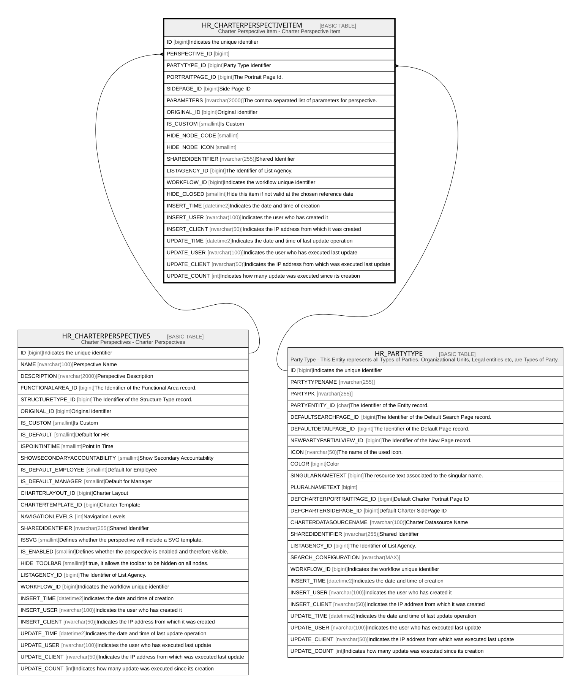

# HR_CHARTERPERSPECTIVEITEM

## Description

Charter Perspective Item - Charter Perspective Item  

## Columns

| Name | Type | Default | Nullable | Parents | Comment |
| ---- | ---- | ------- | -------- | ------- | ------- |
| ID | bigint |  | false |  | Indicates the unique identifier |
| PERSPECTIVE_ID | bigint |  | true | [HR_CHARTERPERSPECTIVES](HR_CHARTERPERSPECTIVES.md) |  |
| PARTYTYPE_ID | bigint |  | true | [HR_PARTYTYPE](HR_PARTYTYPE.md) | Party Type Identifier |
| PORTRAITPAGE_ID | bigint |  | true |  | The Portrait Page Id. |
| SIDEPAGE_ID | bigint |  | true |  | Side Page ID |
| PARAMETERS | nvarchar(2000) |  | true |  | The comma separated list of parameters for perspective. |
| ORIGINAL_ID | bigint |  | true |  | Original identifier |
| IS_CUSTOM | smallint | ((0)) | false |  | Is Custom |
| HIDE_NODE_CODE | smallint | ((0)) | false |  |  |
| HIDE_NODE_ICON | smallint | ((0)) | false |  |  |
| SHAREDIDENTIFIER | nvarchar(255) |  | true |  | Shared Identifier |
| LISTAGENCY_ID | bigint |  | true |  | The Identifier of List Agency. |
| WORKFLOW_ID | bigint |  | true |  | Indicates the workflow unique identifier |
| HIDE_CLOSED | smallint | ((0)) | false |  | Hide this item if not valid at the chosen reference date |
| INSERT_TIME | datetime2 | (sysutcdatetime()) | false |  | Indicates the date and time of creation |
| INSERT_USER | nvarchar(100) | (N'MAIN') | false |  | Indicates the user who has created it |
| INSERT_CLIENT | nvarchar(50) | (N'localhost') | false |  | Indicates the IP address from which it was created |
| UPDATE_TIME | datetime2 | (sysutcdatetime()) | false |  | Indicates the date and time of last update operation |
| UPDATE_USER | nvarchar(100) | (N'MAIN') | false |  | Indicates the user who has executed last update |
| UPDATE_CLIENT | nvarchar(50) | (N'localhost') | false |  | Indicates the IP address from which was executed last update |
| UPDATE_COUNT | int | ((0)) | false |  | Indicates how many update was executed since its creation |

## Constraints

| Name | Type | Definition |
| ---- | ---- | ---------- |
| PK_CHARTERPERSPECTIVEITEM | PRIMARY KEY | CLUSTERED, unique, part of a PRIMARY KEY constraint, [ ID ] |
| FK_CHPERSPECTIVEITEM_PERS | FOREIGN KEY | FOREIGN KEY(PERSPECTIVE_ID) REFERENCES HR_CHARTERPERSPECTIVES(ID) ON UPDATE NO_ACTION ON DELETE CASCADE |
| FK_CHPERSPECTIVEITEM_PT | FOREIGN KEY | FOREIGN KEY(PARTYTYPE_ID) REFERENCES HR_PARTYTYPE(ID) ON UPDATE NO_ACTION ON DELETE NO_ACTION |

## Indexes

| Name | Definition |
| ---- | ---------- |
| PK_CHARTERPERSPECTIVEITEM | CLUSTERED, unique, part of a PRIMARY KEY constraint, [ ID ] |

## Relations

---

> Generated by [tbls](https://github.com/k1LoW/tbls)
