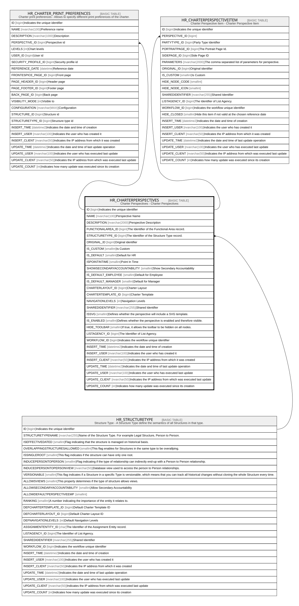

# HR_CHARTERPERSPECTIVES

## Description

Charter Perspectives - Charter Perspectives  

## Columns

| Name | Type | Default | Nullable | Children | Parents | Comment |
| ---- | ---- | ------- | -------- | -------- | ------- | ------- |
| ID | bigint |  | false | [HR_CHARTER_PRINT_PREFERENCES](HR_CHARTER_PRINT_PREFERENCES.md) [HR_CHARTERPERSPECTIVEITEM](HR_CHARTERPERSPECTIVEITEM.md) |  | Indicates the unique identifier |
| NAME | nvarchar(100) |  | false |  |  | Perspective Name |
| DESCRIPTION | nvarchar(2000) |  | true |  |  | Perspective Description |
| FUNCTIONALAREA_ID | bigint |  | true |  |  | The Identifier of the Functional Area record. |
| STRUCTURETYPE_ID | bigint |  | true |  | [HR_STRUCTURETYPE](HR_STRUCTURETYPE.md) | The Identifier of the Structure Type record. |
| ORIGINAL_ID | bigint |  | true |  |  | Original identifier |
| IS_CUSTOM | smallint | ((0)) | false |  |  | Is Custom |
| IS_DEFAULT | smallint | ((0)) | false |  |  | Default for HR |
| ISPOINTINTIME | smallint | ((0)) | false |  |  | Point In Time |
| SHOWSECONDARYACCOUNTABILITY | smallint | ((0)) | false |  |  | Show Secondary Accountability |
| IS_DEFAULT_EMPLOYEE | smallint | ((0)) | false |  |  | Default for Employee |
| IS_DEFAULT_MANAGER | smallint | ((0)) | false |  |  | Default for Manager |
| CHARTERLAYOUT_ID | bigint |  | true |  |  | Charter Layout |
| CHARTERTEMPLATE_ID | bigint |  | true |  |  | Charter Template |
| NAVIGATIONLEVELS | int |  | true |  |  | Navigation Levels |
| SHAREDIDENTIFIER | nvarchar(255) |  | true |  |  | Shared Identifier |
| ISSVG | smallint | ((0)) | false |  |  | Defines whether the perspective will include a SVG template. |
| IS_ENABLED | smallint | ((1)) | false |  |  | Defines whether the perspective is enabled and therefore visible. |
| HIDE_TOOLBAR | smallint | ((0)) | false |  |  | If true, it allows the toolbar to be hidden on all nodes. |
| LISTAGENCY_ID | bigint |  | true |  |  | The Identifier of List Agency. |
| WORKFLOW_ID | bigint |  | true |  |  | Indicates the workflow unique identifier |
| INSERT_TIME | datetime2 | (sysutcdatetime()) | false |  |  | Indicates the date and time of creation |
| INSERT_USER | nvarchar(100) | (N'MAIN') | false |  |  | Indicates the user who has created it |
| INSERT_CLIENT | nvarchar(50) | (N'localhost') | false |  |  | Indicates the IP address from which it was created |
| UPDATE_TIME | datetime2 | (sysutcdatetime()) | false |  |  | Indicates the date and time of last update operation |
| UPDATE_USER | nvarchar(100) | (N'MAIN') | false |  |  | Indicates the user who has executed last update |
| UPDATE_CLIENT | nvarchar(50) | (N'localhost') | false |  |  | Indicates the IP address from which was executed last update |
| UPDATE_COUNT | int | ((0)) | false |  |  | Indicates how many update was executed since its creation |

## Constraints

| Name | Type | Definition |
| ---- | ---- | ---------- |
| PK_CHARTERPERSPECTIVES | PRIMARY KEY | CLUSTERED, unique, part of a PRIMARY KEY constraint, [ ID ] |
| FK_CHPERSPECTIVE_ST | FOREIGN KEY | FOREIGN KEY(STRUCTURETYPE_ID) REFERENCES HR_STRUCTURETYPE(ID) ON UPDATE NO_ACTION ON DELETE NO_ACTION |

## Indexes

| Name | Definition |
| ---- | ---------- |
| PK_CHARTERPERSPECTIVES | CLUSTERED, unique, part of a PRIMARY KEY constraint, [ ID ] |

## Relations

---

> Generated by [tbls](https://github.com/k1LoW/tbls)
