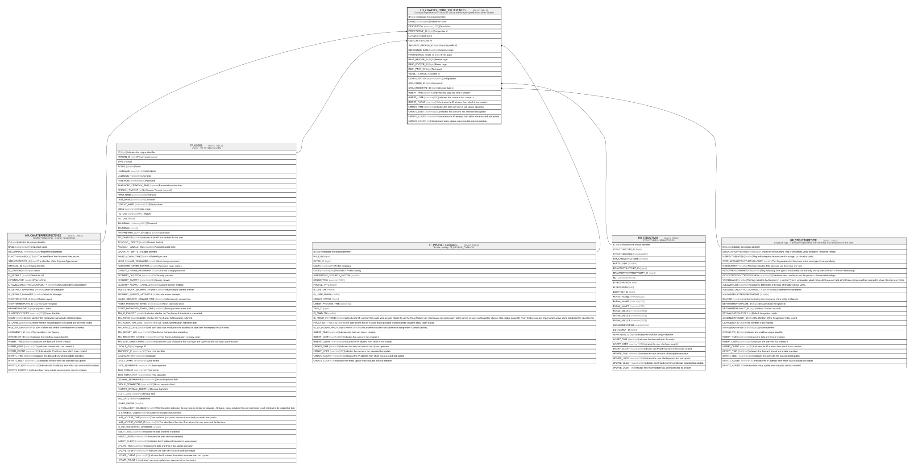

# HR_CHARTER_PRINT_PREFERENCES

## Description

Charter print preferences - Allows to specify different print preferences of the charter.  

## Columns

| Name | Type | Default | Nullable | Parents | Comment |
| ---- | ---- | ------- | -------- | ------- | ------- |
| ID | bigint |  | false |  | Indicates the unique identifier |
| NAME | nvarchar(100) |  | false |  | Preference name |
| DESCRIPTION | nvarchar(1000) |  | true |  | Description |
| PERSPECTIVE_ID | bigint |  | false | [HR_CHARTERPERSPECTIVES](HR_CHARTERPERSPECTIVES.md) | Perspective id |
| LEVELS | int |  | false |  | Chart levels |
| USER_ID | bigint |  | true | [TF_USERS](TF_USERS.md) | User id |
| SECURITY_PROFILE_ID | bigint |  | true | [TF_PROFILE_CATALOG](TF_PROFILE_CATALOG.md) | Security profile id |
| REFERENCE_DATE | datetime |  | true |  | Reference date |
| FRONTESPICE_PAGE_ID | bigint |  | true |  | Front page |
| PAGE_HEADER_ID | bigint |  | true |  | Header page |
| PAGE_FOOTER_ID | bigint |  | true |  | Footer page |
| BACK_PAGE_ID | bigint |  | true |  | Back page |
| VISIBILITY_MODE | int | ((0)) | false |  | Visible to |
| CONFIGURATION | nvarchar(MAX) |  | true |  | Configuration |
| STRUCTURE_ID | bigint |  | false | [HR_STRUCTURE](HR_STRUCTURE.md) | Structure id |
| STRUCTURETYPE_ID | bigint |  | false | [HR_STRUCTURETYPE](HR_STRUCTURETYPE.md) | Structure type id |
| INSERT_TIME | datetime2 | (sysutcdatetime()) | false |  | Indicates the date and time of creation |
| INSERT_USER | nvarchar(100) | (N'MAIN') | false |  | Indicates the user who has created it |
| INSERT_CLIENT | nvarchar(50) | (N'localhost') | false |  | Indicates the IP address from which it was created |
| UPDATE_TIME | datetime2 | (sysutcdatetime()) | false |  | Indicates the date and time of last update operation |
| UPDATE_USER | nvarchar(100) | (N'MAIN') | false |  | Indicates the user who has executed last update |
| UPDATE_CLIENT | nvarchar(50) | (N'localhost') | false |  | Indicates the IP address from which was executed last update |
| UPDATE_COUNT | int | ((0)) | false |  | Indicates how many update was executed since its creation |

## Constraints

| Name | Type | Definition |
| ---- | ---- | ---------- |
| PK_CPP | PRIMARY KEY | CLUSTERED, unique, part of a PRIMARY KEY constraint, [ ID ] |
| FK_CPP_CHARTERPERSPECTIVES | FOREIGN KEY | FOREIGN KEY(PERSPECTIVE_ID) REFERENCES HR_CHARTERPERSPECTIVES(ID) ON UPDATE NO_ACTION ON DELETE NO_ACTION |
| FK_CPP_SECPRFLS | FOREIGN KEY | FOREIGN KEY(SECURITY_PROFILE_ID) REFERENCES TF_PROFILE_CATALOG(ID) ON UPDATE NO_ACTION ON DELETE NO_ACTION |
| FK_CPP_STRUCTURE | FOREIGN KEY | FOREIGN KEY(STRUCTURE_ID) REFERENCES HR_STRUCTURE(ID) ON UPDATE NO_ACTION ON DELETE NO_ACTION |
| FK_CPP_STRUCTURETYPE | FOREIGN KEY | FOREIGN KEY(STRUCTURETYPE_ID) REFERENCES HR_STRUCTURETYPE(ID) ON UPDATE NO_ACTION ON DELETE NO_ACTION |
| FK_CPP_USERS | FOREIGN KEY | FOREIGN KEY(USER_ID) REFERENCES TF_USERS(ID) ON UPDATE NO_ACTION ON DELETE NO_ACTION |

## Indexes

| Name | Definition |
| ---- | ---------- |
| PK_CPP | CLUSTERED, unique, part of a PRIMARY KEY constraint, [ ID ] |

## Relations

---

> Generated by [tbls](https://github.com/k1LoW/tbls)
