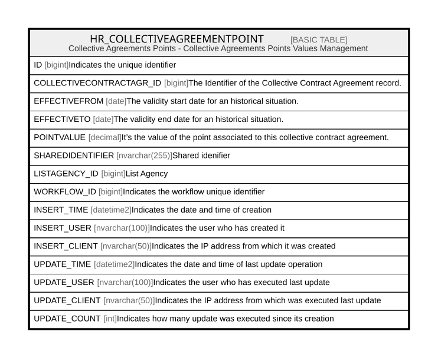

# HR_COLLECTIVEAGREEMENTPOINT

## Description

Collective Agreements Points - Collective Agreements Points Values Management  

## Columns

| Name | Type | Default | Nullable | Comment |
| ---- | ---- | ------- | -------- | ------- |
| ID | bigint |  | false | Indicates the unique identifier |
| COLLECTIVECONTRACTAGR_ID | bigint |  | true | The Identifier of the Collective Contract Agreement record. |
| EFFECTIVEFROM | date |  | true | The validity start date for an historical situation. |
| EFFECTIVETO | date |  | true | The validity end date for an historical situation. |
| POINTVALUE | decimal |  | true | It’s the value of the point associated to this collective contract agreement. |
| SHAREDIDENTIFIER | nvarchar(255) |  | true | Shared idenifier |
| LISTAGENCY_ID | bigint |  | true | List Agency |
| WORKFLOW_ID | bigint |  | true | Indicates the workflow unique identifier |
| INSERT_TIME | datetime2 | (sysutcdatetime()) | false | Indicates the date and time of creation |
| INSERT_USER | nvarchar(100) | (N'MAIN') | false | Indicates the user who has created it |
| INSERT_CLIENT | nvarchar(50) | (N'localhost') | false | Indicates the IP address from which it was created |
| UPDATE_TIME | datetime2 | (sysutcdatetime()) | false | Indicates the date and time of last update operation |
| UPDATE_USER | nvarchar(100) | (N'MAIN') | false | Indicates the user who has executed last update |
| UPDATE_CLIENT | nvarchar(50) | (N'localhost') | false | Indicates the IP address from which was executed last update |
| UPDATE_COUNT | int | ((0)) | false | Indicates how many update was executed since its creation |

## Constraints

| Name | Type | Definition |
| ---- | ---- | ---------- |
| PK_COLLECTIVEAGREEMENTPOINT | PRIMARY KEY | CLUSTERED, unique, part of a PRIMARY KEY constraint, [ ID ] |

## Indexes

| Name | Definition |
| ---- | ---------- |
| PK_COLLECTIVEAGREEMENTPOINT | CLUSTERED, unique, part of a PRIMARY KEY constraint, [ ID ] |

## Relations

---

> Generated by [tbls](https://github.com/k1LoW/tbls)
