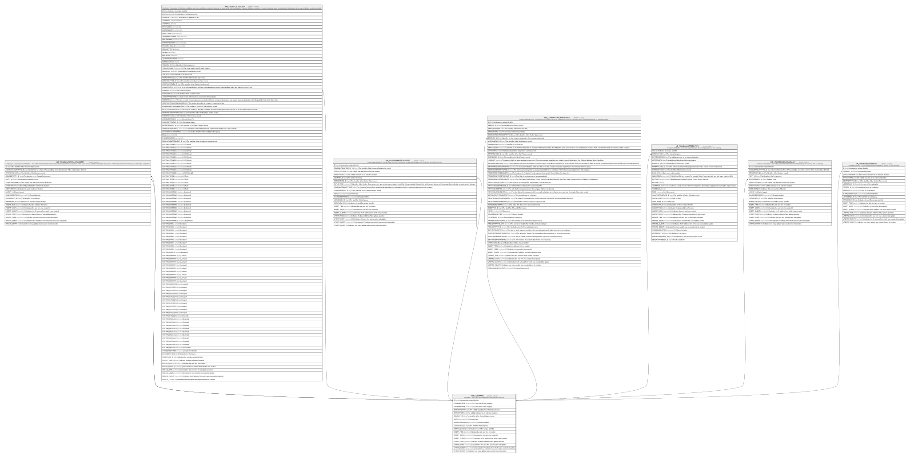

# HR_COMPANY

## Description

Company - This Entity represents the Companies in the Group.  

## Columns

| Name | Type | Default | Nullable | Children | Comment |
| ---- | ---- | ------- | -------- | -------- | ------- |
| ID | bigint |  | false | [HR_COMPANYACCOUNTABILITY](HR_COMPANYACCOUNTABILITY.md) [HR_SHORTLISTEDCND](HR_SHORTLISTEDCND.md) [HR_COMPANYASSIGNMENT](HR_COMPANYASSIGNMENT.md) [HR_COMPANYRELATIONSHIP](HR_COMPANYRELATIONSHIP.md) [HR_COMPANYATTRIBUTES](HR_COMPANYATTRIBUTES.md) [HR_LOCATIONSINCOMPANY](HR_LOCATIONSINCOMPANY.md) [HR_COMPANYCONTACTS](HR_COMPANYCONTACTS.md) | Indicates the unique identifier |
| COMPANYCODE | nvarchar(100) |  | false |  | The code for the company. |
| COMPANYNAME | nvarchar(255) |  | false |  | The name of the company |
| EFFECTIVEFROM | date |  | false |  | The validity start date for an historical situation. |
| EFFECTIVETO | date |  | true |  | The validity end date for an historical situation. |
| CONTEXT_ID | char |  | true |  | The identifier of the Context Values record. |
| NOTE | nvarchar(MAX) |  | true |  | Comment field. |
| SHAREDIDENTIFIER | nvarchar(255) |  | true |  | Shared Identifier |
| LISTAGENCY_ID | bigint |  | true |  | The Identifier of List Agency. |
| WORKFLOW_ID | bigint |  | true |  | Indicates the workflow unique identifier |
| INSERT_TIME | datetime2 | (sysutcdatetime()) | false |  | Indicates the date and time of creation |
| INSERT_USER | nvarchar(100) | (N'MAIN') | false |  | Indicates the user who has created it |
| INSERT_CLIENT | nvarchar(50) | (N'localhost') | false |  | Indicates the IP address from which it was created |
| UPDATE_TIME | datetime2 | (sysutcdatetime()) | false |  | Indicates the date and time of last update operation |
| UPDATE_USER | nvarchar(100) | (N'MAIN') | false |  | Indicates the user who has executed last update |
| UPDATE_CLIENT | nvarchar(50) | (N'localhost') | false |  | Indicates the IP address from which was executed last update |
| UPDATE_COUNT | int | ((0)) | false |  | Indicates how many update was executed since its creation |

## Constraints

| Name | Type | Definition |
| ---- | ---- | ---------- |
| PK_COMPANY | PRIMARY KEY | CLUSTERED, unique, part of a PRIMARY KEY constraint, [ ID ] |

## Indexes

| Name | Definition |
| ---- | ---------- |
| PK_COMPANY | CLUSTERED, unique, part of a PRIMARY KEY constraint, [ ID ] |
| IDX_COMPANY_COMPANYCODE | NONCLUSTERED, unique, [ COMPANYCODE ] |
| IDX_COMPANY_SHAREDIDLISTAGID | NONCLUSTERED, unique, [ SHAREDIDENTIFIER, LISTAGENCY_ID ] |

## Relations

---

> Generated by [tbls](https://github.com/k1LoW/tbls)
