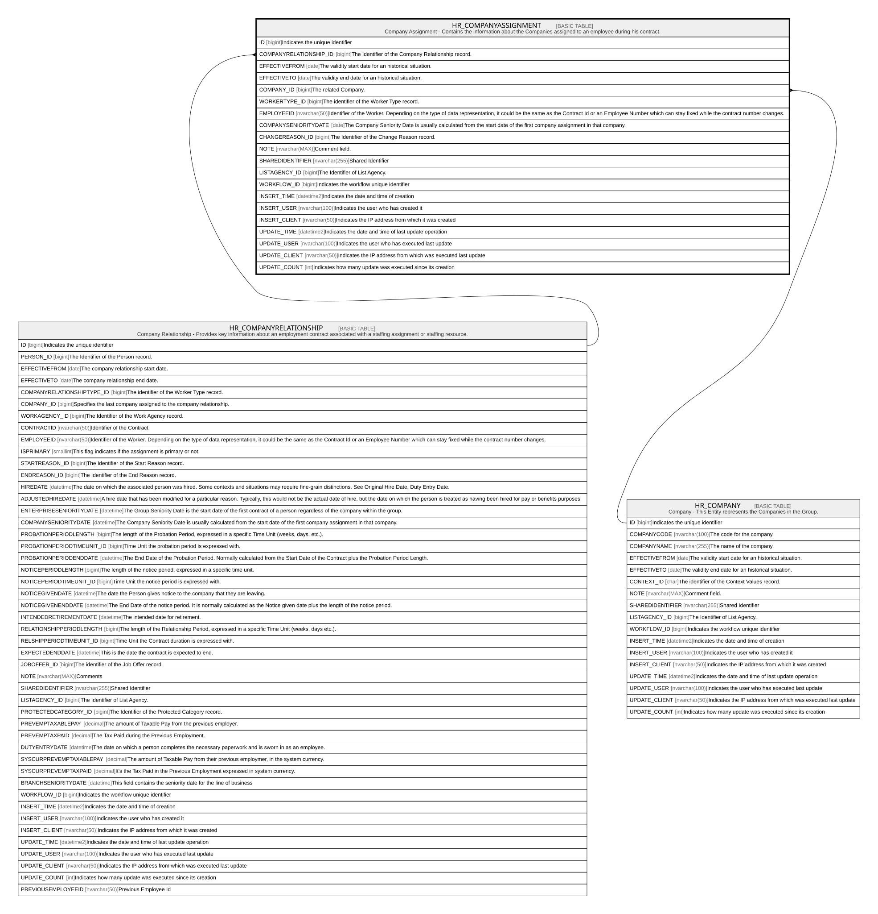

# HR_COMPANYASSIGNMENT

## Description

Company Assignment - Contains the information about the Companies assigned to an employee during his contract.  

## Columns

| Name | Type | Default | Nullable | Parents | Comment |
| ---- | ---- | ------- | -------- | ------- | ------- |
| ID | bigint |  | false |  | Indicates the unique identifier |
| COMPANYRELATIONSHIP_ID | bigint |  | false | [HR_COMPANYRELATIONSHIP](HR_COMPANYRELATIONSHIP.md) | The Identifier of the Company Relationship record. |
| EFFECTIVEFROM | date |  | false |  | The validity start date for an historical situation. |
| EFFECTIVETO | date |  | true |  | The validity end date for an historical situation. |
| COMPANY_ID | bigint |  | false | [HR_COMPANY](HR_COMPANY.md) | The related Company. |
| WORKERTYPE_ID | bigint |  | false |  | The identifier of the Worker Type record. |
| EMPLOYEEID | nvarchar(50) |  | true |  | Identifier of the Worker. Depending on the type of data representation, it could be the same as the Contract Id or an Employee Number which can stay fixed while the contract number changes. |
| COMPANYSENIORITYDATE | date |  | true |  | The Company Seniority Date is usually calculated from the start date of the first company assignment in that company. |
| CHANGEREASON_ID | bigint |  | true |  | The Identifier of the Change Reason record. |
| NOTE | nvarchar(MAX) |  | true |  | Comment field. |
| SHAREDIDENTIFIER | nvarchar(255) |  | true |  | Shared Identifier |
| LISTAGENCY_ID | bigint |  | true |  | The Identifier of List Agency. |
| WORKFLOW_ID | bigint |  | true |  | Indicates the workflow unique identifier |
| INSERT_TIME | datetime2 | (sysutcdatetime()) | false |  | Indicates the date and time of creation |
| INSERT_USER | nvarchar(100) | (N'MAIN') | false |  | Indicates the user who has created it |
| INSERT_CLIENT | nvarchar(50) | (N'localhost') | false |  | Indicates the IP address from which it was created |
| UPDATE_TIME | datetime2 | (sysutcdatetime()) | false |  | Indicates the date and time of last update operation |
| UPDATE_USER | nvarchar(100) | (N'MAIN') | false |  | Indicates the user who has executed last update |
| UPDATE_CLIENT | nvarchar(50) | (N'localhost') | false |  | Indicates the IP address from which was executed last update |
| UPDATE_COUNT | int | ((0)) | false |  | Indicates how many update was executed since its creation |

## Constraints

| Name | Type | Definition |
| ---- | ---- | ---------- |
| PK_HR_COMPANYASSIGNMENT | PRIMARY KEY | CLUSTERED, unique, part of a PRIMARY KEY constraint, [ ID ] |
| UQ_COMPANYASSIGNMENT | UNIQUE | NONCLUSTERED, unique, part of a UNIQUE constraint, [ COMPANYRELATIONSHIP_ID, EFFECTIVEFROM, COMPANY_ID ] |
| FK_COMPANYASSIGN_COMPANY | FOREIGN KEY | FOREIGN KEY(COMPANY_ID) REFERENCES HR_COMPANY(ID) ON UPDATE NO_ACTION ON DELETE NO_ACTION |
| FK_COMPANYASSIGN_COMPREL | FOREIGN KEY | FOREIGN KEY(COMPANYRELATIONSHIP_ID) REFERENCES HR_COMPANYRELATIONSHIP(ID) ON UPDATE NO_ACTION ON DELETE CASCADE |

## Indexes

| Name | Definition |
| ---- | ---------- |
| PK_HR_COMPANYASSIGNMENT | CLUSTERED, unique, part of a PRIMARY KEY constraint, [ ID ] |
| UQ_COMPANYASSIGNMENT | NONCLUSTERED, unique, part of a UNIQUE constraint, [ COMPANYRELATIONSHIP_ID, EFFECTIVEFROM, COMPANY_ID ] |
| IDX_COMPANYASSIGNMENT_CHANGE | NONCLUSTERED, [ CHANGEREASON_ID ] |
| IDX_COMPANYASSIGNMENT_COMPANY | NONCLUSTERED, [ COMPANY_ID ] |
| IDX_COMPANYASSIGNMENT_WORKER | NONCLUSTERED, [ WORKERTYPE_ID ] |
| IDX_COMPANYASSIGNMENT_S | NONCLUSTERED, [ COMPANYRELATIONSHIP_ID, EFFECTIVEFROM, EFFECTIVETO, COMPANY_ID, WORKERTYPE_ID ] |

## Relations

---

> Generated by [tbls](https://github.com/k1LoW/tbls)
