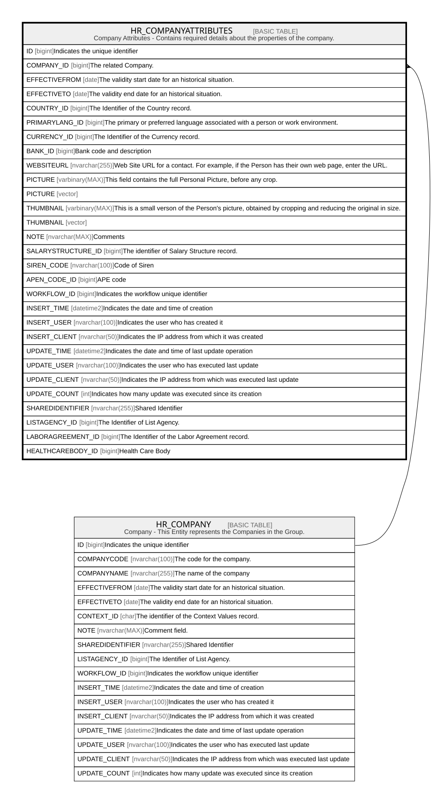

# HR_COMPANYATTRIBUTES

## Description

Company Attributes - Contains required details about the properties of the company.  

## Columns

| Name | Type | Default | Nullable | Parents | Comment |
| ---- | ---- | ------- | -------- | ------- | ------- |
| ID | bigint |  | false |  | Indicates the unique identifier |
| COMPANY_ID | bigint |  | false | [HR_COMPANY](HR_COMPANY.md) | The related Company. |
| EFFECTIVEFROM | date |  | false |  | The validity start date for an historical situation. |
| EFFECTIVETO | date |  | true |  | The validity end date for an historical situation. |
| COUNTRY_ID | bigint |  | false |  | The Identifier of the Country record. |
| PRIMARYLANG_ID | bigint |  | true |  | The primary or preferred language associated with a person or work environment. |
| CURRENCY_ID | bigint |  | true |  | The Identifier of the Currency record. |
| BANK_ID | bigint |  | true |  | Bank code and description |
| WEBSITEURL | nvarchar(255) |  | true |  | Web Site URL for a contact. For example, if the Person has their own web page, enter the URL. |
| PICTURE | varbinary(MAX) |  | true |  | This field contains the full Personal Picture, before any crop. |
| PICTURE | vector |  | true |  |  |
| THUMBNAIL | varbinary(MAX) |  | true |  | This is a small verson of the Person's picture, obtained by cropping and reducing the original in size. |
| THUMBNAIL | vector |  | true |  |  |
| NOTE | nvarchar(MAX) |  | true |  | Comments |
| SALARYSTRUCTURE_ID | bigint |  | true |  | The identifier of Salary Structure record. |
| SIREN_CODE | nvarchar(100) |  | true |  | Code of Siren |
| APEN_CODE_ID | bigint |  | true |  | APE code |
| WORKFLOW_ID | bigint |  | true |  | Indicates the workflow unique identifier |
| INSERT_TIME | datetime2 | (sysutcdatetime()) | false |  | Indicates the date and time of creation |
| INSERT_USER | nvarchar(100) | (N'MAIN') | false |  | Indicates the user who has created it |
| INSERT_CLIENT | nvarchar(50) | (N'localhost') | false |  | Indicates the IP address from which it was created |
| UPDATE_TIME | datetime2 | (sysutcdatetime()) | false |  | Indicates the date and time of last update operation |
| UPDATE_USER | nvarchar(100) | (N'MAIN') | false |  | Indicates the user who has executed last update |
| UPDATE_CLIENT | nvarchar(50) | (N'localhost') | false |  | Indicates the IP address from which was executed last update |
| UPDATE_COUNT | int | ((0)) | false |  | Indicates how many update was executed since its creation |
| SHAREDIDENTIFIER | nvarchar(255) |  | true |  | Shared Identifier |
| LISTAGENCY_ID | bigint |  | true |  | The Identifier of List Agency. |
| LABORAGREEMENT_ID | bigint |  | true |  | The Identifier of the Labor Agreement record. |
| HEALTHCAREBODY_ID | bigint |  | true |  | Health Care Body |

## Constraints

| Name | Type | Definition |
| ---- | ---- | ---------- |
| PK_COMPANYATTRIBUTES | PRIMARY KEY | CLUSTERED, unique, part of a PRIMARY KEY constraint, [ ID ] |
| FK_COMPANYATTRIBUTES_COMPANY | FOREIGN KEY | FOREIGN KEY(COMPANY_ID) REFERENCES HR_COMPANY(ID) ON UPDATE NO_ACTION ON DELETE NO_ACTION |

## Indexes

| Name | Definition |
| ---- | ---------- |
| PK_COMPANYATTRIBUTES | CLUSTERED, unique, part of a PRIMARY KEY constraint, [ ID ] |
| IDX_COMPANYATTRIBUTES_COMEFF | NONCLUSTERED, unique, [ COMPANY_ID, EFFECTIVEFROM ] |
| IDX_COMPANYATTRIBUTES_COU | NONCLUSTERED, [ COUNTRY_ID ] |
| IDX_COMPANYATTRIBUTES_CUR | NONCLUSTERED, [ CURRENCY_ID ] |
| IDX_COMPANYATTRIBUTES_PRI | NONCLUSTERED, [ PRIMARYLANG_ID ] |

## Relations

---

> Generated by [tbls](https://github.com/k1LoW/tbls)
