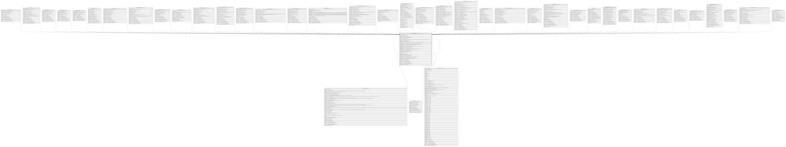

# HR_COMPANYRELATIONSHIP

## Description

Company Relationship - Provides key information about an employment contract associated with a staffing assignment or staffing resource.  

## Columns

| Name | Type | Default | Nullable | Children | Parents | Comment |
| ---- | ---- | ------- | -------- | -------- | ------- | ------- |
| ID | bigint |  | false | [HR_LOCATIONASSIGNMENT](HR_LOCATIONASSIGNMENT.md) [HR_EMPLOYMENTSTATUS](HR_EMPLOYMENTSTATUS.md) [HR_ADDITIONALTERMS](HR_ADDITIONALTERMS.md) [HR_PERSONSINDACATO](HR_PERSONSINDACATO.md) [HR_PAYSLIPDELIVERYMETHOD](HR_PAYSLIPDELIVERYMETHOD.md) [HR_VARIABLEITEMS](HR_VARIABLEITEMS.md) [HR_ORGUNITASSIGNMENT](HR_ORGUNITASSIGNMENT.md) [HR_CONSTPAYROLLITEMASSIGN](HR_CONSTPAYROLLITEMASSIGN.md) [HR_EQUIPMNTASSIGNMENT](HR_EQUIPMNTASSIGNMENT.md) [HR_ADDITIONALWORKERINFO](HR_ADDITIONALWORKERINFO.md) [HR_AUTOCOMPENSATIONINCREASES](HR_AUTOCOMPENSATIONINCREASES.md) [HR_PAYSLIPSLAVEFLOW](HR_PAYSLIPSLAVEFLOW.md) [HR_WORKLOCATIONASSIGNMENT](HR_WORKLOCATIONASSIGNMENT.md) [HR_COMPANYASSIGNMENT](HR_COMPANYASSIGNMENT.md) [HR_CONTRACTASSIGNMENT](HR_CONTRACTASSIGNMENT.md) [HR_ADMINEVENTHEADER](HR_ADMINEVENTHEADER.md) [HR_WORKSCHEDULEASSIGNMENT](HR_WORKSCHEDULEASSIGNMENT.md) [HR_ABSENCEATTENDANCE](HR_ABSENCEATTENDANCE.md) [HR_INDIVIDUALPLANENROLMENT](HR_INDIVIDUALPLANENROLMENT.md) [HR_CONTRACTTYPEASSIGNMENT](HR_CONTRACTTYPEASSIGNMENT.md) [HR_BENEFITSASSIGNMENT](HR_BENEFITSASSIGNMENT.md) [HR_LEARNER](HR_LEARNER.md) [HR_COMPENSATION_CHANGE_LOG](HR_COMPENSATION_CHANGE_LOG.md) [HR_OTHERSTRUCTASSIGNMENT](HR_OTHERSTRUCTASSIGNMENT.md) [HR_DEVICEASSIGNMENT](HR_DEVICEASSIGNMENT.md) [HR_COMPENSATIONASSIGNMENT](HR_COMPENSATIONASSIGNMENT.md) [HR_SALARYGRADEASSIGNMENT](HR_SALARYGRADEASSIGNMENT.md) [HR_DPAE](HR_DPAE.md) [HR_COSTCENTERASSIGNMENT](HR_COSTCENTERASSIGNMENT.md) [HR_PERSONCATEGORIAPROTETTA](HR_PERSONCATEGORIAPROTETTA.md) [HR_COMPHISTORY](HR_COMPHISTORY.md) [HR_JOBASSIGNMENT](HR_JOBASSIGNMENT.md) [HR_TIMESHEET](HR_TIMESHEET.md) [HR_SALARYREVIEWPARTICIPANT](HR_SALARYREVIEWPARTICIPANT.md) [HR_OFFBOARDINGDETAILS](HR_OFFBOARDINGDETAILS.md) [HR_JOBCLASSASSIGNMENT](HR_JOBCLASSASSIGNMENT.md) [HR_PROFQUALIFICATIONS](HR_PROFQUALIFICATIONS.md) [HR_PAYINADVANCEREQUEST](HR_PAYINADVANCEREQUEST.md) |  | Indicates the unique identifier |
| PERSON_ID | bigint |  | false |  | [HR_PERSON](HR_PERSON.md) | The Identifier of the Person record. |
| EFFECTIVEFROM | date |  | false |  |  | The company relationship start date. |
| EFFECTIVETO | date |  | true |  |  | The company relationship end date. |
| COMPANYRELATIONSHIPTYPE_ID | bigint |  | true |  |  | The identifier of the Worker Type record. |
| COMPANY_ID | bigint |  | true |  | [HR_COMPANY](HR_COMPANY.md) | Specifies the last company assigned to the company relationship. |
| WORKAGENCY_ID | bigint |  | true |  |  | The Identifier of the Work Agency record. |
| CONTRACTID | nvarchar(50) |  | true |  |  | Identifier of the Contract. |
| EMPLOYEEID | nvarchar(50) |  | true |  |  | Identifier of the Worker. Depending on the type of data representation, it could be the same as the Contract Id or an Employee Number which can stay fixed while the contract number changes. |
| ISPRIMARY | smallint |  | true |  |  | This flag indicates if the assignment is primary or not. |
| STARTREASON_ID | bigint |  | true |  |  | The Identifier of the Start Reason record. |
| ENDREASON_ID | bigint |  | true |  |  | The Identifier of the End Reason record. |
| HIREDATE | datetime |  | true |  |  | The date on which the associated person was hired. Some contexts and situations may require fine-grain distinctions. See Original Hire Date, Duty Entry Date. |
| ADJUSTEDHIREDATE | datetime |  | true |  |  | A hire date that has been modified for a particular reason. Typically, this would not be the actual date of hire, but the date on which the person is treated as having been hired for pay or benefits purposes. |
| ENTERPRISESENIORITYDATE | datetime |  | true |  |  | The Group Seniority Date is the start date of the first contract of a person regardless of the company within the group.  |
| COMPANYSENIORITYDATE | datetime |  | true |  |  | The Company Seniority Date is usually calculated from the start date of the first company assignment in that company. |
| PROBATIONPERIODLENGTH | bigint |  | true |  |  | The length of the Probation Period, expressed in a specific Time Unit (weeks, days, etc.). |
| PROBATIONPERIODTIMEUNIT_ID | bigint |  | true |  |  | Time Unit the probation period is expressed with. |
| PROBATIONPERIODENDDATE | datetime |  | true |  |  | The End Date of the Probation Period. Normally calculated from the Start Date of the Contract plus the Probation Period Length. |
| NOTICEPERIODLENGTH | bigint |  | true |  |  | The length of the notice period, expressed in a specific time unit. |
| NOTICEPERIODTIMEUNIT_ID | bigint |  | true |  |  | Time Unit the notice period is expressed with. |
| NOTICEGIVENDATE | datetime |  | true |  |  | The date the Person gives notice to the company that they are leaving. |
| NOTICEGIVENENDDATE | datetime |  | true |  |  | The End Date of the notice period. It is normally calculated as the Notice given date plus the length of the notice period. |
| INTENDEDRETIREMENTDATE | datetime |  | true |  |  | The intended date for retirement. |
| RELATIONSHIPPERIODLENGTH | bigint |  | true |  |  | The length of the Relationship Period, expressed in a specific Time Unit (weeks, days etc.). |
| RELSHIPPERIODTIMEUNIT_ID | bigint |  | true |  |  | Time Unit the Contract duration is expressed with. |
| EXPECTEDENDDATE | datetime |  | true |  |  | This is the date the contract is expected to end. |
| JOBOFFER_ID | bigint |  | true |  | [HR_SHORTLISTEDCND](HR_SHORTLISTEDCND.md) | The identifier of the Job Offer record. |
| NOTE | nvarchar(MAX) |  | true |  |  | Comments |
| SHAREDIDENTIFIER | nvarchar(255) |  | true |  |  | Shared Identifier |
| LISTAGENCY_ID | bigint |  | true |  |  | The Identifier of List Agency. |
| PROTECTEDCATEGORY_ID | bigint |  | true |  |  | The Identifier of the Protected Category record. |
| PREVEMPTAXABLEPAY | decimal |  | true |  |  | The amount of Taxable Pay from the previous employer. |
| PREVEMPTAXPAID | decimal |  | true |  |  | The Tax Paid during the Previous Employment. |
| DUTYENTRYDATE | datetime |  | true |  |  | The date on which a person completes the necessary paperwork and is sworn in as an employee. |
| SYSCURPREVEMPTAXABLEPAY | decimal |  | true |  |  | The amount of Taxable Pay from their previous employmer, in the system currency. |
| SYSCURPREVEMPTAXPAID | decimal |  | true |  |  | It's the Tax Paid in the Previous Employment expressed in system currency. |
| BRANCHSENIORITYDATE | datetime |  | true |  |  | This field contains the seniority date for the line of business |
| WORKFLOW_ID | bigint |  | true |  |  | Indicates the workflow unique identifier |
| INSERT_TIME | datetime2 | (sysutcdatetime()) | false |  |  | Indicates the date and time of creation |
| INSERT_USER | nvarchar(100) | (N'MAIN') | false |  |  | Indicates the user who has created it |
| INSERT_CLIENT | nvarchar(50) | (N'localhost') | false |  |  | Indicates the IP address from which it was created |
| UPDATE_TIME | datetime2 | (sysutcdatetime()) | false |  |  | Indicates the date and time of last update operation |
| UPDATE_USER | nvarchar(100) | (N'MAIN') | false |  |  | Indicates the user who has executed last update |
| UPDATE_CLIENT | nvarchar(50) | (N'localhost') | false |  |  | Indicates the IP address from which was executed last update |
| UPDATE_COUNT | int | ((0)) | false |  |  | Indicates how many update was executed since its creation |
| PREVIOUSEMPLOYEEID | nvarchar(50) |  | true |  |  | Previous Employee Id |

## Constraints

| Name | Type | Definition |
| ---- | ---- | ---------- |
| PK_COMPANYRELATIONSHIP | PRIMARY KEY | CLUSTERED, unique, part of a PRIMARY KEY constraint, [ ID ] |
| FK_COMPANYRELATIONSHIP_COMPANY | FOREIGN KEY | FOREIGN KEY(COMPANY_ID) REFERENCES HR_COMPANY(ID) ON UPDATE NO_ACTION ON DELETE NO_ACTION |
| FK_COMPANYRELATIONSHIP_PERSON | FOREIGN KEY | FOREIGN KEY(PERSON_ID) REFERENCES HR_PERSON(ID) ON UPDATE NO_ACTION ON DELETE CASCADE |
| FK_COMPREL_HR_SHORTLISTEDCND | FOREIGN KEY | FOREIGN KEY(JOBOFFER_ID) REFERENCES HR_SHORTLISTEDCND(ID) ON UPDATE NO_ACTION ON DELETE CASCADE |

## Indexes

| Name | Definition |
| ---- | ---------- |
| PK_COMPANYRELATIONSHIP | CLUSTERED, unique, part of a PRIMARY KEY constraint, [ ID ] |
| IDX_COMPANYREL_STANDARD | NONCLUSTERED, [ PERSON_ID, EFFECTIVEFROM, COMPANYRELATIONSHIPTYPE_ID, COMPANY_ID ] |
| IDX_COMPANYRELATIONSHIP_COMP | NONCLUSTERED, [ COMPANYRELATIONSHIPTYPE_ID ] |
| IDX_COMPANYRELATIONSHIP_ENDR | NONCLUSTERED, [ ENDREASON_ID ] |
| IDX_COMPANYRELATIONSHIP_NOT | NONCLUSTERED, [ NOTICEPERIODTIMEUNIT_ID ] |
| IDX_COMPANYRELATIONSHIP_PROB | NONCLUSTERED, [ PROBATIONPERIODTIMEUNIT_ID ] |
| IDX_COMPANYRELATIONSHIP_PROT | NONCLUSTERED, [ PROTECTEDCATEGORY_ID ] |
| IDX_COMPANYRELATIONSHIP_REL | NONCLUSTERED, [ RELSHIPPERIODTIMEUNIT_ID ] |
| IDX_COMPANYRELATIONSHIP_START | NONCLUSTERED, [ STARTREASON_ID ] |
| IDX_COMPANYRELATIONSHIP_WORK | NONCLUSTERED, [ WORKAGENCY_ID ] |
| IDX_COMPANYRELATIONSHIP_SHAR | NONCLUSTERED, [ SHAREDIDENTIFIER ] |

## Relations

---

> Generated by [tbls](https://github.com/k1LoW/tbls)
