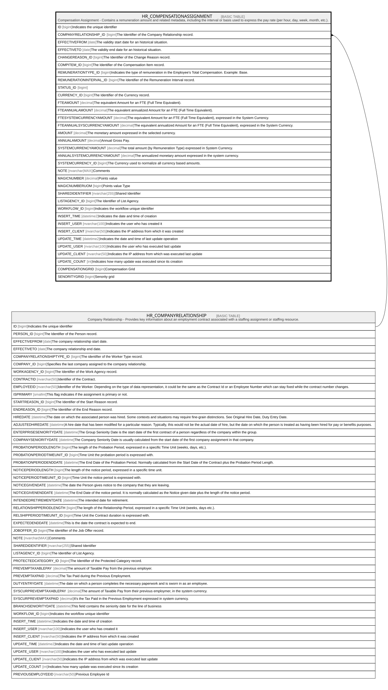

# HR_COMPENSATIONASSIGNMENT

## Description

Compensation Assignment - Contains a remuneration amount and related metadata, including the interval or basis used to express the pay rate (per hour, day, week, month, etc.).  

## Columns

| Name | Type | Default | Nullable | Parents | Comment |
| ---- | ---- | ------- | -------- | ------- | ------- |
| ID | bigint |  | false |  | Indicates the unique identifier |
| COMPANYRELATIONSHIP_ID | bigint |  | false | [HR_COMPANYRELATIONSHIP](HR_COMPANYRELATIONSHIP.md) | The Identifier of the Company Relationship record. |
| EFFECTIVEFROM | date |  | false |  | The validity start date for an historical situation. |
| EFFECTIVETO | date |  | true |  | The validity end date for an historical situation. |
| CHANGEREASON_ID | bigint |  | true |  | The Identifier of the Change Reason record. |
| COMPITEM_ID | bigint |  | true |  | The Identifier of the Compensation Item record. |
| REMUNERATIONTYPE_ID | bigint |  | true |  | Indicates the type of remuneration in the Employee's Total Compensation. Example: Base. |
| REMUNERATIONINTERVAL_ID | bigint |  | true |  | The Identifier of the Remuneration Interval record. |
| STATUS_ID | bigint |  | true |  |  |
| CURRENCY_ID | bigint |  | true |  | The Identifier of the Currency record. |
| FTEAMOUNT | decimal |  | true |  | The equivalent Amount for an FTE (Full Time Equivalent). |
| FTEANNUALAMOUNT | decimal |  | true |  | The equivalent annualized Amount for an FTE (Full Time Equivalent). |
| FTESYSTEMCURRENCYAMOUNT | decimal |  | true |  | The equivalent Amount for an FTE (Full Time Equivalent), expressed in the System Currency. |
| FTEANNUALSYSCURRENCYAMOUNT | decimal |  | true |  | The equivalent annualized Amount for an FTE (Full Time Equivalent), expressed in the System Currency. |
| AMOUNT | decimal |  | true |  | The monetary amount expressed in the selected currency. |
| ANNUALAMOUNT | decimal |  | true |  | Annual Gross Pay. |
| SYSTEMCURRENCYAMOUNT | decimal |  | true |  | The total amount (by Remuneration Type) expressed in System Currency. |
| ANNUALSYSTEMCURRENCYAMOUNT | decimal |  | true |  | The annualized monetary amount expressed in the system currency. |
| SYSTEMCURRENCY_ID | bigint |  | true |  | The Currency used to normalize all currency based amounts. |
| NOTE | nvarchar(MAX) |  | true |  | Comments |
| MAGICNUMBER | decimal |  | true |  | Points value |
| MAGICNUMBERUOM | bigint |  | true |  | Points value Type |
| SHAREDIDENTIFIER | nvarchar(255) |  | true |  | Shared Identifier |
| LISTAGENCY_ID | bigint |  | true |  | The Identifier of List Agency. |
| WORKFLOW_ID | bigint |  | true |  | Indicates the workflow unique identifier |
| INSERT_TIME | datetime2 | (sysutcdatetime()) | false |  | Indicates the date and time of creation |
| INSERT_USER | nvarchar(100) | (N'MAIN') | false |  | Indicates the user who has created it |
| INSERT_CLIENT | nvarchar(50) | (N'localhost') | false |  | Indicates the IP address from which it was created |
| UPDATE_TIME | datetime2 | (sysutcdatetime()) | false |  | Indicates the date and time of last update operation |
| UPDATE_USER | nvarchar(100) | (N'MAIN') | false |  | Indicates the user who has executed last update |
| UPDATE_CLIENT | nvarchar(50) | (N'localhost') | false |  | Indicates the IP address from which was executed last update |
| UPDATE_COUNT | int | ((0)) | false |  | Indicates how many update was executed since its creation |
| COMPENSATIONGRID | bigint |  | true |  | Compensation Grid |
| SENORITYGRID | bigint |  | true |  | Senority grid |

## Constraints

| Name | Type | Definition |
| ---- | ---- | ---------- |
| PK_COMPENSATIONASSIGNMENT | PRIMARY KEY | CLUSTERED, unique, part of a PRIMARY KEY constraint, [ ID ] |
| FK_COMPASS_COMPANYRELATIONSHIP | FOREIGN KEY | FOREIGN KEY(COMPANYRELATIONSHIP_ID) REFERENCES HR_COMPANYRELATIONSHIP(ID) ON UPDATE NO_ACTION ON DELETE CASCADE |

## Indexes

| Name | Definition |
| ---- | ---------- |
| PK_COMPENSATIONASSIGNMENT | CLUSTERED, unique, part of a PRIMARY KEY constraint, [ ID ] |
| IDX_COMPENSATIONASSIGNMENT | NONCLUSTERED, unique, [ COMPANYRELATIONSHIP_ID, EFFECTIVEFROM, COMPITEM_ID, REMUNERATIONTYPE_ID ] |
| IDX_COMPASSIGNMENT_CHANGE | NONCLUSTERED, [ CHANGEREASON_ID ] |
| IDX_COMPASSIGNMENT_COMP | NONCLUSTERED, [ COMPITEM_ID ] |
| IDX_COMPASSIGNMENT_CUR | NONCLUSTERED, [ CURRENCY_ID ] |
| IDX_COMPASSIGNMENT_REMINT | NONCLUSTERED, [ REMUNERATIONINTERVAL_ID ] |
| IDX_COMPASSIGNMENT_REMTYPE | NONCLUSTERED, [ REMUNERATIONTYPE_ID ] |
| IDX_COMPASSIGNMENT_SYSCUR | NONCLUSTERED, [ SYSTEMCURRENCY_ID ] |
| IDX_COMPASSIGNMENT_CR | NONCLUSTERED, [ COMPANYRELATIONSHIP_ID ] |
| IDX_COMPENSATIONASSIGNMENT_S | NONCLUSTERED, [ COMPANYRELATIONSHIP_ID, EFFECTIVEFROM, EFFECTIVETO ] |

## Relations

---

> Generated by [tbls](https://github.com/k1LoW/tbls)
