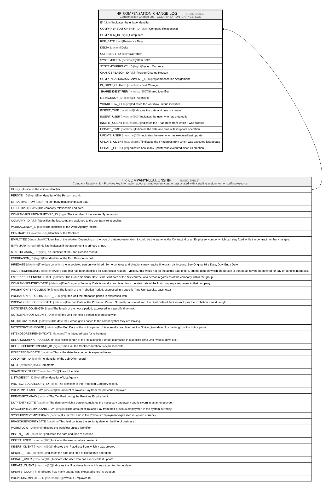

# HR_COMPENSATION_CHANGE_LOG

## Description

Compensation Change Log - COMPENSATION_CHANGE_LOG  

## Columns

| Name | Type | Default | Nullable | Parents | Comment |
| ---- | ---- | ------- | -------- | ------- | ------- |
| ID | bigint |  | false |  | Indicates the unique identifier |
| COMPANYRELATIONSHIP_ID | bigint |  | true | [HR_COMPANYRELATIONSHIP](HR_COMPANYRELATIONSHIP.md) | Company Relationship |
| COMPITEM_ID | bigint |  | true |  | Comp Item |
| REF_DATE | date |  | true |  | Reference Date |
| DELTA | decimal |  | true |  | Delta |
| CURRENCY_ID | bigint |  | true |  | Currency |
| SYSTEMDELTA | decimal |  | true |  | System Delta |
| SYSTEMCURRENCY_ID | bigint |  | true |  | System Currency |
| CHANGEREASON_ID | bigint |  | true |  | Assign/Change Reason |
| COMPENSATIONASSIGNMENT_ID | bigint |  | true |  | Compensation Assignment |
| IS_FIRST_CHANGE | smallint |  | true |  | Is First Change |
| SHAREDIDENTIFIER | nvarchar(255) |  | true |  | Shared Identifier |
| LISTAGENCY_ID | bigint |  | true |  | List Agency id |
| WORKFLOW_ID | bigint |  | true |  | Indicates the workflow unique identifier |
| INSERT_TIME | datetime2 | (sysutcdatetime()) | false |  | Indicates the date and time of creation |
| INSERT_USER | nvarchar(100) | (N'MAIN') | false |  | Indicates the user who has created it |
| INSERT_CLIENT | nvarchar(50) | (N'localhost') | false |  | Indicates the IP address from which it was created |
| UPDATE_TIME | datetime2 | (sysutcdatetime()) | false |  | Indicates the date and time of last update operation |
| UPDATE_USER | nvarchar(100) | (N'MAIN') | false |  | Indicates the user who has executed last update |
| UPDATE_CLIENT | nvarchar(50) | (N'localhost') | false |  | Indicates the IP address from which was executed last update |
| UPDATE_COUNT | int | ((0)) | false |  | Indicates how many update was executed since its creation |

## Constraints

| Name | Type | Definition |
| ---- | ---- | ---------- |
| PK_HR_COMPENSATION_CHANGE_LOG | PRIMARY KEY | CLUSTERED, unique, part of a PRIMARY KEY constraint, [ ID ] |
| UQ_COMPENSATION_CHANGE_LOG | UNIQUE | NONCLUSTERED, unique, part of a UNIQUE constraint, [ COMPANYRELATIONSHIP_ID, COMPITEM_ID, REF_DATE ] |
| FK_COMPCHANGELOG_COMPREL | FOREIGN KEY | FOREIGN KEY(COMPANYRELATIONSHIP_ID) REFERENCES HR_COMPANYRELATIONSHIP(ID) ON UPDATE NO_ACTION ON DELETE CASCADE |

## Indexes

| Name | Definition |
| ---- | ---------- |
| PK_HR_COMPENSATION_CHANGE_LOG | CLUSTERED, unique, part of a PRIMARY KEY constraint, [ ID ] |
| UQ_COMPENSATION_CHANGE_LOG | NONCLUSTERED, unique, part of a UNIQUE constraint, [ COMPANYRELATIONSHIP_ID, COMPITEM_ID, REF_DATE ] |

## Relations

---

> Generated by [tbls](https://github.com/k1LoW/tbls)
