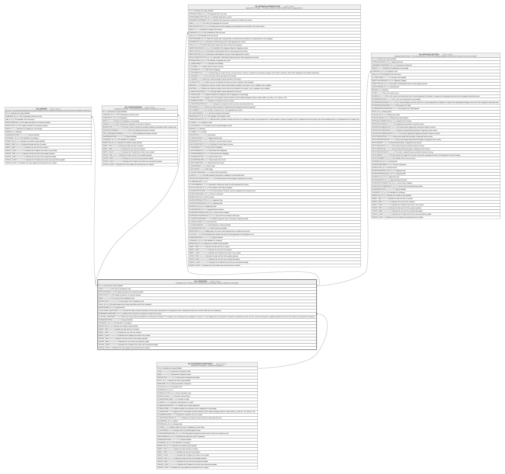

# HR_COMPGRID

## Description

Competency Grid - Defines a list of competencies and, optionally, enables a weight to be associated.  

## Columns

| Name | Type | Default | Nullable | Children | Parents | Comment |
| ---- | ---- | ------- | -------- | -------- | ------- | ------- |
| ID | bigint |  | false | [HR_JOBGRID](HR_JOBGRID.md) [HR_COMPGRIDROW](HR_COMPGRIDROW.md) [HR_APPRAISALFORMSECTION](HR_APPRAISALFORMSECTION.md) [HR_APPRAISALSECTION](HR_APPRAISALSECTION.md) |  | Indicates the unique identifier |
| CODE | nvarchar(50) |  | false |  |  | The code of Competency Grid. |
| EFFECTIVEFROM | date |  | true |  |  | The validity start date for an historical situation. |
| EFFECTIVETO | date |  | true |  |  | The validity end date for an historical situation. |
| NAME | nvarchar(255) |  | true |  |  | The name of the Competency Grid. |
| DESCRIPTION | nvarchar(MAX) |  | true |  |  | The description of the Competency Grid. |
| SCALE_ID | bigint |  | true |  |  | This field indicate which rating scale will be used for the evaluation. |
| QUESTIONAIRE_ID | bigint |  | true |  |  | Questionnaire |
| IS_INCLUDEALLQUESTIONS | smallint |  | true |  |  | Activate this flag to include all questions from the grid's questionnaire in the appraisal review, including those that have not been linked with any competency. |
| ASSESMENTCOMPONENT_ID | bigint |  | true |  | [HR_ASSESMENTCOMPONENT](HR_ASSESMENTCOMPONENT.md) | Identify which assessment component is linked to this section |
| IS_SCORE_COMPONENT | smallint |  | true |  |  | When true, the grid will be associated to an Assessment Component. For example, when evaluating the job suitability for a person, if a Grid mapped with an Assessment Component is attached to the Job, then the system will calculate an additional partial score for the Grid, linked to its Assessment Component. |
| SHAREDIDENTIFIER | nvarchar(255) |  | true |  |  | Shared Identifier |
| LISTAGENCY_ID | bigint |  | true |  |  | The Identifier of List Agency. |
| WORKFLOW_ID | bigint |  | true |  |  | Indicates the workflow unique identifier |
| INSERT_TIME | datetime2 | (sysutcdatetime()) | false |  |  | Indicates the date and time of creation |
| INSERT_USER | nvarchar(100) | (N'MAIN') | false |  |  | Indicates the user who has created it |
| INSERT_CLIENT | nvarchar(50) | (N'localhost') | false |  |  | Indicates the IP address from which it was created |
| UPDATE_TIME | datetime2 | (sysutcdatetime()) | false |  |  | Indicates the date and time of last update operation |
| UPDATE_USER | nvarchar(100) | (N'MAIN') | false |  |  | Indicates the user who has executed last update |
| UPDATE_CLIENT | nvarchar(50) | (N'localhost') | false |  |  | Indicates the IP address from which was executed last update |
| UPDATE_COUNT | int | ((0)) | false |  |  | Indicates how many update was executed since its creation |

## Constraints

| Name | Type | Definition |
| ---- | ---- | ---------- |
| PK_HR_COMPGRID | PRIMARY KEY | CLUSTERED, unique, part of a PRIMARY KEY constraint, [ ID ] |
| UQ_COMPGRID | UNIQUE | NONCLUSTERED, unique, part of a UNIQUE constraint, [ CODE ] |
| FK_COMPGRID_ASSESMENTCOMPONENT | FOREIGN KEY | FOREIGN KEY(ASSESMENTCOMPONENT_ID) REFERENCES HR_ASSESMENTCOMPONENT(ID) ON UPDATE NO_ACTION ON DELETE NO_ACTION |

## Indexes

| Name | Definition |
| ---- | ---------- |
| PK_HR_COMPGRID | CLUSTERED, unique, part of a PRIMARY KEY constraint, [ ID ] |
| UQ_COMPGRID | NONCLUSTERED, unique, part of a UNIQUE constraint, [ CODE ] |

## Relations

---

> Generated by [tbls](https://github.com/k1LoW/tbls)
