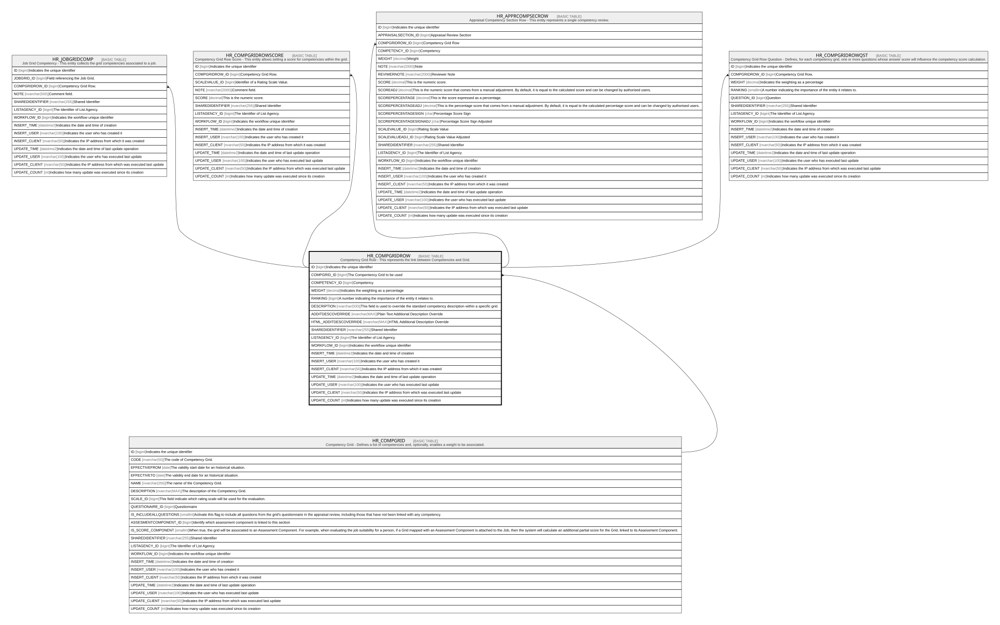

# HR_COMPGRIDROW

## Description

Competency Grid Row - This represents the link between Competencies and Grid.  

## Columns

| Name | Type | Default | Nullable | Children | Parents | Comment |
| ---- | ---- | ------- | -------- | -------- | ------- | ------- |
| ID | bigint |  | false | [HR_JOBGRIDCOMP](HR_JOBGRIDCOMP.md) [HR_COMPGRIDROWSCORE](HR_COMPGRIDROWSCORE.md) [HR_APPRCOMPSECROW](HR_APPRCOMPSECROW.md) [HR_COMPGRIDROWQST](HR_COMPGRIDROWQST.md) |  | Indicates the unique identifier |
| COMPGRID_ID | bigint |  | false |  | [HR_COMPGRID](HR_COMPGRID.md) | The Compentency Grid to be used |
| COMPETENCY_ID | bigint |  | true |  |  | Competency |
| WEIGHT | decimal |  | true |  |  | Indicates the weighting as a percentage |
| RANKING | bigint |  | true |  |  | A number indicating the importance of the entity it relates to. |
| DESCRIPTION | nvarchar(500) |  | true |  |  | This field is used to override the standard competency description within a specific grid. |
| ADDITDESCOVERRIDE | nvarchar(MAX) |  | true |  |  | Plain Text Additional Description Override |
| HTML_ADDITDESCOVERRIDE | nvarchar(MAX) |  | true |  |  | HTML Additional Description Override |
| SHAREDIDENTIFIER | nvarchar(255) |  | true |  |  | Shared Identifier |
| LISTAGENCY_ID | bigint |  | true |  |  | The Identifier of List Agency. |
| WORKFLOW_ID | bigint |  | true |  |  | Indicates the workflow unique identifier |
| INSERT_TIME | datetime2 | (sysutcdatetime()) | false |  |  | Indicates the date and time of creation |
| INSERT_USER | nvarchar(100) | (N'MAIN') | false |  |  | Indicates the user who has created it |
| INSERT_CLIENT | nvarchar(50) | (N'localhost') | false |  |  | Indicates the IP address from which it was created |
| UPDATE_TIME | datetime2 | (sysutcdatetime()) | false |  |  | Indicates the date and time of last update operation |
| UPDATE_USER | nvarchar(100) | (N'MAIN') | false |  |  | Indicates the user who has executed last update |
| UPDATE_CLIENT | nvarchar(50) | (N'localhost') | false |  |  | Indicates the IP address from which was executed last update |
| UPDATE_COUNT | int | ((0)) | false |  |  | Indicates how many update was executed since its creation |

## Constraints

| Name | Type | Definition |
| ---- | ---- | ---------- |
| PK_HR_COMPGRIDROW | PRIMARY KEY | CLUSTERED, unique, part of a PRIMARY KEY constraint, [ ID ] |
| UQ_COMPGRIDROW | UNIQUE | NONCLUSTERED, unique, part of a UNIQUE constraint, [ COMPGRID_ID, COMPETENCY_ID ] |
| FK_HR_COMPGRIDROW_HR_COMPGRID | FOREIGN KEY | FOREIGN KEY(COMPGRID_ID) REFERENCES HR_COMPGRID(ID) ON UPDATE NO_ACTION ON DELETE NO_ACTION |

## Indexes

| Name | Definition |
| ---- | ---------- |
| PK_HR_COMPGRIDROW | CLUSTERED, unique, part of a PRIMARY KEY constraint, [ ID ] |
| UQ_COMPGRIDROW | NONCLUSTERED, unique, part of a UNIQUE constraint, [ COMPGRID_ID, COMPETENCY_ID ] |

## Relations

---

> Generated by [tbls](https://github.com/k1LoW/tbls)
