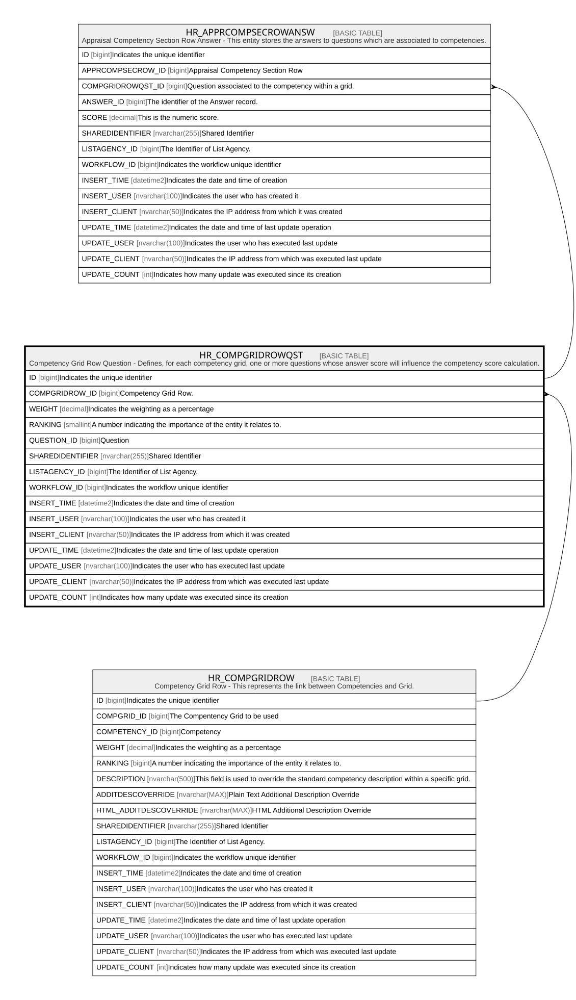

# HR_COMPGRIDROWQST

## Description

Competency Grid Row Question - Defines, for each competency grid, one or more questions whose answer score will influence the competency score calculation.  

## Columns

| Name | Type | Default | Nullable | Children | Parents | Comment |
| ---- | ---- | ------- | -------- | -------- | ------- | ------- |
| ID | bigint |  | false | [HR_APPRCOMPSECROWANSW](HR_APPRCOMPSECROWANSW.md) |  | Indicates the unique identifier |
| COMPGRIDROW_ID | bigint |  | true |  | [HR_COMPGRIDROW](HR_COMPGRIDROW.md) | Competency Grid Row. |
| WEIGHT | decimal |  | true |  |  | Indicates the weighting as a percentage |
| RANKING | smallint |  | true |  |  | A number indicating the importance of the entity it relates to. |
| QUESTION_ID | bigint |  | true |  |  | Question |
| SHAREDIDENTIFIER | nvarchar(255) |  | true |  |  | Shared Identifier |
| LISTAGENCY_ID | bigint |  | true |  |  | The Identifier of List Agency. |
| WORKFLOW_ID | bigint |  | true |  |  | Indicates the workflow unique identifier |
| INSERT_TIME | datetime2 | (sysutcdatetime()) | false |  |  | Indicates the date and time of creation |
| INSERT_USER | nvarchar(100) | (N'MAIN') | false |  |  | Indicates the user who has created it |
| INSERT_CLIENT | nvarchar(50) | (N'localhost') | false |  |  | Indicates the IP address from which it was created |
| UPDATE_TIME | datetime2 | (sysutcdatetime()) | false |  |  | Indicates the date and time of last update operation |
| UPDATE_USER | nvarchar(100) | (N'MAIN') | false |  |  | Indicates the user who has executed last update |
| UPDATE_CLIENT | nvarchar(50) | (N'localhost') | false |  |  | Indicates the IP address from which was executed last update |
| UPDATE_COUNT | int | ((0)) | false |  |  | Indicates how many update was executed since its creation |

## Constraints

| Name | Type | Definition |
| ---- | ---- | ---------- |
| PK_HR_COMPGRIDROWQST | PRIMARY KEY | CLUSTERED, unique, part of a PRIMARY KEY constraint, [ ID ] |
| UQ_COMPGRID_QUESTION | UNIQUE | NONCLUSTERED, unique, part of a UNIQUE constraint, [ COMPGRIDROW_ID, QUESTION_ID ] |
| FK_COMPGRIDROWQST_COMPGRIDROW | FOREIGN KEY | FOREIGN KEY(COMPGRIDROW_ID) REFERENCES HR_COMPGRIDROW(ID) ON UPDATE NO_ACTION ON DELETE NO_ACTION |

## Indexes

| Name | Definition |
| ---- | ---------- |
| PK_HR_COMPGRIDROWQST | CLUSTERED, unique, part of a PRIMARY KEY constraint, [ ID ] |
| UQ_COMPGRID_QUESTION | NONCLUSTERED, unique, part of a UNIQUE constraint, [ COMPGRIDROW_ID, QUESTION_ID ] |

## Relations

---

> Generated by [tbls](https://github.com/k1LoW/tbls)
