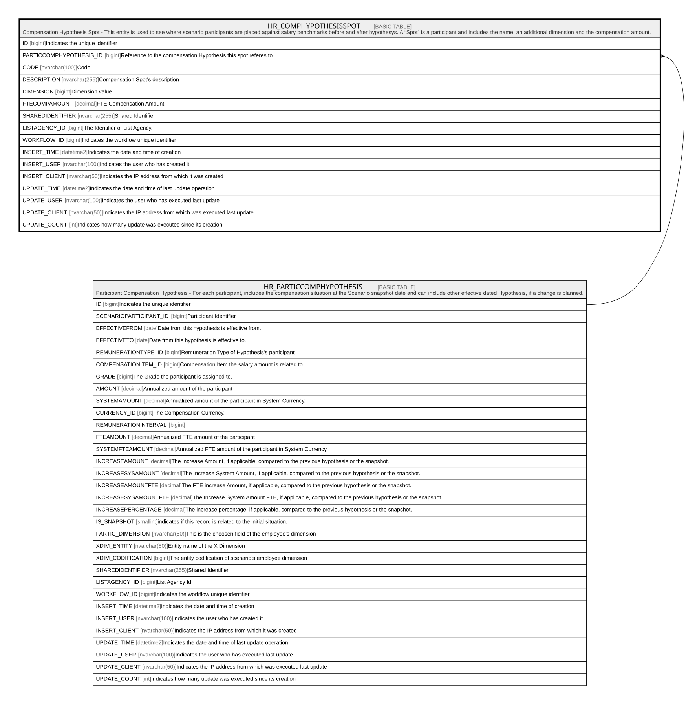

# HR_COMPHYPOTHESISSPOT

## Description

Compensation Hypothesis Spot - This entity is used to see where scenario participants are placed against salary benchmarks before and after hypothesys. A “Spot” is a participant and includes the name, an additional dimension and the compensation amount.  

## Columns

| Name | Type | Default | Nullable | Parents | Comment |
| ---- | ---- | ------- | -------- | ------- | ------- |
| ID | bigint |  | false |  | Indicates the unique identifier |
| PARTICCOMPHYPOTHESIS_ID | bigint |  | false | [HR_PARTICCOMPHYPOTHESIS](HR_PARTICCOMPHYPOTHESIS.md) | Reference to the compensation Hypothesis this spot referes to. |
| CODE | nvarchar(100) |  | true |  | Code |
| DESCRIPTION | nvarchar(255) |  | true |  | Compensation Spot's description |
| DIMENSION | bigint |  | true |  | Dimension value. |
| FTECOMPAMOUNT | decimal |  | true |  | FTE Compensation Amount |
| SHAREDIDENTIFIER | nvarchar(255) |  | true |  | Shared Identifier |
| LISTAGENCY_ID | bigint |  | true |  | The Identifier of List Agency. |
| WORKFLOW_ID | bigint |  | true |  | Indicates the workflow unique identifier |
| INSERT_TIME | datetime2 |  | false |  | Indicates the date and time of creation |
| INSERT_USER | nvarchar(100) |  | false |  | Indicates the user who has created it |
| INSERT_CLIENT | nvarchar(50) |  | false |  | Indicates the IP address from which it was created |
| UPDATE_TIME | datetime2 |  | false |  | Indicates the date and time of last update operation |
| UPDATE_USER | nvarchar(100) |  | false |  | Indicates the user who has executed last update |
| UPDATE_CLIENT | nvarchar(50) |  | false |  | Indicates the IP address from which was executed last update |
| UPDATE_COUNT | int |  | false |  | Indicates how many update was executed since its creation |

## Constraints

| Name | Type | Definition |
| ---- | ---- | ---------- |
| PK__HR_COMPH__3214EC27DB26C91D | PRIMARY KEY | CLUSTERED, unique, part of a PRIMARY KEY constraint, [ ID ] |
| UQ__HR_COMPH__EBF403BCABEB03C1 | UNIQUE | NONCLUSTERED, unique, part of a UNIQUE constraint, [ PARTICCOMPHYPOTHESIS_ID ] |
| FK__HR_COMPHY__PARTI__1571C0B7 | FOREIGN KEY | FOREIGN KEY(PARTICCOMPHYPOTHESIS_ID) REFERENCES HR_PARTICCOMPHYPOTHESIS(ID) ON UPDATE NO_ACTION ON DELETE CASCADE |

## Indexes

| Name | Definition |
| ---- | ---------- |
| PK__HR_COMPH__3214EC27DB26C91D | CLUSTERED, unique, part of a PRIMARY KEY constraint, [ ID ] |
| UQ__HR_COMPH__EBF403BCABEB03C1 | NONCLUSTERED, unique, part of a UNIQUE constraint, [ PARTICCOMPHYPOTHESIS_ID ] |

## Relations

---

> Generated by [tbls](https://github.com/k1LoW/tbls)
