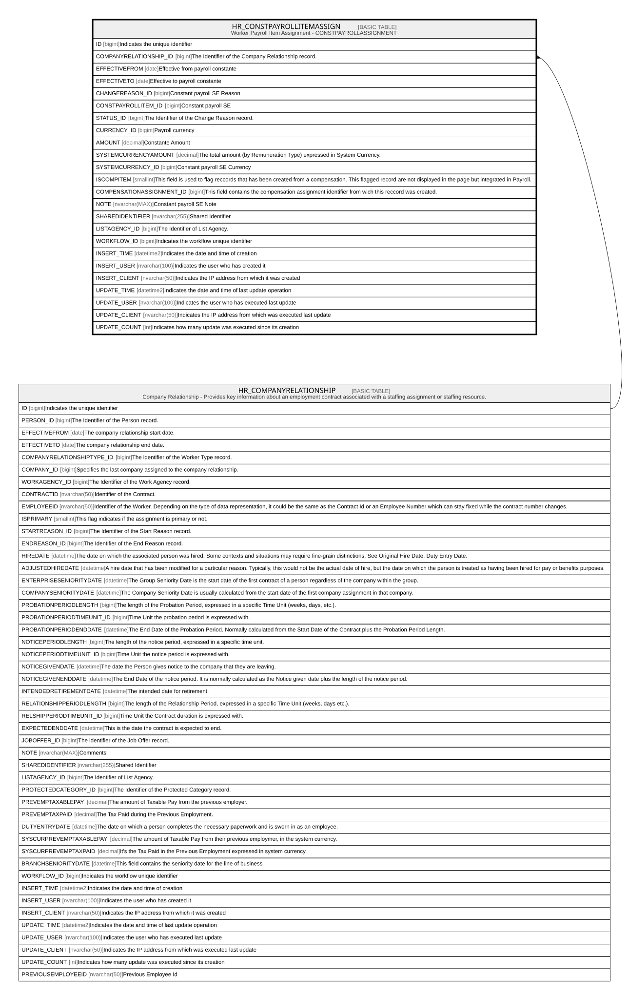

# HR_CONSTPAYROLLITEMASSIGN

## Description

Worker Payroll Item Assignment - CONSTPAYROLLASSIGNMENT  

## Columns

| Name | Type | Default | Nullable | Parents | Comment |
| ---- | ---- | ------- | -------- | ------- | ------- |
| ID | bigint |  | false |  | Indicates the unique identifier |
| COMPANYRELATIONSHIP_ID | bigint |  | false | [HR_COMPANYRELATIONSHIP](HR_COMPANYRELATIONSHIP.md) | The Identifier of the Company Relationship record. |
| EFFECTIVEFROM | date |  | false |  | Effective from payroll constante |
| EFFECTIVETO | date |  | true |  | Effective to payroll constante |
| CHANGEREASON_ID | bigint |  | true |  | Constant payroll SE Reason  |
| CONSTPAYROLLITEM_ID | bigint |  | true |  | Constant payroll SE  |
| STATUS_ID | bigint |  | true |  | The Identifier of the Change Reason record. |
| CURRENCY_ID | bigint |  | true |  | Payroll currency |
| AMOUNT | decimal |  | true |  | Constante Amount |
| SYSTEMCURRENCYAMOUNT | decimal |  | true |  | The total amount (by Remuneration Type) expressed in System Currency. |
| SYSTEMCURRENCY_ID | bigint |  | true |  | Constant payroll SE Currency |
| ISCOMPITEM | smallint |  | true |  | This field is used to flag reccords that has been created from a compensation. This flagged record are not displayed in the page but integrated in Payroll. |
| COMPENSATIONASSIGNMENT_ID | bigint |  | true |  | This field contains the compensation assignment identifier from wich this reccord was created. |
| NOTE | nvarchar(MAX) |  | true |  | Constant payroll SE Note |
| SHAREDIDENTIFIER | nvarchar(255) |  | true |  | Shared Identifier |
| LISTAGENCY_ID | bigint |  | true |  | The Identifier of List Agency. |
| WORKFLOW_ID | bigint |  | true |  | Indicates the workflow unique identifier |
| INSERT_TIME | datetime2 | (sysutcdatetime()) | false |  | Indicates the date and time of creation |
| INSERT_USER | nvarchar(100) | (N'MAIN') | false |  | Indicates the user who has created it |
| INSERT_CLIENT | nvarchar(50) | (N'localhost') | false |  | Indicates the IP address from which it was created |
| UPDATE_TIME | datetime2 | (sysutcdatetime()) | false |  | Indicates the date and time of last update operation |
| UPDATE_USER | nvarchar(100) | (N'MAIN') | true |  | Indicates the user who has executed last update |
| UPDATE_CLIENT | nvarchar(50) | (N'localhost') | false |  | Indicates the IP address from which was executed last update |
| UPDATE_COUNT | int | ((0)) | false |  | Indicates how many update was executed since its creation |

## Constraints

| Name | Type | Definition |
| ---- | ---- | ---------- |
| PK_CONSTPAYROLLITEMASSIGN | PRIMARY KEY | CLUSTERED, unique, part of a PRIMARY KEY constraint, [ ID ] |
| UQ_CONSTPAYROLLITEMASSIGN | UNIQUE | NONCLUSTERED, unique, part of a UNIQUE constraint, [ COMPANYRELATIONSHIP_ID, EFFECTIVEFROM, CONSTPAYROLLITEM_ID ] |
| FK_CONSTPAYA_COMPRELATIONSHIP | FOREIGN KEY | FOREIGN KEY(COMPANYRELATIONSHIP_ID) REFERENCES HR_COMPANYRELATIONSHIP(ID) ON UPDATE NO_ACTION ON DELETE CASCADE |

## Indexes

| Name | Definition |
| ---- | ---------- |
| PK_CONSTPAYROLLITEMASSIGN | CLUSTERED, unique, part of a PRIMARY KEY constraint, [ ID ] |
| UQ_CONSTPAYROLLITEMASSIGN | NONCLUSTERED, unique, part of a UNIQUE constraint, [ COMPANYRELATIONSHIP_ID, EFFECTIVEFROM, CONSTPAYROLLITEM_ID ] |
| IDX_CONSTPAYROLLITEMASS_CHANGE | NONCLUSTERED, [ CHANGEREASON_ID ] |
| IDX_CONSTPAYROLLITEMASS_COMP | NONCLUSTERED, [ CONSTPAYROLLITEM_ID ] |
| IDX_CONSTPAYROLLITEMASS_CUR | NONCLUSTERED, [ CURRENCY_ID ] |
| IDX_CONSTPAYROLLITEMASS_SYSCUR | NONCLUSTERED, [ SYSTEMCURRENCY_ID ] |
| IDX_CONSTPAYROLLITEMASSIGN_S | NONCLUSTERED, [ COMPANYRELATIONSHIP_ID, EFFECTIVEFROM, EFFECTIVETO ] |

## Relations

---

> Generated by [tbls](https://github.com/k1LoW/tbls)
