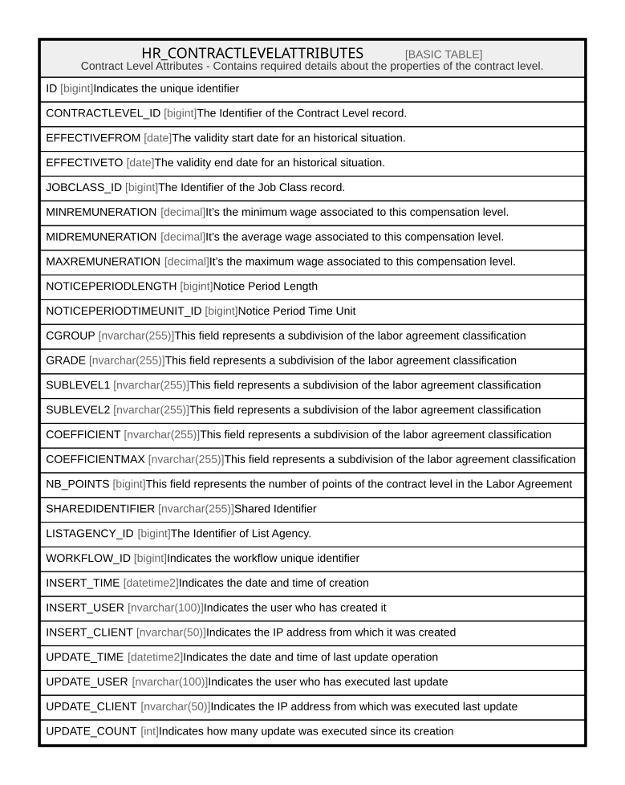

# HR_CONTRACTLEVELATTRIBUTES

## Description

Contract Level Attributes - Contains required details about the properties of the contract level.  

## Columns

| Name | Type | Default | Nullable | Comment |
| ---- | ---- | ------- | -------- | ------- |
| ID | bigint |  | false | Indicates the unique identifier |
| CONTRACTLEVEL_ID | bigint |  | true | The Identifier of the Contract Level record. |
| EFFECTIVEFROM | date |  | true | The validity start date for an historical situation. |
| EFFECTIVETO | date |  | true | The validity end date for an historical situation. |
| JOBCLASS_ID | bigint |  | true | The Identifier of the Job Class record. |
| MINREMUNERATION | decimal |  | true | It’s the minimum wage associated to this compensation level. |
| MIDREMUNERATION | decimal |  | true | It’s the average wage associated to this compensation level. |
| MAXREMUNERATION | decimal |  | true | It’s the maximum wage associated to this compensation level. |
| NOTICEPERIODLENGTH | bigint |  | true | Notice Period Length |
| NOTICEPERIODTIMEUNIT_ID | bigint |  | true | Notice Period Time Unit |
| CGROUP | nvarchar(255) |  | true | This field represents a subdivision of the labor agreement classification |
| GRADE | nvarchar(255) |  | true | This field represents a subdivision of the labor agreement classification |
| SUBLEVEL1 | nvarchar(255) |  | true | This field represents a subdivision of the labor agreement classification |
| SUBLEVEL2 | nvarchar(255) |  | true | This field represents a subdivision of the labor agreement classification |
| COEFFICIENT | nvarchar(255) |  | true | This field represents a subdivision of the labor agreement classification |
| COEFFICIENTMAX | nvarchar(255) |  | true | This field represents a subdivision of the labor agreement classification |
| NB_POINTS | bigint |  | true | This field represents the number of points of the contract level in the Labor Agreement |
| SHAREDIDENTIFIER | nvarchar(255) |  | true | Shared Identifier |
| LISTAGENCY_ID | bigint |  | true | The Identifier of List Agency. |
| WORKFLOW_ID | bigint |  | true | Indicates the workflow unique identifier |
| INSERT_TIME | datetime2 | (sysutcdatetime()) | false | Indicates the date and time of creation |
| INSERT_USER | nvarchar(100) | (N'MAIN') | false | Indicates the user who has created it |
| INSERT_CLIENT | nvarchar(50) | (N'localhost') | false | Indicates the IP address from which it was created |
| UPDATE_TIME | datetime2 | (sysutcdatetime()) | false | Indicates the date and time of last update operation |
| UPDATE_USER | nvarchar(100) | (N'MAIN') | false | Indicates the user who has executed last update |
| UPDATE_CLIENT | nvarchar(50) | (N'localhost') | false | Indicates the IP address from which was executed last update |
| UPDATE_COUNT | int | ((0)) | false | Indicates how many update was executed since its creation |

## Constraints

| Name | Type | Definition |
| ---- | ---- | ---------- |
| PK_CONTRACTLEVELATTRIBUTES | PRIMARY KEY | CLUSTERED, unique, part of a PRIMARY KEY constraint, [ ID ] |

## Indexes

| Name | Definition |
| ---- | ---------- |
| PK_CONTRACTLEVELATTRIBUTES | CLUSTERED, unique, part of a PRIMARY KEY constraint, [ ID ] |
| IDX_CONTLEVATTR_JOBCLASS | NONCLUSTERED, [ JOBCLASS_ID ] |
| IDX_CONTLEVATTR_NOTPERLENG | NONCLUSTERED, [ NOTICEPERIODTIMEUNIT_ID ] |

## Relations

---

> Generated by [tbls](https://github.com/k1LoW/tbls)
