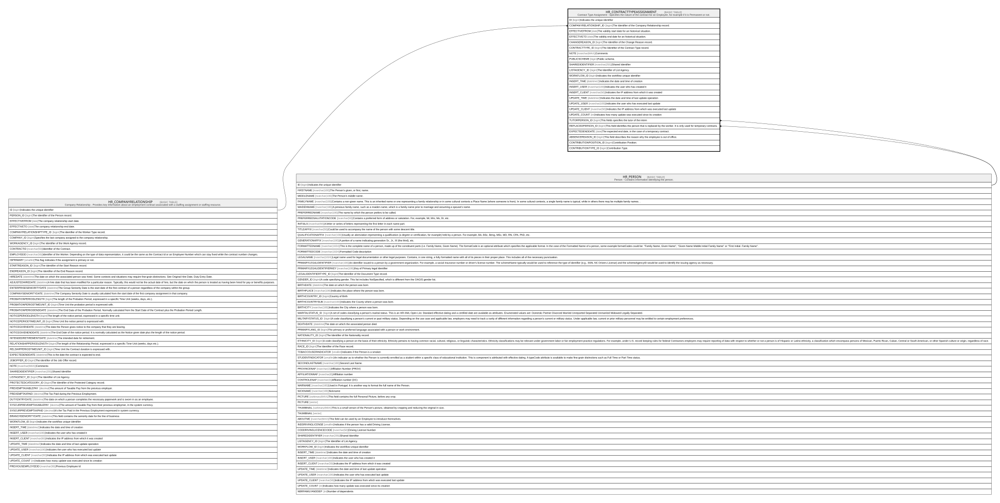

# HR_CONTRACTTYPEASSIGNMENT

## Description

Contract Type Assignment - Specifies the nature of the contract for an Employee, for example if it is Permanent or not.  

## Columns

| Name | Type | Default | Nullable | Parents | Comment |
| ---- | ---- | ------- | -------- | ------- | ------- |
| ID | bigint |  | false |  | Indicates the unique identifier |
| COMPANYRELATIONSHIP_ID | bigint |  | false | [HR_COMPANYRELATIONSHIP](HR_COMPANYRELATIONSHIP.md) | The Identifier of the Company Relationship record. |
| EFFECTIVEFROM | date |  | false |  | The validity start date for an historical situation. |
| EFFECTIVETO | date |  | true |  | The validity end date for an historical situation. |
| CHANGEREASON_ID | bigint |  | true |  | The Identifier of the Change Reason record. |
| CONTRACTTYPE_ID | bigint |  | true |  | The Identifier of the Contract Type record. |
| NOTE | nvarchar(MAX) |  | true |  | Comments |
| PUBLICSCHEME | bigint |  | true |  | Public scheme. |
| SHAREDIDENTIFIER | nvarchar(255) |  | true |  | Shared Identifier |
| LISTAGENCY_ID | bigint |  | true |  | The Identifier of List Agency. |
| WORKFLOW_ID | bigint |  | true |  | Indicates the workflow unique identifier |
| INSERT_TIME | datetime2 | (sysutcdatetime()) | false |  | Indicates the date and time of creation |
| INSERT_USER | nvarchar(100) | (N'MAIN') | false |  | Indicates the user who has created it |
| INSERT_CLIENT | nvarchar(50) | (N'localhost') | false |  | Indicates the IP address from which it was created |
| UPDATE_TIME | datetime2 | (sysutcdatetime()) | false |  | Indicates the date and time of last update operation |
| UPDATE_USER | nvarchar(100) | (N'MAIN') | false |  | Indicates the user who has executed last update |
| UPDATE_CLIENT | nvarchar(50) | (N'localhost') | false |  | Indicates the IP address from which was executed last update |
| UPDATE_COUNT | int | ((0)) | false |  | Indicates how many update was executed since its creation |
| TUTORPERSON_ID | bigint |  | true | [HR_PERSON](HR_PERSON.md) | This fields specifies the tutor of the intern |
| REPLACEDPERSON_ID | bigint |  | true | [HR_PERSON](HR_PERSON.md) | This field identifies the person that is replaced by the worker. It is only used for temporary contracts. |
| EXPECTEDENDDATE | date |  | true |  | The expected end date, in the case of a temporary contract. |
| ABSENCEREASON_ID | bigint |  | true |  | This field describes the reason why the employee is out of office. |
| CONTRIBUTIONPOSITION_ID | bigint |  | true |  | Contribution Position. |
| CONTRIBUTIONTYPE_ID | bigint |  | true |  | Contribution Type. |

## Constraints

| Name | Type | Definition |
| ---- | ---- | ---------- |
| PK_CONTRACTTYPEASSIGNMENT | PRIMARY KEY | CLUSTERED, unique, part of a PRIMARY KEY constraint, [ ID ] |
| FK_CONTRTERM_COMPRELATIONSHIP | FOREIGN KEY | FOREIGN KEY(COMPANYRELATIONSHIP_ID) REFERENCES HR_COMPANYRELATIONSHIP(ID) ON UPDATE NO_ACTION ON DELETE CASCADE |
| FK_CONTRTERM_PERSON | FOREIGN KEY | FOREIGN KEY(TUTORPERSON_ID) REFERENCES HR_PERSON(ID) ON UPDATE NO_ACTION ON DELETE NO_ACTION |
| FK_CONTRTERM_PERSON2 | FOREIGN KEY | FOREIGN KEY(REPLACEDPERSON_ID) REFERENCES HR_PERSON(ID) ON UPDATE NO_ACTION ON DELETE NO_ACTION |

## Indexes

| Name | Definition |
| ---- | ---------- |
| PK_CONTRACTTYPEASSIGNMENT | CLUSTERED, unique, part of a PRIMARY KEY constraint, [ ID ] |
| IDX_CONTRACTTYPEASSIGNMENT | NONCLUSTERED, unique, [ COMPANYRELATIONSHIP_ID, EFFECTIVEFROM, CONTRACTTYPE_ID ] |
| IDX_CONTYPEASSIGNMENT_CHANGE | NONCLUSTERED, [ CHANGEREASON_ID ] |
| IDX_CONTYPEASSIGNMENT_CONTR | NONCLUSTERED, [ CONTRACTTYPE_ID ] |
| IDX_CONTYPEASSIGNMENT_PUBL | NONCLUSTERED, [ PUBLICSCHEME ] |
| IDX_CONTYPEASSIGNMENT_ABS | NONCLUSTERED, [ ABSENCEREASON_ID ] |
| IDX_CONTYPEASSIGNMENT_CONPOS | NONCLUSTERED, [ CONTRIBUTIONPOSITION_ID ] |
| IDX_CONTYPEASSIGNMENT_CONTYPE | NONCLUSTERED, [ CONTRIBUTIONTYPE_ID ] |
| IDX_CONTRACTTYPEASSIGNMENT_P | NONCLUSTERED, [ COMPANYRELATIONSHIP_ID, EFFECTIVEFROM, EFFECTIVETO, CONTRACTTYPE_ID ] |

## Relations

---

> Generated by [tbls](https://github.com/k1LoW/tbls)
