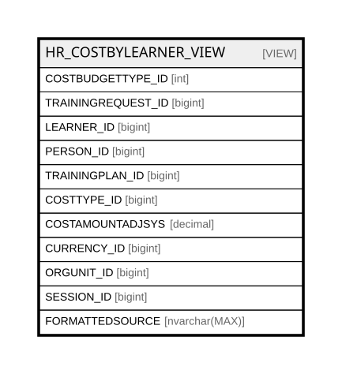

# HR_COSTBYLEARNER_VIEW

## Description

<details>
<summary><strong>Table Definition</strong></summary>

```sql
-- Talentia Software - All right reserved
-- Type: VIEW                     Name: HR_COSTBYLEARNER_VIEW
-- Date: 09-04-2026 07:27:59 (UTC)
-- 
-- ChangeLogId: 00000000-0000-0000-0000-000000000000
-- ChangeSetId: 768cd541-fe6b-4a7e-968a-a5a1682baa0e
-- Original file name: C:\repos\Talentia-Software\hcm-core/DB/ProductDB/EDM\Schema\Views\HR_COSTBYLEARNER_VIEW.xml


CREATE VIEW [HR_COSTBYLEARNER_VIEW]
 ( COSTBUDGETTYPE_ID, TRAININGREQUEST_ID, LEARNER_ID, PERSON_ID, TRAININGPLAN_ID, COSTTYPE_ID, COSTAMOUNTADJSYS, CURRENCY_ID, ORGUNIT_ID, SESSION_ID, FORMATTEDSOURCE ) 
 AS 
( SELECT 1182265 AS COSTBUDGETTYPE_ID, HR_LEARNER.TRAININGREQUEST_ID, LEARNER_ID, HR_LEARNER.PERSON_ID, (CASE WHEN HR_TRAININGREQUEST.ID IS NULL THEN HR_SESSION.TRAININGPLAN_ID ELSE HR_TRAININGREQUEST.TRAININGPLAN_ID END) as TRAININGPLAN_ID, COSTTYPE_ID, COSTAMOUNTADJSYS, (SELECT top 1 TF_CODES.ID FROM TF_TENANT_PROPERTIES LEFT OUTER JOIN TF_CODES ON (TF_TENANT_PROPERTIES.VALUE=TF_CODES.CODE) WHERE TF_TENANT_PROPERTIES.NAME='SystemCurrency' AND TF_CODES.ENTITY_ID='a5f9178d-6c1c-47b4-8f44-5c4f3b1d6cce' order by TF_TENANT_PROPERTIES.IS_CUSTOM DESC) as CURRENCY_ID, ORGUNIT_ID, SESSION_ID, LEARNERDESCRIPTION as FORMATTEDSOURCE
FROM HR_LEARNERCOSTS 
INNER JOIN HR_LEARNER ON (HR_LEARNERCOSTS.LEARNER_ID = HR_LEARNER.ID AND HR_LEARNER.LEARNERSTATUS_ID = 1900039) 
LEFT OUTER JOIN HR_TRAININGREQUEST ON (HR_LEARNER.TRAININGREQUEST_ID = HR_TRAININGREQUEST.ID AND HR_TRAININGREQUEST.STATUS_ID = 1930108) 
INNER JOIN HR_SESSION ON (HR_LEARNER.SESSION_ID = HR_SESSION.ID) 
LEFT OUTER JOIN HR_ORGUNITASSIGNMENT ON (HR_LEARNER.COMPANYRELATIONSHIP_ID = HR_ORGUNITASSIGNMENT.COMPANYRELATIONSHIP_ID AND HR_LEARNER.DTA_JOINEDDON 
BETWEEN HR_ORGUNITASSIGNMENT.EFFECTIVEFROM AND HR_ORGUNITASSIGNMENT.EFFECTIVETO AND HR_ORGUNITASSIGNMENT.ISPRIMARY = 1) 
UNION ALL 
SELECT 1182264 AS COSTBUDGETTYPE_ID, HR_LEARNER.TRAININGREQUEST_ID, LEARNER_ID, HR_LEARNER.PERSON_ID, (CASE WHEN HR_TRAININGREQUEST.ID IS NULL THEN HR_SESSION.TRAININGPLAN_ID ELSE HR_TRAININGREQUEST.TRAININGPLAN_ID END) as TRAININGPLAN_ID, COSTTYPE_ID, COSTAMOUNTADJSYS, (SELECT top 1 TF_CODES.ID FROM TF_TENANT_PROPERTIES LEFT OUTER JOIN TF_CODES ON (TF_TENANT_PROPERTIES.VALUE=TF_CODES.CODE) WHERE TF_TENANT_PROPERTIES.NAME='SystemCurrency' AND TF_CODES.ENTITY_ID='a5f9178d-6c1c-47b4-8f44-5c4f3b1d6cce' order by TF_TENANT_PROPERTIES.IS_CUSTOM DESC) as CURRENCY_ID, ORGUNIT_ID, SESSION_ID, LEARNERDESCRIPTION as FORMATTEDSOURCE
FROM HR_LERNFORECASTCOSTS 
INNER JOIN HR_LEARNER ON (HR_LERNFORECASTCOSTS.LEARNER_ID = HR_LEARNER.ID AND HR_LEARNER.LEARNERSTATUS_ID = 1900039) 
LEFT OUTER JOIN HR_TRAININGREQUEST ON (HR_LEARNER.TRAININGREQUEST_ID = HR_TRAININGREQUEST.ID AND HR_TRAININGREQUEST.STATUS_ID = 1930108) 
INNER JOIN HR_SESSION ON (HR_LEARNER.SESSION_ID = HR_SESSION.ID)
LEFT OUTER JOIN HR_ORGUNITASSIGNMENT ON (HR_LEARNER.COMPANYRELATIONSHIP_ID = HR_ORGUNITASSIGNMENT.COMPANYRELATIONSHIP_ID AND HR_LEARNER.DTA_JOINEDDON 
BETWEEN HR_ORGUNITASSIGNMENT.EFFECTIVEFROM AND HR_ORGUNITASSIGNMENT.EFFECTIVETO AND HR_ORGUNITASSIGNMENT.ISPRIMARY = 1) 
UNION ALL 
SELECT 1186015 AS COSTBUDGETTYPE_ID, HR_LEARNER.TRAININGREQUEST_ID, LEARNER_ID, HR_LEARNER.PERSON_ID, (CASE WHEN HR_TRAININGREQUEST.ID IS NULL THEN HR_SESSION.TRAININGPLAN_ID ELSE HR_TRAININGREQUEST.TRAININGPLAN_ID END) as TRAININGPLAN_ID, COSTTYPE_ID, HR_FORECASTCOSTFINANCING.AMOUNTADJUSTEDSYS, (SELECT top 1 TF_CODES.ID FROM TF_TENANT_PROPERTIES LEFT OUTER JOIN TF_CODES ON (TF_TENANT_PROPERTIES.VALUE=TF_CODES.CODE) WHERE TF_TENANT_PROPERTIES.NAME='SystemCurrency' AND TF_CODES.ENTITY_ID='a5f9178d-6c1c-47b4-8f44-5c4f3b1d6cce' order by TF_TENANT_PROPERTIES.IS_CUSTOM DESC) as CURRENCY_ID, ORGUNIT_ID,  SESSION_ID, LEARNERDESCRIPTION as FORMATTEDSOURCE
FROM HR_FORECASTCOSTFINANCING
LEFT OUTER JOIN HR_LERNFORECASTCOSTS ON (HR_LERNFORECASTCOSTS.ID = HR_FORECASTCOSTFINANCING.LEARNERFORECASTCOSTS_ID)
INNER JOIN HR_LEARNER ON (HR_LERNFORECASTCOSTS.LEARNER_ID = HR_LEARNER.ID AND HR_LEARNER.LEARNERSTATUS_ID = 1900039) 
LEFT OUTER JOIN HR_TRAININGREQUEST ON (HR_LEARNER.TRAININGREQUEST_ID = HR_TRAININGREQUEST.ID AND HR_TRAININGREQUEST.STATUS_ID = 1930108) 
INNER JOIN HR_SESSION ON (HR_LEARNER.SESSION_ID = HR_SESSION.ID) 
LEFT OUTER JOIN HR_ORGUNITASSIGNMENT ON (HR_LEARNER.COMPANYRELATIONSHIP_ID = HR_ORGUNITASSIGNMENT.COMPANYRELATIONSHIP_ID AND HR_LEARNER.DTA_JOINEDDON BETWEEN HR_ORGUNITASSIGNMENT.EFFECTIVEFROM AND HR_ORGUNITASSIGNMENT.EFFECTIVETO AND HR_ORGUNITASSIGNMENT.ISPRIMARY = 1) 
UNION ALL
SELECT 1186016 AS COSTBUDGETTYPE_ID, HR_LEARNER.TRAININGREQUEST_ID, LEARNER_ID, HR_LEARNER.PERSON_ID, (CASE WHEN HR_TRAININGREQUEST.ID IS NULL THEN HR_SESSION.TRAININGPLAN_ID ELSE HR_TRAININGREQUEST.TRAININGPLAN_ID END) as TRAININGPLAN_ID, COSTTYPE_ID, HR_LEARNERCOSTFINANCING.AMOUNTADJUSTEDSYS, (SELECT top 1 TF_CODES.ID FROM TF_TENANT_PROPERTIES LEFT OUTER JOIN TF_CODES ON (TF_TENANT_PROPERTIES.VALUE=TF_CODES.CODE) WHERE TF_TENANT_PROPERTIES.NAME='SystemCurrency' AND TF_CODES.ENTITY_ID='a5f9178d-6c1c-47b4-8f44-5c4f3b1d6cce' order by TF_TENANT_PROPERTIES.IS_CUSTOM DESC) as CURRENCY_ID, ORGUNIT_ID,  SESSION_ID, LEARNERDESCRIPTION as FORMATTEDSOURCE
FROM HR_LEARNERCOSTFINANCING
LEFT OUTER JOIN HR_LEARNERCOSTS ON (HR_LEARNERCOSTS.ID = HR_LEARNERCOSTFINANCING.LEARNERCOSTS_ID)
INNER JOIN HR_LEARNER ON (HR_LEARNERCOSTS.LEARNER_ID = HR_LEARNER.ID AND HR_LEARNER.LEARNERSTATUS_ID = 1900039) 
LEFT OUTER JOIN HR_TRAININGREQUEST ON (HR_LEARNER.TRAININGREQUEST_ID = HR_TRAININGREQUEST.ID AND HR_TRAININGREQUEST.STATUS_ID = 1930108) 
INNER JOIN HR_SESSION ON (HR_LEARNER.SESSION_ID = HR_SESSION.ID) 
LEFT OUTER JOIN HR_ORGUNITASSIGNMENT ON (HR_LEARNER.COMPANYRELATIONSHIP_ID = HR_ORGUNITASSIGNMENT.COMPANYRELATIONSHIP_ID AND HR_LEARNER.DTA_JOINEDDON 
BETWEEN HR_ORGUNITASSIGNMENT.EFFECTIVEFROM AND HR_ORGUNITASSIGNMENT.EFFECTIVETO AND HR_ORGUNITASSIGNMENT.ISPRIMARY = 1)
UNION ALL
SELECT        1435951 AS COSTBUDGETTYPE_ID, HR_LEARNER.TRAININGREQUEST_ID, HR_LEARNERCOSTS.LEARNER_ID, HR_LEARNER.PERSON_ID, COALESCE (HR_TRAININGREQUEST.TRAININGPLAN_ID, 
                         HR_SESSION.TRAININGPLAN_ID) AS TRAININGPLAN_ID, HR_LEARNERCOSTS.COSTTYPE_ID, MAX(HR_LEARNERCOSTS.COSTAMOUNTADJSYS) - SUM(COALESCE (HR_LEARNERCOSTFINANCING.AMOUNTADJUSTEDSYS, 0)) 
                         AS REAL_COSTS, TF_CODES.ID AS CURRENCY_ID, HR_ORGUNITASSIGNMENT.ORGUNIT_ID, HR_LEARNER.SESSION_ID, HR_LEARNER.LEARNERDESCRIPTION AS FORMATTEDSOURCE
FROM            HR_LEARNERCOSTS LEFT OUTER JOIN
                         HR_LEARNERCOSTFINANCING ON HR_LEARNERCOSTS.ID = HR_LEARNERCOSTFINANCING.LEARNERCOSTS_ID INNER JOIN
                         HR_LEARNER ON HR_LEARNERCOSTS.LEARNER_ID = HR_LEARNER.ID AND HR_LEARNER.LEARNERSTATUS_ID = 1900039 LEFT OUTER JOIN
                         HR_TRAININGREQUEST ON HR_LEARNER.TRAININGREQUEST_ID = HR_TRAININGREQUEST.ID AND HR_TRAININGREQUEST.STATUS_ID = 1930108 INNER JOIN
                         HR_SESSION ON HR_LEARNER.SESSION_ID = HR_SESSION.ID LEFT OUTER JOIN
                         HR_ORGUNITASSIGNMENT ON HR_LEARNER.COMPANYRELATIONSHIP_ID = HR_ORGUNITASSIGNMENT.COMPANYRELATIONSHIP_ID AND HR_LEARNER.DTA_JOINEDDON BETWEEN 
                         HR_ORGUNITASSIGNMENT.EFFECTIVEFROM AND HR_ORGUNITASSIGNMENT.EFFECTIVETO AND HR_ORGUNITASSIGNMENT.ISPRIMARY = 1 LEFT OUTER JOIN
                         TF_TENANT_PROPERTIES ON TF_TENANT_PROPERTIES.NAME = 'SystemCurrency' LEFT OUTER JOIN
                         TF_CODES ON TF_TENANT_PROPERTIES.VALUE = TF_CODES.CODE AND TF_CODES.ENTITY_ID = 'a5f9178d-6c1c-47b4-8f44-5c4f3b1d6cce'
GROUP BY HR_LEARNER.TRAININGREQUEST_ID, HR_LEARNERCOSTS.LEARNER_ID, HR_LEARNER.PERSON_ID, COALESCE (HR_TRAININGREQUEST.TRAININGPLAN_ID, HR_SESSION.TRAININGPLAN_ID), 
                         HR_LEARNERCOSTS.COSTTYPE_ID, HR_ORGUNITASSIGNMENT.ORGUNIT_ID, HR_LEARNER.SESSION_ID, HR_LEARNER.LEARNERDESCRIPTION, TF_CODES.ID
UNION ALL
SELECT        1435950 AS COSTBUDGETTYPE_ID, HR_LEARNER.TRAININGREQUEST_ID, HR_LERNFORECASTCOSTS.LEARNER_ID, HR_LEARNER.PERSON_ID, COALESCE (HR_TRAININGREQUEST.TRAININGPLAN_ID, 
                         HR_SESSION.TRAININGPLAN_ID) AS TRAININGPLAN_ID, HR_LERNFORECASTCOSTS.COSTTYPE_ID, MAX(HR_LERNFORECASTCOSTS.COSTAMOUNTADJSYS) 
                         - SUM(COALESCE (HR_FORECASTCOSTFINANCING.AMOUNTADJUSTEDSYS, 0)) AS ENGAGED_COSTS, TF_CODES.ID AS CURRENCY_ID, HR_ORGUNITASSIGNMENT.ORGUNIT_ID, HR_LEARNER.SESSION_ID, 
                         HR_LEARNER.LEARNERDESCRIPTION AS FORMATTEDSOURCE
FROM            HR_LERNFORECASTCOSTS LEFT OUTER JOIN
                         HR_FORECASTCOSTFINANCING ON HR_LERNFORECASTCOSTS.ID = HR_FORECASTCOSTFINANCING.LEARNERFORECASTCOSTS_ID INNER JOIN
                         HR_LEARNER ON HR_LERNFORECASTCOSTS.LEARNER_ID = HR_LEARNER.ID AND HR_LEARNER.LEARNERSTATUS_ID = 1900039 LEFT OUTER JOIN
                         HR_TRAININGREQUEST ON HR_LEARNER.TRAININGREQUEST_ID = HR_TRAININGREQUEST.ID AND HR_TRAININGREQUEST.STATUS_ID = 1930108 INNER JOIN
                         HR_SESSION ON HR_LEARNER.SESSION_ID = HR_SESSION.ID LEFT OUTER JOIN
                         HR_ORGUNITASSIGNMENT ON HR_LEARNER.COMPANYRELATIONSHIP_ID = HR_ORGUNITASSIGNMENT.COMPANYRELATIONSHIP_ID AND HR_LEARNER.DTA_JOINEDDON BETWEEN 
                         HR_ORGUNITASSIGNMENT.EFFECTIVEFROM AND HR_ORGUNITASSIGNMENT.EFFECTIVETO AND HR_ORGUNITASSIGNMENT.ISPRIMARY = 1 LEFT OUTER JOIN
                         TF_TENANT_PROPERTIES ON TF_TENANT_PROPERTIES.NAME = 'SystemCurrency' LEFT OUTER JOIN
                         TF_CODES ON TF_TENANT_PROPERTIES.VALUE = TF_CODES.CODE AND TF_CODES.ENTITY_ID = 'a5f9178d-6c1c-47b4-8f44-5c4f3b1d6cce'
GROUP BY HR_LEARNER.TRAININGREQUEST_ID, HR_LERNFORECASTCOSTS.LEARNER_ID, HR_LEARNER.PERSON_ID, COALESCE (HR_TRAININGREQUEST.TRAININGPLAN_ID, HR_SESSION.TRAININGPLAN_ID), 
                         HR_LERNFORECASTCOSTS.COSTTYPE_ID, HR_ORGUNITASSIGNMENT.ORGUNIT_ID, HR_LEARNER.SESSION_ID, HR_LEARNER.LEARNERDESCRIPTION, TF_CODES.ID )

```

</details>

## Columns

| Name | Type | Default | Nullable | Comment |
| ---- | ---- | ------- | -------- | ------- |
| COSTBUDGETTYPE_ID | int |  | false |  |
| TRAININGREQUEST_ID | bigint |  | true |  |
| LEARNER_ID | bigint |  | true |  |
| PERSON_ID | bigint |  | false |  |
| TRAININGPLAN_ID | bigint |  | true |  |
| COSTTYPE_ID | bigint |  | true |  |
| COSTAMOUNTADJSYS | decimal |  | true |  |
| CURRENCY_ID | bigint |  | true |  |
| ORGUNIT_ID | bigint |  | true |  |
| SESSION_ID | bigint |  | false |  |
| FORMATTEDSOURCE | nvarchar(MAX) |  | true |  |

## Referenced Tables

| Name | Columns | Comment | Type |
| ---- | ------- | ------- | ---- |
| [TF_TENANT_PROPERTIES](TF_TENANT_PROPERTIES.md) | 17 | Tenant Properties - TF_TENANT_PROPERTIES<br /> | BASIC TABLE |
| [TF_CODES](TF_CODES.md) | 87 |  | BASIC TABLE |
| [HR_LEARNERCOSTS](HR_LEARNERCOSTS.md) | 21 | Learner Costs - This entity contains the costs related to a learner.<br /> | BASIC TABLE |
| [HR_LEARNER](HR_LEARNER.md) | 43 | Learner - This is the entity representing a person enrolled or candidate to a course.<br /> | BASIC TABLE |
| [HR_TRAININGREQUEST](HR_TRAININGREQUEST.md) | 36 | Training Request - description of entity training request<br /> | BASIC TABLE |
| [HR_SESSION](HR_SESSION.md) | 47 | Session - This entity contains training session.<br /> | BASIC TABLE |
| [HR_ORGUNITASSIGNMENT](HR_ORGUNITASSIGNMENT.md) | 21 | Organizational Deployment - Is the position or designation of the person within the given organization. Examples are Director, Software Engineer, Purchasing Manager etc.<br /> | BASIC TABLE |
| [HR_LERNFORECASTCOSTS](HR_LERNFORECASTCOSTS.md) | 21 | Learner Forecast Costs - The currency of the course cost.<br /> | BASIC TABLE |
| [HR_FORECASTCOSTFINANCING](HR_FORECASTCOSTFINANCING.md) | 19 | Forecast Costs Financing - Contains the financed forecast costs.<br /> | BASIC TABLE |
| [HR_LEARNERCOSTFINANCING](HR_LEARNERCOSTFINANCING.md) | 19 | Actual Costs Financing - Contains the financed actual costs.<br /> | BASIC TABLE |

## Relations



---

> Generated by [tbls](https://github.com/k1LoW/tbls)
