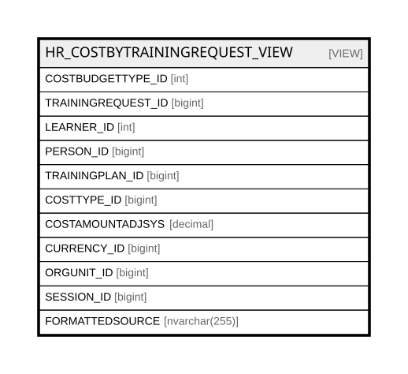

# HR_COSTBYTRAININGREQUEST_VIEW

## Description

<details>
<summary><strong>Table Definition</strong></summary>

```sql
-- Talentia Software - All right reserved
-- Type: VIEW                     Name: HR_COSTBYTRAININGREQUEST_VIEW
-- Date: 09-04-2026 07:27:59 (UTC)
-- 
-- ChangeLogId: 00000000-0000-0000-0000-000000000000
-- ChangeSetId: f3e2d82f-64bb-4073-bee3-a109cb8c82c4
-- Original file name: C:\repos\Talentia-Software\hcm-core/DB/ProductDB/EDM\Schema\Views\HR_COSTBYTRAININGREQUEST_VIEW.xml


CREATE VIEW [HR_COSTBYTRAININGREQUEST_VIEW]
 ( COSTBUDGETTYPE_ID, TRAININGREQUEST_ID, LEARNER_ID, PERSON_ID, TRAININGPLAN_ID, COSTTYPE_ID, COSTAMOUNTADJSYS, CURRENCY_ID, ORGUNIT_ID, SESSION_ID, FORMATTEDSOURCE ) 
 AS 
( SELECT 1182263 AS COSTBUDGETTYPE_ID, TRAININGREQUEST_ID, NULL AS LEARNER_ID, HR_TRAININGREQUEST.PERSON_ID, TRAININGPLAN_ID, COSTTYPE_ID, COSTAMOUNTADJSYS, (SELECT top 1 TF_CODES.ID FROM TF_TENANT_PROPERTIES LEFT OUTER JOIN TF_CODES ON (TF_TENANT_PROPERTIES.VALUE=TF_CODES.CODE) WHERE TF_TENANT_PROPERTIES.NAME='SystemCurrency' AND TF_CODES.ENTITY_ID='a5f9178d-6c1c-47b4-8f44-5c4f3b1d6cce' ORDER BY TF_TENANT_PROPERTIES.IS_CUSTOM DESC) as CURRENCY_ID, ORGUNIT_ID, 
(CASE WHEN 
(SELECT TOP 1 HR_LEARNER.SESSION_ID FROM HR_LEARNER WHERE HR_LEARNER.TRAININGREQUEST_ID = HR_TRAININGREQUEST.ID AND HR_LEARNER.LEARNERSTATUS_ID = 1900039 AND HR_TRAININGREQUEST.STATUS_ID = 1930108 ORDER BY DTA_ENROLLEDON DESC) IS NOT NULL 
 THEN (SELECT TOP 1 HR_LEARNER.SESSION_ID FROM HR_LEARNER WHERE HR_LEARNER.TRAININGREQUEST_ID = HR_TRAININGREQUEST.ID AND HR_LEARNER.LEARNERSTATUS_ID = 1900039 AND HR_TRAININGREQUEST.STATUS_ID = 1930108 ORDER BY DTA_ENROLLEDON DESC)
 ELSE (SELECT TOP 1 HR_SESSION.ID FROM HR_SESSION
		INNER JOIN HR_LEARNER on (HR_SESSION.ID = HR_LEARNER.SESSION_ID and HR_LEARNER.PERSON_ID = HR_TRAININGREQUEST.PERSON_ID AND HR_LEARNER.LEARNERSTATUS_ID = 1900039 AND HR_TRAININGREQUEST.STATUS_ID = 1930108)
		WHERE HR_SESSION.COURSE_ID = HR_TRAININGREQUEST.COURSE_ID and HR_SESSION.TRAININGPLAN_ID = HR_TRAININGREQUEST.TRAININGPLAN_ID
		ORDER BY HR_SESSION.EFFECTIVEFROM DESC)
		END)
AS SESSION_ID, HR_TRAININGREQUEST.FORMATTEDDESCRIPTION AS FORMATTEDSOURCE
FROM HR_TRAININGREQUESTCOSTS 
INNER JOIN HR_TRAININGREQUEST ON (HR_TRAININGREQUESTCOSTS.TRAININGREQUEST_ID = HR_TRAININGREQUEST.ID) 
LEFT OUTER JOIN HR_ORGUNITASSIGNMENT ON (HR_TRAININGREQUEST.COMPANYRELATIONSHIP_ID = HR_ORGUNITASSIGNMENT.COMPANYRELATIONSHIP_ID AND HR_TRAININGREQUEST.REFDATE BETWEEN HR_ORGUNITASSIGNMENT.EFFECTIVEFROM AND HR_ORGUNITASSIGNMENT.EFFECTIVETO AND HR_ORGUNITASSIGNMENT.ISPRIMARY = 1)
UNION ALL
SELECT 1186014 AS COSTBUDGETTYPE_ID, TRAININGREQUEST_ID, NULL AS LEARNER_ID, HR_TRAININGREQUEST.PERSON_ID, TRAININGPLAN_ID, COSTTYPE_ID, HR_REQUESTCOSTFINANCING.AMOUNTADJUSTEDSYS, (SELECT top 1 TF_CODES.ID FROM TF_TENANT_PROPERTIES LEFT OUTER JOIN TF_CODES ON (TF_TENANT_PROPERTIES.VALUE=TF_CODES.CODE) WHERE TF_TENANT_PROPERTIES.NAME='SystemCurrency' AND TF_CODES.ENTITY_ID='a5f9178d-6c1c-47b4-8f44-5c4f3b1d6cce' ORDER BY TF_TENANT_PROPERTIES.IS_CUSTOM DESC) as CURRENCY_ID, ORGUNIT_ID, 
(CASE WHEN 
(SELECT TOP 1 HR_LEARNER.SESSION_ID FROM HR_LEARNER WHERE HR_LEARNER.TRAININGREQUEST_ID = HR_TRAININGREQUEST.ID AND HR_LEARNER.LEARNERSTATUS_ID = 1900039 AND HR_TRAININGREQUEST.STATUS_ID = 1930108 ORDER BY DTA_ENROLLEDON DESC) IS NOT NULL 
 THEN (SELECT TOP 1 HR_LEARNER.SESSION_ID FROM HR_LEARNER WHERE HR_LEARNER.TRAININGREQUEST_ID = HR_TRAININGREQUEST.ID AND HR_LEARNER.LEARNERSTATUS_ID = 1900039 AND HR_TRAININGREQUEST.STATUS_ID = 1930108 ORDER BY DTA_ENROLLEDON DESC)
 ELSE (SELECT TOP 1 HR_SESSION.ID FROM HR_SESSION
		INNER JOIN HR_LEARNER on (HR_SESSION.ID = HR_LEARNER.SESSION_ID and HR_LEARNER.PERSON_ID = HR_TRAININGREQUEST.PERSON_ID AND HR_LEARNER.LEARNERSTATUS_ID = 1900039 AND HR_TRAININGREQUEST.STATUS_ID = 1930108)
		WHERE HR_SESSION.COURSE_ID = HR_TRAININGREQUEST.COURSE_ID and HR_SESSION.TRAININGPLAN_ID = HR_TRAININGREQUEST.TRAININGPLAN_ID
		ORDER BY HR_SESSION.EFFECTIVEFROM DESC)
		END)
AS SESSION_ID, HR_TRAININGREQUEST.FORMATTEDDESCRIPTION AS FORMATTEDSOURCE
FROM  HR_REQUESTCOSTFINANCING
LEFT OUTER JOIN HR_TRAININGREQUESTCOSTS ON (HR_TRAININGREQUESTCOSTS.ID = HR_REQUESTCOSTFINANCING.TRAININGREQUESTCOST_ID)
INNER JOIN HR_TRAININGREQUEST ON (HR_TRAININGREQUEST.ID = HR_TRAININGREQUESTCOSTS.TRAININGREQUEST_ID AND HR_TRAININGREQUEST.STATUS_ID = 1930108)
LEFT OUTER JOIN HR_ORGUNITASSIGNMENT ON (HR_TRAININGREQUEST.COMPANYRELATIONSHIP_ID = HR_ORGUNITASSIGNMENT.COMPANYRELATIONSHIP_ID AND HR_TRAININGREQUEST.REFDATE BETWEEN HR_ORGUNITASSIGNMENT.EFFECTIVEFROM AND HR_ORGUNITASSIGNMENT.EFFECTIVETO AND HR_ORGUNITASSIGNMENT.ISPRIMARY = 1)
UNION ALL
SELECT 1435952 AS COSTBUDGETTYPE_ID, TRAININGREQUEST_ID, NULL AS LEARNER_ID, HR_TRAININGREQUEST.PERSON_ID, TRAININGPLAN_ID, COSTTYPE_ID, 
MAX(HR_TRAININGREQUESTCOSTS.COSTAMOUNTADJSYS) - SUM(COALESCE (HR_REQUESTCOSTFINANCING.AMOUNTADJUSTEDSYS, 0)) AS PROVISIONAL_COSTS, 
(SELECT top 1 TF_CODES.ID FROM TF_TENANT_PROPERTIES LEFT OUTER JOIN TF_CODES ON (TF_TENANT_PROPERTIES.VALUE=TF_CODES.CODE) WHERE TF_TENANT_PROPERTIES.NAME='SystemCurrency' AND TF_CODES.ENTITY_ID='a5f9178d-6c1c-47b4-8f44-5c4f3b1d6cce' ORDER BY TF_TENANT_PROPERTIES.IS_CUSTOM DESC) as CURRENCY_ID, ORGUNIT_ID, 
(CASE WHEN 
(SELECT TOP 1 HR_LEARNER.SESSION_ID FROM HR_LEARNER WHERE HR_LEARNER.TRAININGREQUEST_ID = HR_TRAININGREQUEST.ID AND HR_LEARNER.LEARNERSTATUS_ID = 1900039 AND HR_TRAININGREQUEST.STATUS_ID = 1930108 ORDER BY DTA_ENROLLEDON DESC) IS NOT NULL 
 THEN (SELECT TOP 1 HR_LEARNER.SESSION_ID FROM HR_LEARNER WHERE HR_LEARNER.TRAININGREQUEST_ID = HR_TRAININGREQUEST.ID AND HR_LEARNER.LEARNERSTATUS_ID = 1900039 AND HR_TRAININGREQUEST.STATUS_ID = 1930108 ORDER BY DTA_ENROLLEDON DESC)
 ELSE (SELECT TOP 1 HR_SESSION.ID FROM HR_SESSION
		INNER JOIN HR_LEARNER on (HR_SESSION.ID = HR_LEARNER.SESSION_ID and HR_LEARNER.PERSON_ID = HR_TRAININGREQUEST.PERSON_ID AND HR_LEARNER.LEARNERSTATUS_ID = 1900039 AND HR_TRAININGREQUEST.STATUS_ID = 1930108)
		WHERE HR_SESSION.COURSE_ID = HR_TRAININGREQUEST.COURSE_ID and HR_SESSION.TRAININGPLAN_ID = HR_TRAININGREQUEST.TRAININGPLAN_ID
		ORDER BY HR_SESSION.EFFECTIVEFROM DESC)
		END)
AS SESSION_ID, HR_TRAININGREQUEST.FORMATTEDDESCRIPTION AS FORMATTEDSOURCE
FROM  HR_TRAININGREQUESTCOSTS
LEFT OUTER JOIN HR_REQUESTCOSTFINANCING ON (HR_TRAININGREQUESTCOSTS.ID = HR_REQUESTCOSTFINANCING.TRAININGREQUESTCOST_ID)
INNER JOIN HR_TRAININGREQUEST ON (HR_TRAININGREQUEST.ID = HR_TRAININGREQUESTCOSTS.TRAININGREQUEST_ID AND HR_TRAININGREQUEST.STATUS_ID = 1930108)
LEFT OUTER JOIN HR_ORGUNITASSIGNMENT ON (HR_TRAININGREQUEST.COMPANYRELATIONSHIP_ID = HR_ORGUNITASSIGNMENT.COMPANYRELATIONSHIP_ID AND HR_TRAININGREQUEST.REFDATE BETWEEN HR_ORGUNITASSIGNMENT.EFFECTIVEFROM AND HR_ORGUNITASSIGNMENT.EFFECTIVETO AND HR_ORGUNITASSIGNMENT.ISPRIMARY = 1)
GROUP BY HR_TRAININGREQUESTCOSTS.TRAININGREQUEST_ID, HR_TRAININGREQUEST.PERSON_ID, HR_TRAININGREQUEST.TRAININGPLAN_ID, HR_TRAININGREQUESTCOSTS.COSTTYPE_ID,
                         HR_ORGUNITASSIGNMENT.ORGUNIT_ID, HR_TRAININGREQUEST.ID, HR_TRAININGREQUEST.STATUS_ID, HR_TRAININGREQUEST.COURSE_ID, HR_TRAININGREQUEST.FORMATTEDDESCRIPTION )

```

</details>

## Columns

| Name | Type | Default | Nullable | Comment |
| ---- | ---- | ------- | -------- | ------- |
| COSTBUDGETTYPE_ID | int |  | false |  |
| TRAININGREQUEST_ID | bigint |  | true |  |
| LEARNER_ID | int |  | true |  |
| PERSON_ID | bigint |  | true |  |
| TRAININGPLAN_ID | bigint |  | false |  |
| COSTTYPE_ID | bigint |  | true |  |
| COSTAMOUNTADJSYS | decimal |  | true |  |
| CURRENCY_ID | bigint |  | true |  |
| ORGUNIT_ID | bigint |  | true |  |
| SESSION_ID | bigint |  | true |  |
| FORMATTEDSOURCE | nvarchar(255) |  | true |  |

## Referenced Tables

| Name | Columns | Comment | Type |
| ---- | ------- | ------- | ---- |
| [TF_TENANT_PROPERTIES](TF_TENANT_PROPERTIES.md) | 17 | Tenant Properties - TF_TENANT_PROPERTIES<br /> | BASIC TABLE |
| [TF_CODES](TF_CODES.md) | 87 |  | BASIC TABLE |
| [HR_LEARNER](HR_LEARNER.md) | 43 | Learner - This is the entity representing a person enrolled or candidate to a course.<br /> | BASIC TABLE |
| [HR_SESSION](HR_SESSION.md) | 47 | Session - This entity contains training session.<br /> | BASIC TABLE |
| [HR_TRAININGREQUESTCOSTS](HR_TRAININGREQUESTCOSTS.md) | 22 | Training Request Costs - This entity contains the costs related to a training request.<br /> | BASIC TABLE |
| [HR_TRAININGREQUEST](HR_TRAININGREQUEST.md) | 36 | Training Request - description of entity training request<br /> | BASIC TABLE |
| [HR_ORGUNITASSIGNMENT](HR_ORGUNITASSIGNMENT.md) | 21 | Organizational Deployment - Is the position or designation of the person within the given organization. Examples are Director, Software Engineer, Purchasing Manager etc.<br /> | BASIC TABLE |
| [HR_REQUESTCOSTFINANCING](HR_REQUESTCOSTFINANCING.md) | 20 | Request Costs Financing - Contains the financed costs about training request.<br /> | BASIC TABLE |

## Relations



---

> Generated by [tbls](https://github.com/k1LoW/tbls)
