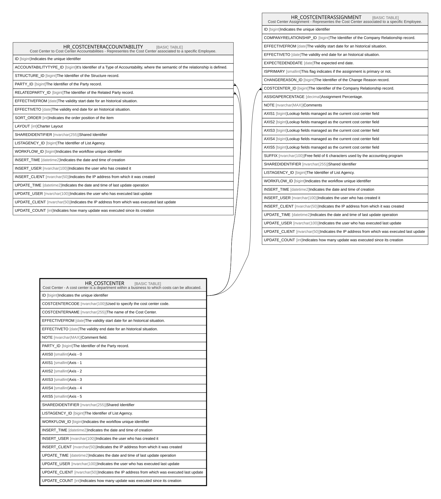

# HR_COSTCENTER

## Description

Cost Center - A cost center is a department within a business to which costs can be allocated.  

## Columns

| Name | Type | Default | Nullable | Children | Comment |
| ---- | ---- | ------- | -------- | -------- | ------- |
| ID | bigint |  | false | [HR_COSTCENTERACCOUNTABILITY](HR_COSTCENTERACCOUNTABILITY.md) [HR_COSTCENTERASSIGNMENT](HR_COSTCENTERASSIGNMENT.md) | Indicates the unique identifier |
| COSTCENTERCODE | nvarchar(100) |  | false |  | Used to specify the cost center code. |
| COSTCENTERNAME | nvarchar(255) |  | false |  | The name of the Cost Center. |
| EFFECTIVEFROM | date |  | false |  | The validity start date for an historical situation. |
| EFFECTIVETO | date |  | true |  | The validity end date for an historical situation. |
| NOTE | nvarchar(MAX) |  | true |  | Comment field. |
| PARTY_ID | bigint |  | true |  | The Identifier of the Party record. |
| AXIS0 | smallint |  | true |  | Axis - 0 |
| AXIS1 | smallint |  | true |  | Axis - 1 |
| AXIS2 | smallint |  | true |  | Axis - 2 |
| AXIS3 | smallint |  | true |  | Axis - 3 |
| AXIS4 | smallint |  | true |  | Axis - 4 |
| AXIS5 | smallint |  | true |  | Axis - 5 |
| SHAREDIDENTIFIER | nvarchar(255) |  | true |  | Shared Identifier |
| LISTAGENCY_ID | bigint |  | true |  | The Identifier of List Agency. |
| WORKFLOW_ID | bigint |  | true |  | Indicates the workflow unique identifier |
| INSERT_TIME | datetime2 | (sysutcdatetime()) | false |  | Indicates the date and time of creation |
| INSERT_USER | nvarchar(100) | (N'MAIN') | false |  | Indicates the user who has created it |
| INSERT_CLIENT | nvarchar(50) | (N'localhost') | false |  | Indicates the IP address from which it was created |
| UPDATE_TIME | datetime2 | (sysutcdatetime()) | false |  | Indicates the date and time of last update operation |
| UPDATE_USER | nvarchar(100) | (N'MAIN') | false |  | Indicates the user who has executed last update |
| UPDATE_CLIENT | nvarchar(50) | (N'localhost') | false |  | Indicates the IP address from which was executed last update |
| UPDATE_COUNT | int | ((0)) | false |  | Indicates how many update was executed since its creation |

## Constraints

| Name | Type | Definition |
| ---- | ---- | ---------- |
| PK_COSTCENTER | PRIMARY KEY | CLUSTERED, unique, part of a PRIMARY KEY constraint, [ ID ] |

## Indexes

| Name | Definition |
| ---- | ---------- |
| PK_COSTCENTER | CLUSTERED, unique, part of a PRIMARY KEY constraint, [ ID ] |
| IDX_COSTCENTER_COSTCENTERCODE | NONCLUSTERED, unique, [ COSTCENTERCODE ] |
| IDX_COSTCENTER_SHAREDLIST | NONCLUSTERED, unique, [ SHAREDIDENTIFIER, LISTAGENCY_ID ] |

## Relations

---

> Generated by [tbls](https://github.com/k1LoW/tbls)
