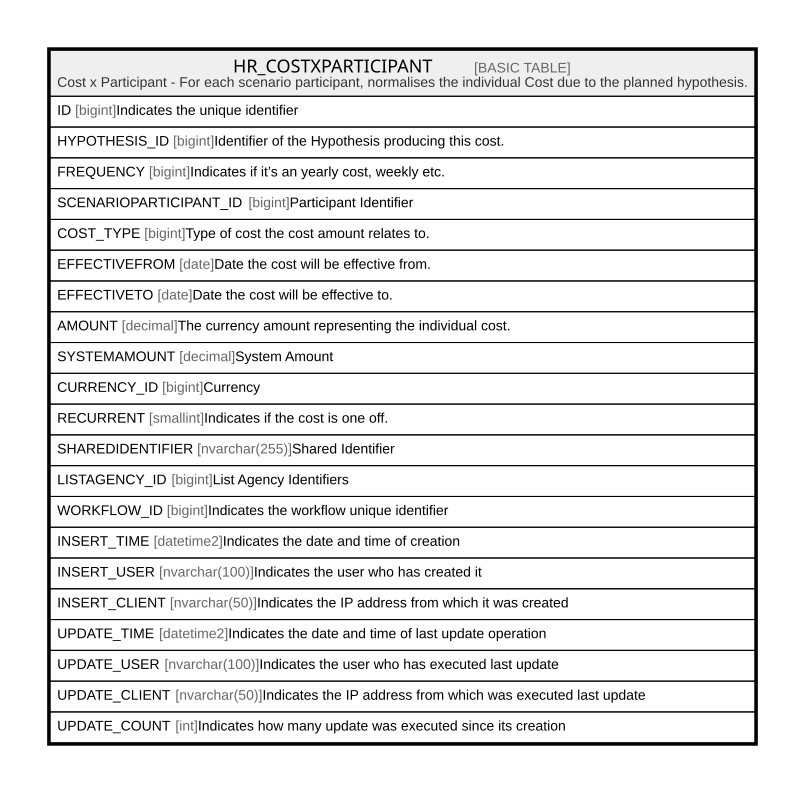

# HR_COSTXPARTICIPANT

## Description

Cost x Participant - For each scenario participant, normalises the individual Cost due to the planned hypothesis.  

## Columns

| Name | Type | Default | Nullable | Comment |
| ---- | ---- | ------- | -------- | ------- |
| ID | bigint |  | false | Indicates the unique identifier |
| HYPOTHESIS_ID | bigint |  | true | Identifier of the Hypothesis producing this cost. |
| FREQUENCY | bigint |  | true | Indicates if it’s an yearly cost, weekly etc. |
| SCENARIOPARTICIPANT_ID | bigint |  | false | Participant Identifier |
| COST_TYPE | bigint |  | true | Type of cost the cost amount relates to. |
| EFFECTIVEFROM | date |  | true | Date the cost will be effective from. |
| EFFECTIVETO | date |  | true | Date the cost will be effective to. |
| AMOUNT | decimal |  | true | The currency amount representing the individual cost. |
| SYSTEMAMOUNT | decimal |  | true | System Amount |
| CURRENCY_ID | bigint |  | true | Currency |
| RECURRENT | smallint |  | true | Indicates if the cost is one off. |
| SHAREDIDENTIFIER | nvarchar(255) |  | true | Shared Identifier |
| LISTAGENCY_ID | bigint |  | true | List Agency Identifiers |
| WORKFLOW_ID | bigint |  | true | Indicates the workflow unique identifier |
| INSERT_TIME | datetime2 | (sysutcdatetime()) | false | Indicates the date and time of creation |
| INSERT_USER | nvarchar(100) | (N'MAIN') | false | Indicates the user who has created it |
| INSERT_CLIENT | nvarchar(50) | (N'localhost') | false | Indicates the IP address from which it was created |
| UPDATE_TIME | datetime2 | (sysutcdatetime()) | false | Indicates the date and time of last update operation |
| UPDATE_USER | nvarchar(100) | (N'MAIN') | false | Indicates the user who has executed last update |
| UPDATE_CLIENT | nvarchar(50) | (N'localhost') | false | Indicates the IP address from which was executed last update |
| UPDATE_COUNT | int | ((0)) | false | Indicates how many update was executed since its creation |

## Constraints

| Name | Type | Definition |
| ---- | ---- | ---------- |
| PK_HR_COSTXPARTICIPANT | PRIMARY KEY | CLUSTERED, unique, part of a PRIMARY KEY constraint, [ ID ] |

## Indexes

| Name | Definition |
| ---- | ---------- |
| PK_HR_COSTXPARTICIPANT | CLUSTERED, unique, part of a PRIMARY KEY constraint, [ ID ] |

## Relations

---

> Generated by [tbls](https://github.com/k1LoW/tbls)
