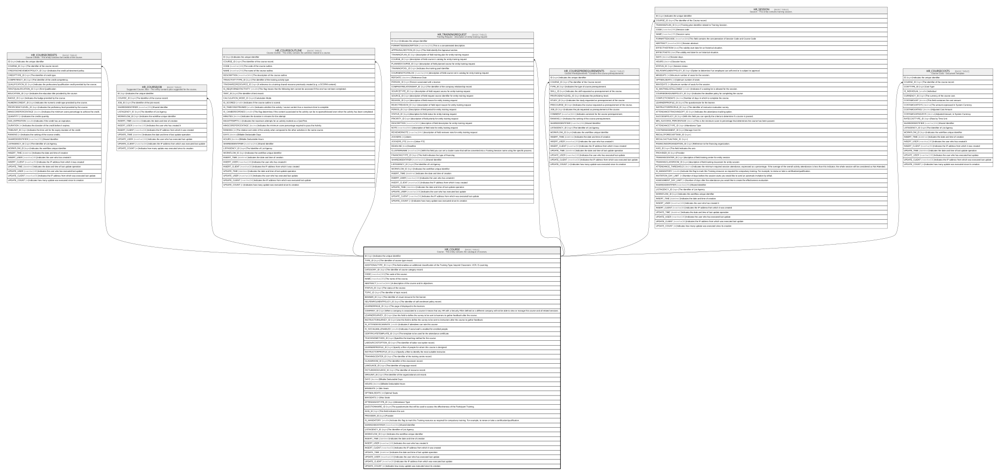

# HR_COURSE

## Description

Course - This entity contains the catalogue of courses.  

## Columns

| Name | Type | Default | Nullable | Children | Comment |
| ---- | ---- | ------- | -------- | -------- | ------- |
| ID | bigint |  | false | [HR_COURSECREDITS](HR_COURSECREDITS.md) [HR_COURSEJOB](HR_COURSEJOB.md) [HR_COURSEOUTLINE](HR_COURSEOUTLINE.md) [HR_TRAININGREQUEST](HR_TRAININGREQUEST.md) [HR_COURSEPREREQUIREMENTS](HR_COURSEPREREQUIREMENTS.md) [HR_SESSION](HR_SESSION.md) [HR_COURSECOSTS](HR_COURSECOSTS.md) | Indicates the unique identifier |
| TYPE_ID | bigint |  | true |  | The identifier of course type record. |
| ADDITIONALTYPE_ID | bigint |  | true |  | This field enables an additional classification of the Training Type; beyond Classroom, VCR, E-Learning. |
| CATEGORY_ID | bigint |  | true |  | The identifier of course category record. |
| CODE | nvarchar(100) |  | false |  | The code of the course. |
| NAME | nvarchar(255) |  | false |  | The name of the course. |
| ABSTRACT | nvarchar(MAX) |  | true |  | A description of the course and its objectives. |
| STATUS_ID | bigint |  | true |  | The status of the course. |
| TOPIC_ID | bigint |  | true |  | The identifier of topic record. |
| BANNER_ID | bigint |  | true |  | The identifier of visual resource for the banner. |
| SELFENROLMENTPOLICY_ID | bigint |  | true |  | The identifier of self enrolment policy record. |
| LEARNERPAGE_ID | bigint |  | true |  | The page of displayed to the learners. |
| COMPANY_ID | bigint |  | true |  | When a company is associated to a course it means that any HR with a Security Filter defined on a different company will not be able to view or manage this course and all related sessions. |
| LEARNERSURVEY_ID | bigint |  | true |  | Use this field to define the survey to be sent to learners to gather feedback after the course. |
| INSTRUCTORSURVEY_ID | bigint |  | true |  | Use this field to define the survey to be sent to instructors after the course to gather feedback. |
| IS_ATTENDEESCANRATE | smallint |  | true |  | Indicates if attendees can rate this course. |
| IS_SOCIALWALLENABLED | smallint |  | true |  | Indicates if social wall is enabled for enrolled people. |
| CERTIFICATETEMPLATE_ID | bigint |  | true |  | The template to be used for the attendance certificate. |
| TEACHINGMETHOD_ID | bigint |  | true |  | Specifies the teaching method for the course. |
| LABOURCOSTOPTION_ID | bigint |  | true |  | The identifier of lablur cost option record. |
| LEARNERPROFILE_ID | bigint |  | true |  | Specify a filter of people for whom this course is designed. |
| INSTRUCTORPROFILE_ID | bigint |  | true |  | Specify a filter to identify the most suitable instructor. |
| TRAININGCENTER_ID | bigint |  | true |  | The identifier of the training centre record. |
| CLASSROOM_ID | bigint |  | true |  | The identifier of the classroom record. |
| LANGUAGE_ID | bigint |  | true |  | The identifier of language record. |
| PICTURERESOURCE_ID | bigint |  | true |  | The identifier of resource record. |
| ORGUNIT_ID | bigint |  | true |  | The identifier of the organizational unit record. |
| DAYS | decimal |  | true |  | Billable Deductable Days |
| HOURS | decimal |  | true |  | Billable Deductable Hours |
| MINSEATS | int |  | true |  | Min Seats |
| OPTIMALSEATS | int |  | true |  | Optimal Seats |
| MAXSEATS | int |  | true |  | Max Seats |
| ATTENDANCETYPE_ID | bigint |  | true |  | Attendance Type |
| QUESTIONNAIRE_ID | bigint |  | true |  | The questionnaire that will be used to assess the effectiveness of the Participant Training. |
| AXIS_ID | bigint |  | true |  | This field indicates the axis |
| PROVIDER_ID | bigint |  | true |  | Provider |
| IS_MANDATORY | smallint |  | true |  | Activate this flag to mark this Training resource as required for compulsory training. For example, to renew or take a certification/qualification. |
| SHAREDIDENTIFIER | nvarchar(255) |  | true |  | Shared Identifier |
| LISTAGENCY_ID | bigint |  | true |  | The Identifier of List Agency. |
| WORKFLOW_ID | bigint |  | true |  | Indicates the workflow unique identifier |
| INSERT_TIME | datetime2 | (sysutcdatetime()) | false |  | Indicates the date and time of creation |
| INSERT_USER | nvarchar(100) | (N'MAIN') | false |  | Indicates the user who has created it |
| INSERT_CLIENT | nvarchar(50) | (N'localhost') | false |  | Indicates the IP address from which it was created |
| UPDATE_TIME | datetime2 | (sysutcdatetime()) | false |  | Indicates the date and time of last update operation |
| UPDATE_USER | nvarchar(100) | (N'MAIN') | false |  | Indicates the user who has executed last update |
| UPDATE_CLIENT | nvarchar(50) | (N'localhost') | false |  | Indicates the IP address from which was executed last update |
| UPDATE_COUNT | int | ((0)) | false |  | Indicates how many update was executed since its creation |

## Constraints

| Name | Type | Definition |
| ---- | ---- | ---------- |
| PK_HR_COURSE | PRIMARY KEY | CLUSTERED, unique, part of a PRIMARY KEY constraint, [ ID ] |
| UQ_COURSE | UNIQUE | NONCLUSTERED, unique, part of a UNIQUE constraint, [ CODE ] |

## Indexes

| Name | Definition |
| ---- | ---------- |
| PK_HR_COURSE | CLUSTERED, unique, part of a PRIMARY KEY constraint, [ ID ] |
| UQ_COURSE | NONCLUSTERED, unique, part of a UNIQUE constraint, [ CODE ] |

## Relations

---

> Generated by [tbls](https://github.com/k1LoW/tbls)
