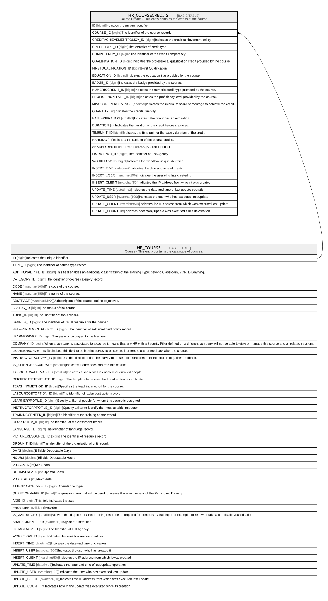

# HR_COURSECREDITS

## Description

Course Credits - This entity contains the credits of the course.  

## Columns

| Name | Type | Default | Nullable | Parents | Comment |
| ---- | ---- | ------- | -------- | ------- | ------- |
| ID | bigint |  | false |  | Indicates the unique identifier |
| COURSE_ID | bigint |  | false | [HR_COURSE](HR_COURSE.md) | The identifier of the course record. |
| CREDITACHIEVEMENTPOLICY_ID | bigint |  | false |  | Indicates the credit achievement policy. |
| CREDITTYPE_ID | bigint |  | false |  | The identifier of credit type. |
| COMPETENCY_ID | bigint |  | true |  | The identifier of the credit competency. |
| QUALIFICATION_ID | bigint |  | true |  | Indicates the professional qualification credit provided by the course. |
| FIRSTQUALIFICATION_ID | bigint |  | true |  | First Qualification |
| EDUCATION_ID | bigint |  | true |  | Indicates the education title provided by the course. |
| BADGE_ID | bigint |  | true |  | Indicates the badge provided by the course. |
| NUMERICCREDIT_ID | bigint |  | true |  | Indicates the numeric credit type provided by the course. |
| PROFICIENCYLEVEL_ID | bigint |  | true |  | Indicates the proficiency level provided by the course. |
| MINSCOREPERCENTAGE | decimal |  | true |  | Indicates the minimum score percentage to achieve the credit. |
| QUANTITY | int |  | true |  | Indicates the credits quantity. |
| HAS_EXPIRATION | smallint |  | true |  | Indicates if the credit has an expiration. |
| DURATION | int |  | true |  | Indicates the duration of the credit before it expires. |
| TIMEUNIT_ID | bigint |  | true |  | Indicates the time unit for the expiry duration of the credit. |
| RANKING | int |  | true |  | Indicates the ranking of the course credits. |
| SHAREDIDENTIFIER | nvarchar(255) |  | true |  | Shared Identifier |
| LISTAGENCY_ID | bigint |  | true |  | The Identifier of List Agency. |
| WORKFLOW_ID | bigint |  | true |  | Indicates the workflow unique identifier |
| INSERT_TIME | datetime2 | (sysutcdatetime()) | false |  | Indicates the date and time of creation |
| INSERT_USER | nvarchar(100) | (N'MAIN') | false |  | Indicates the user who has created it |
| INSERT_CLIENT | nvarchar(50) | (N'localhost') | false |  | Indicates the IP address from which it was created |
| UPDATE_TIME | datetime2 | (sysutcdatetime()) | false |  | Indicates the date and time of last update operation |
| UPDATE_USER | nvarchar(100) | (N'MAIN') | false |  | Indicates the user who has executed last update |
| UPDATE_CLIENT | nvarchar(50) | (N'localhost') | false |  | Indicates the IP address from which was executed last update |
| UPDATE_COUNT | int | ((0)) | false |  | Indicates how many update was executed since its creation |

## Constraints

| Name | Type | Definition |
| ---- | ---- | ---------- |
| PK_HR_COURSECREDITS | PRIMARY KEY | CLUSTERED, unique, part of a PRIMARY KEY constraint, [ ID ] |
| UQ_COURSECREDITS | UNIQUE | NONCLUSTERED, unique, part of a UNIQUE constraint, [ COURSE_ID, CREDITTYPE_ID, COMPETENCY_ID, QUALIFICATION_ID, EDUCATION_ID, BADGE_ID, NUMERICCREDIT_ID ] |
| FK_COURSECREDITS_COURSE | FOREIGN KEY | FOREIGN KEY(COURSE_ID) REFERENCES HR_COURSE(ID) ON UPDATE NO_ACTION ON DELETE CASCADE |

## Indexes

| Name | Definition |
| ---- | ---------- |
| PK_HR_COURSECREDITS | CLUSTERED, unique, part of a PRIMARY KEY constraint, [ ID ] |
| UQ_COURSECREDITS | NONCLUSTERED, unique, part of a UNIQUE constraint, [ COURSE_ID, CREDITTYPE_ID, COMPETENCY_ID, QUALIFICATION_ID, EDUCATION_ID, BADGE_ID, NUMERICCREDIT_ID ] |

## Relations

---

> Generated by [tbls](https://github.com/k1LoW/tbls)
