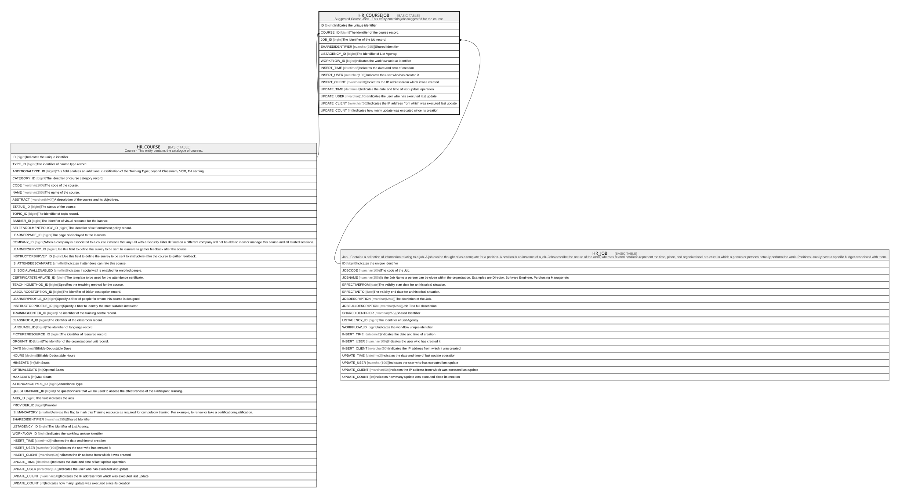

# HR_COURSEJOB

## Description

Suggested Course Jobs - This entity contains jobs suggested for the course.  

## Columns

| Name | Type | Default | Nullable | Parents | Comment |
| ---- | ---- | ------- | -------- | ------- | ------- |
| ID | bigint |  | false |  | Indicates the unique identifier |
| COURSE_ID | bigint |  | false | [HR_COURSE](HR_COURSE.md) | The identifier of the course record. |
| JOB_ID | bigint |  | false | [HR_JOB](HR_JOB.md) | The identifier of the job record. |
| SHAREDIDENTIFIER | nvarchar(255) |  | true |  | Shared Identifier |
| LISTAGENCY_ID | bigint |  | true |  | The Identifier of List Agency. |
| WORKFLOW_ID | bigint |  | true |  | Indicates the workflow unique identifier |
| INSERT_TIME | datetime2 | (sysutcdatetime()) | false |  | Indicates the date and time of creation |
| INSERT_USER | nvarchar(100) | (N'MAIN') | false |  | Indicates the user who has created it |
| INSERT_CLIENT | nvarchar(50) | (N'localhost') | false |  | Indicates the IP address from which it was created |
| UPDATE_TIME | datetime2 | (sysutcdatetime()) | false |  | Indicates the date and time of last update operation |
| UPDATE_USER | nvarchar(100) | (N'MAIN') | false |  | Indicates the user who has executed last update |
| UPDATE_CLIENT | nvarchar(50) | (N'localhost') | false |  | Indicates the IP address from which was executed last update |
| UPDATE_COUNT | int | ((0)) | false |  | Indicates how many update was executed since its creation |

## Constraints

| Name | Type | Definition |
| ---- | ---- | ---------- |
| PK_HR_COURSEJOB | PRIMARY KEY | CLUSTERED, unique, part of a PRIMARY KEY constraint, [ ID ] |
| UQ_COURSEJOB | UNIQUE | NONCLUSTERED, unique, part of a UNIQUE constraint, [ COURSE_ID, JOB_ID ] |
| FK_COURSEJOB_COURSE | FOREIGN KEY | FOREIGN KEY(COURSE_ID) REFERENCES HR_COURSE(ID) ON UPDATE NO_ACTION ON DELETE CASCADE |
| FK_COURSEJOB_JOB | FOREIGN KEY | FOREIGN KEY(JOB_ID) REFERENCES HR_JOB(ID) ON UPDATE NO_ACTION ON DELETE CASCADE |

## Indexes

| Name | Definition |
| ---- | ---------- |
| PK_HR_COURSEJOB | CLUSTERED, unique, part of a PRIMARY KEY constraint, [ ID ] |
| UQ_COURSEJOB | NONCLUSTERED, unique, part of a UNIQUE constraint, [ COURSE_ID, JOB_ID ] |

## Relations

---

> Generated by [tbls](https://github.com/k1LoW/tbls)
