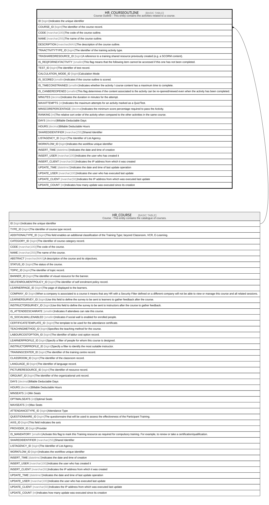

# HR_COURSEOUTLINE

## Description

Course Outline - This entity contains the activities related to a course.  

## Columns

| Name | Type | Default | Nullable | Parents | Comment |
| ---- | ---- | ------- | -------- | ------- | ------- |
| ID | bigint |  | false |  | Indicates the unique identifier |
| COURSE_ID | bigint |  | false | [HR_COURSE](HR_COURSE.md) | The identifier of the course record. |
| CODE | nvarchar(100) |  | false |  | The code of the course outline. |
| NAME | nvarchar(255) |  | false |  | The name of the course outline. |
| DESCRIPTION | nvarchar(MAX) |  | true |  | The description of the course outline. |
| TRAACTIVITYTYPE_ID | bigint |  | true |  | The identifier of the training activity type. |
| TRASHAREDRESOURCE_ID | bigint |  | true |  | A reference to a training shared resource previously created (e.g. a SCORM content). |
| IS_REQFORNEXTACTIVITY | smallint |  | true |  | This flag means that the following item cannot be accessed if this one has not been completed. |
| TEST_ID | bigint |  | true |  | The identifier of test record. |
| CALCULATION_MODE_ID | bigint |  | true |  | Calculation Mode |
| IS_SCORED | smallint |  | true |  | Indicates if the course outline is scored. |
| IS_TIMECONSTRAINED | smallint |  | true |  | Indicates whether the activity / course content has a maximum time to complete. |
| IS_CANBEREOPENED | smallint |  | true |  | This flag determines if the content associated to the activity can be re-opened/viewed even when the activity has been completed. |
| MINUTES | decimal |  | true |  | Indicates the duration in minutes for the attempt. |
| MAXATTEMPTS | int |  | true |  | Indicates the maximum attempts for an activity marked as a Quiz/Test. |
| MINSCOREPERCENTAGE | decimal |  | true |  | Indicates the minimum score percentage required to pass the Activity. |
| RANKING | int |  | true |  | The relative sort order of the activity when compared to the other activities in the same course. |
| DAYS | decimal |  | true |  | Billable Deductable Days |
| HOURS | decimal |  | true |  | Billable Deductable Hours |
| SHAREDIDENTIFIER | nvarchar(255) |  | true |  | Shared Identifier |
| LISTAGENCY_ID | bigint |  | true |  | The Identifier of List Agency. |
| WORKFLOW_ID | bigint |  | true |  | Indicates the workflow unique identifier |
| INSERT_TIME | datetime2 | (sysutcdatetime()) | false |  | Indicates the date and time of creation |
| INSERT_USER | nvarchar(100) | (N'MAIN') | false |  | Indicates the user who has created it |
| INSERT_CLIENT | nvarchar(50) | (N'localhost') | false |  | Indicates the IP address from which it was created |
| UPDATE_TIME | datetime2 | (sysutcdatetime()) | false |  | Indicates the date and time of last update operation |
| UPDATE_USER | nvarchar(100) | (N'MAIN') | false |  | Indicates the user who has executed last update |
| UPDATE_CLIENT | nvarchar(50) | (N'localhost') | false |  | Indicates the IP address from which was executed last update |
| UPDATE_COUNT | int | ((0)) | false |  | Indicates how many update was executed since its creation |

## Constraints

| Name | Type | Definition |
| ---- | ---- | ---------- |
| PK_HR_COURSEOUTLINE | PRIMARY KEY | CLUSTERED, unique, part of a PRIMARY KEY constraint, [ ID ] |
| UQ_COURSEOUTLINE | UNIQUE | NONCLUSTERED, unique, part of a UNIQUE constraint, [ COURSE_ID, CODE ] |
| FK_COURSEOUTLINE_COURSE | FOREIGN KEY | FOREIGN KEY(COURSE_ID) REFERENCES HR_COURSE(ID) ON UPDATE NO_ACTION ON DELETE CASCADE |

## Indexes

| Name | Definition |
| ---- | ---------- |
| PK_HR_COURSEOUTLINE | CLUSTERED, unique, part of a PRIMARY KEY constraint, [ ID ] |
| UQ_COURSEOUTLINE | NONCLUSTERED, unique, part of a UNIQUE constraint, [ COURSE_ID, CODE ] |

## Relations

---

> Generated by [tbls](https://github.com/k1LoW/tbls)
