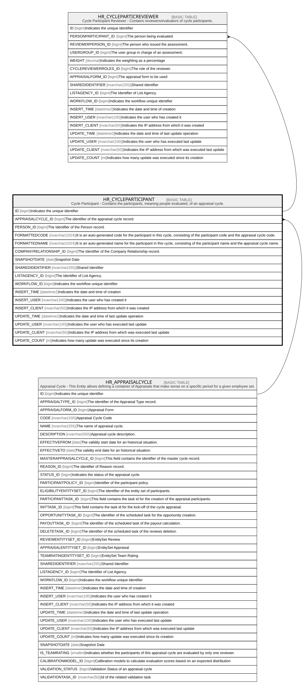

# HR_CYCLEPARTICIPANT

## Description

Cycle Participant - Contains the participants, meaning people evaluated, of an appraisal cycle.  

## Columns

| Name | Type | Default | Nullable | Children | Parents | Comment |
| ---- | ---- | ------- | -------- | -------- | ------- | ------- |
| ID | bigint |  | false | [HR_CYCLEPARTICREVIEWER](HR_CYCLEPARTICREVIEWER.md) |  | Indicates the unique identifier |
| APPRAISALCYCLE_ID | bigint |  | false |  | [HR_APPRAISALCYCLE](HR_APPRAISALCYCLE.md) | The identifier of the appraisal cycle record. |
| PERSON_ID | bigint |  | true |  |  | The Identifier of the Person record. |
| FORMATTEDCODE | nvarchar(1024) |  | true |  |  | It is an auto-generated code for the participant in this cycle, consisting of the participant code and the appraisal cycle code. |
| FORMATTEDNAME | nvarchar(1024) |  | true |  |  | It is an auto-generated name for the participant in this cycle, consisting of the participant name and the appraisal cycle name. |
| COMPANYRELATIONSHIP_ID | bigint |  | true |  |  | The Identifier of the Company Relationship record. |
| SNAPSHOTDATE | date |  | true |  |  | Snapshot Date |
| SHAREDIDENTIFIER | nvarchar(255) |  | true |  |  | Shared Identifier |
| LISTAGENCY_ID | bigint |  | true |  |  | The Identifier of List Agency. |
| WORKFLOW_ID | bigint |  | true |  |  | Indicates the workflow unique identifier |
| INSERT_TIME | datetime2 | (sysutcdatetime()) | false |  |  | Indicates the date and time of creation |
| INSERT_USER | nvarchar(100) | (N'MAIN') | false |  |  | Indicates the user who has created it |
| INSERT_CLIENT | nvarchar(50) | (N'localhost') | false |  |  | Indicates the IP address from which it was created |
| UPDATE_TIME | datetime2 | (sysutcdatetime()) | false |  |  | Indicates the date and time of last update operation |
| UPDATE_USER | nvarchar(100) | (N'MAIN') | false |  |  | Indicates the user who has executed last update |
| UPDATE_CLIENT | nvarchar(50) | (N'localhost') | false |  |  | Indicates the IP address from which was executed last update |
| UPDATE_COUNT | int | ((0)) | false |  |  | Indicates how many update was executed since its creation |

## Constraints

| Name | Type | Definition |
| ---- | ---- | ---------- |
| PK_HR_APPRCYCLEPARTICIPANT | PRIMARY KEY | CLUSTERED, unique, part of a PRIMARY KEY constraint, [ ID ] |
| UQ_CYCLEPART | UNIQUE | NONCLUSTERED, unique, part of a UNIQUE constraint, [ APPRAISALCYCLE_ID, PERSON_ID ] |
| FK_APPRCYCLEPARTIC_APPRCYCLE | FOREIGN KEY | FOREIGN KEY(APPRAISALCYCLE_ID) REFERENCES HR_APPRAISALCYCLE(ID) ON UPDATE NO_ACTION ON DELETE NO_ACTION |

## Indexes

| Name | Definition |
| ---- | ---------- |
| PK_HR_APPRCYCLEPARTICIPANT | CLUSTERED, unique, part of a PRIMARY KEY constraint, [ ID ] |
| UQ_CYCLEPART | NONCLUSTERED, unique, part of a UNIQUE constraint, [ APPRAISALCYCLE_ID, PERSON_ID ] |

## Relations

---

> Generated by [tbls](https://github.com/k1LoW/tbls)
