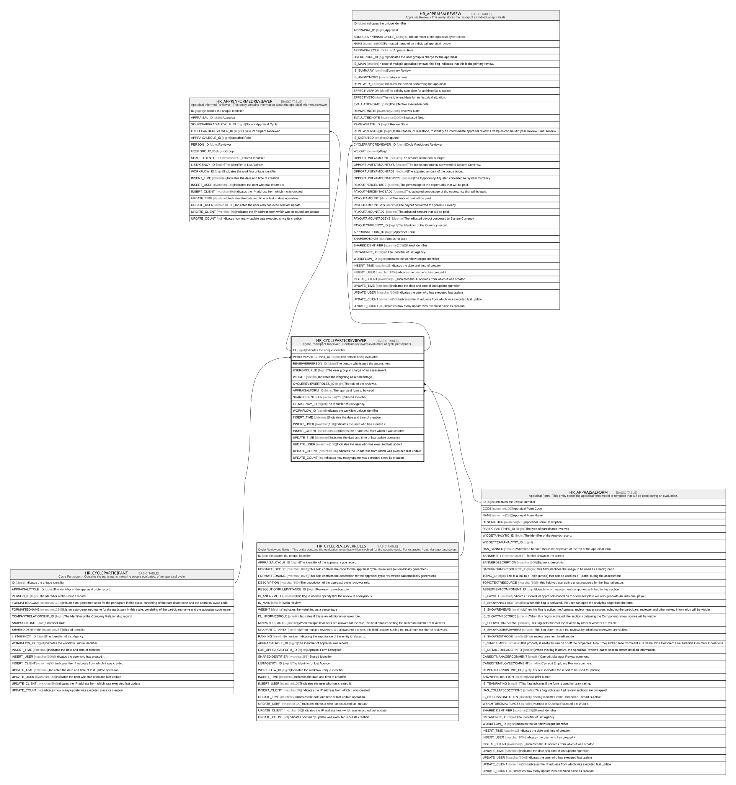

# HR_CYCLEPARTICREVIEWER

## Description

Cycle Participant Reviewer - Contains reviewers/evaluators of cycle participants.  

## Columns

| Name | Type | Default | Nullable | Children | Parents | Comment |
| ---- | ---- | ------- | -------- | -------- | ------- | ------- |
| ID | bigint |  | false | [HR_APPRINFORMEDREVIEWER](HR_APPRINFORMEDREVIEWER.md) [HR_APPRAISALREVIEW](HR_APPRAISALREVIEW.md) |  | Indicates the unique identifier |
| PERSONPARTICIPANT_ID | bigint |  | true |  | [HR_CYCLEPARTICIPANT](HR_CYCLEPARTICIPANT.md) | The person being evaluated. |
| REVIEWERPERSON_ID | bigint |  | true |  |  | The person who issued the assessment. |
| USERGROUP_ID | bigint |  | true |  |  | The user group in charge of an assessment. |
| WEIGHT | decimal |  | true |  |  | Indicates the weighting as a percentage |
| CYCLEREVIEWERROLES_ID | bigint |  | true |  | [HR_CYCLEREVIEWERROLES](HR_CYCLEREVIEWERROLES.md) | The role of the reviewer. |
| APPRAISALFORM_ID | bigint |  | true |  | [HR_APPRAISALFORM](HR_APPRAISALFORM.md) | The appraisal form to be used |
| SHAREDIDENTIFIER | nvarchar(255) |  | true |  |  | Shared Identifier |
| LISTAGENCY_ID | bigint |  | true |  |  | The Identifier of List Agency. |
| WORKFLOW_ID | bigint |  | true |  |  | Indicates the workflow unique identifier |
| INSERT_TIME | datetime2 | (sysutcdatetime()) | false |  |  | Indicates the date and time of creation |
| INSERT_USER | nvarchar(100) | (N'MAIN') | false |  |  | Indicates the user who has created it |
| INSERT_CLIENT | nvarchar(50) | (N'localhost') | false |  |  | Indicates the IP address from which it was created |
| UPDATE_TIME | datetime2 | (sysutcdatetime()) | false |  |  | Indicates the date and time of last update operation |
| UPDATE_USER | nvarchar(100) | (N'MAIN') | false |  |  | Indicates the user who has executed last update |
| UPDATE_CLIENT | nvarchar(50) | (N'localhost') | false |  |  | Indicates the IP address from which was executed last update |
| UPDATE_COUNT | int | ((0)) | false |  |  | Indicates how many update was executed since its creation |

## Constraints

| Name | Type | Definition |
| ---- | ---- | ---------- |
| PK_HR_APPCYCPARTREV | PRIMARY KEY | CLUSTERED, unique, part of a PRIMARY KEY constraint, [ ID ] |
| UQ_CYCLEPARTREV | UNIQUE | NONCLUSTERED, unique, part of a UNIQUE constraint, [ PERSONPARTICIPANT_ID, CYCLEREVIEWERROLES_ID, REVIEWERPERSON_ID, USERGROUP_ID ] |
| FK_CYCLEPARTICREV_APPRFORM | FOREIGN KEY | FOREIGN KEY(APPRAISALFORM_ID) REFERENCES HR_APPRAISALFORM(ID) ON UPDATE NO_ACTION ON DELETE NO_ACTION |
| FK_CYCLEPARTICREV_CYCLEREVROLE | FOREIGN KEY | FOREIGN KEY(CYCLEREVIEWERROLES_ID) REFERENCES HR_CYCLEREVIEWERROLES(ID) ON UPDATE NO_ACTION ON DELETE NO_ACTION |
| FK_CYCLEPARTICREV_PERSON | FOREIGN KEY | FOREIGN KEY(PERSONPARTICIPANT_ID) REFERENCES HR_CYCLEPARTICIPANT(ID) ON UPDATE NO_ACTION ON DELETE NO_ACTION |

## Indexes

| Name | Definition |
| ---- | ---------- |
| PK_HR_APPCYCPARTREV | CLUSTERED, unique, part of a PRIMARY KEY constraint, [ ID ] |
| UQ_CYCLEPARTREV | NONCLUSTERED, unique, part of a UNIQUE constraint, [ PERSONPARTICIPANT_ID, CYCLEREVIEWERROLES_ID, REVIEWERPERSON_ID, USERGROUP_ID ] |

## Relations

---

> Generated by [tbls](https://github.com/k1LoW/tbls)
