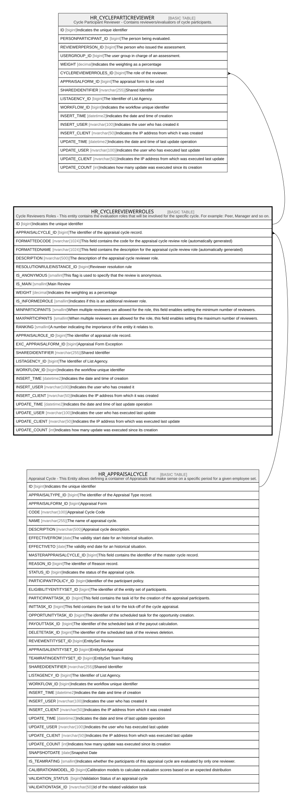

# HR_CYCLEREVIEWERROLES

## Description

Cycle Reviewers Roles - This entity contains the evaluation roles that will be involved for the specific cycle. For example: Peer, Manager and so on.

## Columns

| Name | Type | Default | Nullable | Children | Parents | Comment |
| ---- | ---- | ------- | -------- | -------- | ------- | ------- |
| ID | bigint |  | false | [HR_CYCLEPARTICREVIEWER](HR_CYCLEPARTICREVIEWER.md) |  | Indicates the unique identifier |
| APPRAISALCYCLE_ID | bigint |  | false |  | [HR_APPRAISALCYCLE](HR_APPRAISALCYCLE.md) | The identifier of the appraisal cycle record. |
| FORMATTEDCODE | nvarchar(1024) |  | true |  |  | This field contains the code for the appraisal cycle review role (automatically generated) |
| FORMATTEDNAME | nvarchar(1024) |  | true |  |  | This field contains the description for the appraisal cycle review role (automatically generated) |
| DESCRIPTION | nvarchar(500) |  | true |  |  | The description of the appraisal cycle reviewer role. |
| RESOLUTIONRULEINSTANCE_ID | bigint |  | true |  |  | Reviewer resolution rule |
| IS_ANONYMOUS | smallint |  | true |  |  | This flag is used to specify that the review is anonymous. |
| IS_MAIN | smallint |  | true |  |  | Main Review |
| WEIGHT | decimal |  | true |  |  | Indicates the weighting as a percentage |
| IS_INFORMEDROLE | smallint |  | true |  |  | Indicates if this is an additional reviewer role. |
| MINPARTICIPANTS | smallint |  | true |  |  | When multiple reviewers are allowed for the role, this field enables setting the minimum number of reviewers. |
| MAXPARTICIPANTS | smallint |  | true |  |  | When multiple reviewers are allowed for the role, this field enables setting the maximum number of reviewers. |
| RANKING | smallint |  | true |  |  | A number indicating the importance of the entity it relates to. |
| APPRAISALROLE_ID | bigint |  | true |  |  | The identifier of appraisal role record. |
| EXC_APPRAISALFORM_ID | bigint |  | true |  |  | Appraisal Form Exception |
| SHAREDIDENTIFIER | nvarchar(255) |  | true |  |  | Shared Identifier |
| LISTAGENCY_ID | bigint |  | true |  |  | The Identifier of List Agency. |
| WORKFLOW_ID | bigint |  | true |  |  | Indicates the workflow unique identifier |
| INSERT_TIME | datetime2 | (sysutcdatetime()) | false |  |  | Indicates the date and time of creation |
| INSERT_USER | nvarchar(100) | (N'MAIN') | false |  |  | Indicates the user who has created it |
| INSERT_CLIENT | nvarchar(50) | (N'localhost') | false |  |  | Indicates the IP address from which it was created |
| UPDATE_TIME | datetime2 | (sysutcdatetime()) | false |  |  | Indicates the date and time of last update operation |
| UPDATE_USER | nvarchar(100) | (N'MAIN') | false |  |  | Indicates the user who has executed last update |
| UPDATE_CLIENT | nvarchar(50) | (N'localhost') | false |  |  | Indicates the IP address from which was executed last update |
| UPDATE_COUNT | int | ((0)) | false |  |  | Indicates how many update was executed since its creation |

## Constraints

| Name | Type | Definition |
| ---- | ---- | ---------- |
| PK_HR_APPRCYCLEREVROLES | PRIMARY KEY | CLUSTERED, unique, part of a PRIMARY KEY constraint, [ ID ] |
| UQ_CYCLEREVROLE | UNIQUE | NONCLUSTERED, unique, part of a UNIQUE constraint, [ APPRAISALCYCLE_ID, APPRAISALROLE_ID, IS_INFORMEDROLE ] |
| FK_APPRCYCLEREVROLES_APPRCYCLE | FOREIGN KEY | FOREIGN KEY(APPRAISALCYCLE_ID) REFERENCES HR_APPRAISALCYCLE(ID) ON UPDATE NO_ACTION ON DELETE NO_ACTION |

## Indexes

| Name | Definition |
| ---- | ---------- |
| PK_HR_APPRCYCLEREVROLES | CLUSTERED, unique, part of a PRIMARY KEY constraint, [ ID ] |
| UQ_CYCLEREVROLE | NONCLUSTERED, unique, part of a UNIQUE constraint, [ APPRAISALCYCLE_ID, APPRAISALROLE_ID, IS_INFORMEDROLE ] |

## Relations

---

> Generated by [tbls](https://github.com/k1LoW/tbls)
