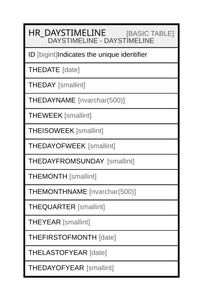

# HR_DAYSTIMELINE

## Description

DAYSTIMELINE - DAYSTIMELINE  

## Columns

| Name | Type | Default | Nullable | Comment |
| ---- | ---- | ------- | -------- | ------- |
| ID | bigint |  | false | Indicates the unique identifier |
| THEDATE | date |  | false |  |
| THEDAY | smallint |  | true |  |
| THEDAYNAME | nvarchar(500) |  | true |  |
| THEWEEK | smallint |  | true |  |
| THEISOWEEK | smallint |  | true |  |
| THEDAYOFWEEK | smallint |  | true |  |
| THEDAYFROMSUNDAY | smallint |  | true |  |
| THEMONTH | smallint |  | true |  |
| THEMONTHNAME | nvarchar(500) |  | true |  |
| THEQUARTER | smallint |  | true |  |
| THEYEAR | smallint |  | true |  |
| THEFIRSTOFMONTH | date |  | true |  |
| THELASTOFYEAR | date |  | true |  |
| THEDAYOFYEAR | smallint |  | true |  |

## Constraints

| Name | Type | Definition |
| ---- | ---- | ---------- |
| PK_DAYSTIMELINE | PRIMARY KEY | CLUSTERED, unique, part of a PRIMARY KEY constraint, [ THEDATE ] |
| UQ_DAYSTIMELINE | UNIQUE | NONCLUSTERED, unique, part of a UNIQUE constraint, [ ID ] |

## Indexes

| Name | Definition |
| ---- | ---------- |
| PK_DAYSTIMELINE | CLUSTERED, unique, part of a PRIMARY KEY constraint, [ THEDATE ] |
| UQ_DAYSTIMELINE | NONCLUSTERED, unique, part of a UNIQUE constraint, [ ID ] |

## Relations

---

> Generated by [tbls](https://github.com/k1LoW/tbls)
