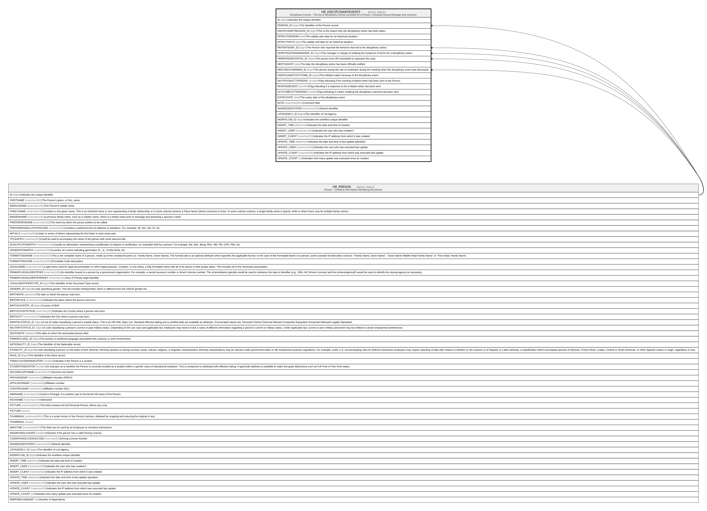

# HR_DISCIPLINARYEVENTS

## Description

Disciplinary Events - The list of disciplinary events recorded for a Person, including Issuing Manager and outcome.  

## Columns

| Name | Type | Default | Nullable | Parents | Comment |
| ---- | ---- | ------- | -------- | ------- | ------- |
| ID | bigint |  | false |  | Indicates the unique identifier |
| PERSON_ID | bigint |  | false | [HR_PERSON](HR_PERSON.md) | The Identifier of the Person record. |
| DISCIPLINARYREASON_ID | bigint |  | false |  | This is the reason why the disciplinary action has been taken. |
| EFFECTIVEFROM | date |  | false |  | The validity start date for an historical situation. |
| EFFECTIVETO | date |  | true |  | The validity end date for an historical situation. |
| REPORTEDBY_ID | bigint |  | true | [HR_PERSON](HR_PERSON.md) | The Person who reported the behavior that led to the disciplinary action. |
| INVESTIGATINGMANAGER_ID | bigint |  | true | [HR_PERSON](HR_PERSON.md) | The manager in charge of verifying the existence of terms for a disciplinary action. |
| HRREPRESENTATIVE_ID | bigint |  | true | [HR_PERSON](HR_PERSON.md) | The person from HR nominated to represent the case. |
| MEETIGDATE | date |  | false |  | The date the disciplinary action has been officially notified. |
| MEETINGCHAIRMAN_ID | bigint |  | true | [HR_PERSON](HR_PERSON.md) | The person acting the role of moderator during the meeting when the disciplinary event was discussed. |
| DISCIPLINARYOUTCOME_ID | bigint |  | false |  | The initiative taken because of the disciplinary event. |
| INVITATIONLETTERSEND | smallint |  | true |  | Flag indicating if the meeting invitation letter has been sent to the Person. |
| RESPONSESENT | smallint |  | true |  | Flag indicating if a response to the invitation letter has been sent. |
| OUTCOMELETTERSEND | smallint |  | true |  | Flag indicating if a letter notifying the disciplinary outcome has been sent. |
| EXPIRYDATE | date |  | true |  | The expiry date of the disciplinary event. |
| NOTE | nvarchar(MAX) |  | true |  | Comment field. |
| SHAREDIDENTIFIER | nvarchar(255) |  | true |  | Shared Identifier |
| LISTAGENCY_ID | bigint |  | true |  | The Identifier of List Agency. |
| WORKFLOW_ID | bigint |  | true |  | Indicates the workflow unique identifier |
| INSERT_TIME | datetime2 | (sysutcdatetime()) | false |  | Indicates the date and time of creation |
| INSERT_USER | nvarchar(100) | (N'MAIN') | false |  | Indicates the user who has created it |
| INSERT_CLIENT | nvarchar(50) | (N'localhost') | false |  | Indicates the IP address from which it was created |
| UPDATE_TIME | datetime2 | (sysutcdatetime()) | false |  | Indicates the date and time of last update operation |
| UPDATE_USER | nvarchar(100) | (N'MAIN') | false |  | Indicates the user who has executed last update |
| UPDATE_CLIENT | nvarchar(50) | (N'localhost') | false |  | Indicates the IP address from which was executed last update |
| UPDATE_COUNT | int | ((0)) | false |  | Indicates how many update was executed since its creation |

## Constraints

| Name | Type | Definition |
| ---- | ---- | ---------- |
| PK_DISCIPLINARYEVENTS | PRIMARY KEY | CLUSTERED, unique, part of a PRIMARY KEY constraint, [ ID ] |
| FK_DISC_PERSON_HRREPRESENT | FOREIGN KEY | FOREIGN KEY(HRREPRESENTATIVE_ID) REFERENCES HR_PERSON(ID) ON UPDATE NO_ACTION ON DELETE NO_ACTION |
| FK_DISC_PERSON_INVESTMANAGER | FOREIGN KEY | FOREIGN KEY(INVESTIGATINGMANAGER_ID) REFERENCES HR_PERSON(ID) ON UPDATE NO_ACTION ON DELETE NO_ACTION |
| FK_DISC_PERSON_MEETCHAIRMAN | FOREIGN KEY | FOREIGN KEY(MEETINGCHAIRMAN_ID) REFERENCES HR_PERSON(ID) ON UPDATE NO_ACTION ON DELETE NO_ACTION |
| FK_DISC_PERSON_REPORTEDBY | FOREIGN KEY | FOREIGN KEY(REPORTEDBY_ID) REFERENCES HR_PERSON(ID) ON UPDATE NO_ACTION ON DELETE NO_ACTION |
| FK_PERSON_DISCIPLINARYEVENTS | FOREIGN KEY | FOREIGN KEY(PERSON_ID) REFERENCES HR_PERSON(ID) ON UPDATE NO_ACTION ON DELETE CASCADE |

## Indexes

| Name | Definition |
| ---- | ---------- |
| PK_DISCIPLINARYEVENTS | CLUSTERED, unique, part of a PRIMARY KEY constraint, [ ID ] |
| IDX_DISCIPLINARYEVENTS_REASON | NONCLUSTERED, [ DISCIPLINARYREASON_ID ] |
| IDX_DISCIPLINARYEVENTS_OUTCOME | NONCLUSTERED, [ DISCIPLINARYOUTCOME_ID ] |

## Relations

---

> Generated by [tbls](https://github.com/k1LoW/tbls)
