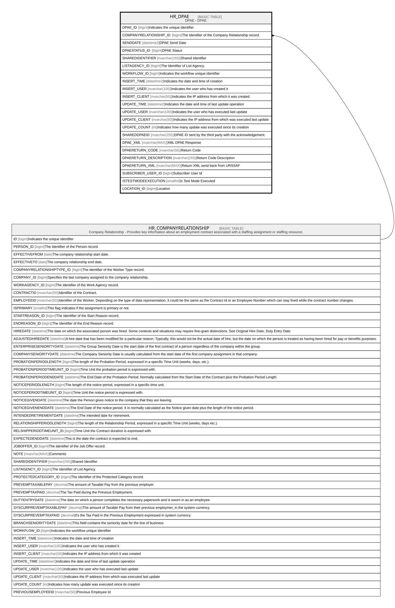

# HR_DPAE

## Description

DPAE - DPAE  

## Columns

| Name | Type | Default | Nullable | Parents | Comment |
| ---- | ---- | ------- | -------- | ------- | ------- |
| DPAE_ID | bigint |  | false |  | Indicates the unique identifier |
| COMPANYRELATIONSHIP_ID | bigint |  | false | [HR_COMPANYRELATIONSHIP](HR_COMPANYRELATIONSHIP.md) | The Identifier of the Company Relationship record. |
| SENDDATE | datetime2 |  | false |  | DPAE Send Date |
| DPAESTATUS_ID | bigint |  | false |  | DPAE Status |
| SHAREDIDENTIFIER | nvarchar(255) |  | true |  | Shared Identifier |
| LISTAGENCY_ID | bigint |  | true |  | The Identifier of List Agency. |
| WORKFLOW_ID | bigint |  | true |  | Indicates the workflow unique identifier |
| INSERT_TIME | datetime2 | (sysutcdatetime()) | false |  | Indicates the date and time of creation |
| INSERT_USER | nvarchar(100) | (N'MAIN') | false |  | Indicates the user who has created it |
| INSERT_CLIENT | nvarchar(50) | (N'localhost') | false |  | Indicates the IP address from which it was created |
| UPDATE_TIME | datetime2 | (sysutcdatetime()) | false |  | Indicates the date and time of last update operation |
| UPDATE_USER | nvarchar(100) | (N'MAIN') | false |  | Indicates the user who has executed last update |
| UPDATE_CLIENT | nvarchar(50) | (N'localhost') | false |  | Indicates the IP address from which was executed last update |
| UPDATE_COUNT | int | ((0)) | false |  | Indicates how many update was executed since its creation |
| SHAREDDPAEID | nvarchar(255) |  | true |  | DPAE ID sent by the third party with the acknowledgement. |
| DPAE_XML | nvarchar(MAX) |  | true |  | XML DPAE Response |
| DPAERETURN_CODE | nvarchar(50) |  | true |  | Return Code |
| DPAERETURN_DESCRIPTION | nvarchar(255) |  | true |  | Return Code Description |
| DPAERETURN_XML | nvarchar(MAX) |  | true |  | Return XML send back from URSSAF |
| SUBSCRIBER_USER_ID | bigint |  | true |  | Subscriber User Id |
| ISTESTMODEEXECUTION | smallint |  | true |  | Is Test Mode Executed |
| LOCATION_ID | bigint |  | true |  | Location |

## Constraints

| Name | Type | Definition |
| ---- | ---- | ---------- |
| PK_DPAE | PRIMARY KEY | CLUSTERED, unique, part of a PRIMARY KEY constraint, [ DPAE_ID ] |
| FK_DPAE_COMPREL | FOREIGN KEY | FOREIGN KEY(COMPANYRELATIONSHIP_ID) REFERENCES HR_COMPANYRELATIONSHIP(ID) ON UPDATE NO_ACTION ON DELETE CASCADE |

## Indexes

| Name | Definition |
| ---- | ---------- |
| PK_DPAE | CLUSTERED, unique, part of a PRIMARY KEY constraint, [ DPAE_ID ] |

## Relations

---

> Generated by [tbls](https://github.com/k1LoW/tbls)
