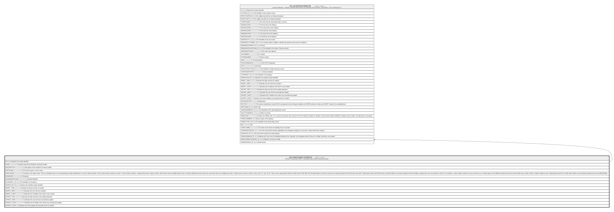

# HR_DPAECONNECTORSINFO

## Description

URSSAF Connection Profile - Information about DPAE connection details.  

## Columns

| Name | Type | Default | Nullable | Children | Comment |
| ---- | ---- | ------- | -------- | -------- | ------- |
| ID | bigint |  | false | [HR_LOCATIONATTRIBUTES](HR_LOCATIONATTRIBUTES.md) | Indicates the unique identifier |
| CODE | nvarchar(100) |  | false |  | Internal code of the URSSAF Connexion Profile. |
| DESCRIPTION | nvarchar(1000) |  | false |  | Description of the URSSAF connexion profile. |
| FIRSTNAME | nvarchar(100) |  | false |  | The Person's given, or first, name. |
| FAMILYNAME | nvarchar(100) |  | false |  | Contains a non-given name. This is an inherited name or one representing a family relationship or in some cultural contexts a Place Name (where someone is from). In some cultural contexts, a single family name is typical, while in others there may be multiple family names. A primary attribute may be used in the case where there are multiple last names. A family name can have a prefix, such as Von, De, Van, Al, etc. These can be represented using the Family Name Prefix field. Not all implementers may find it necessary to separate prefixes from the family name itself. Capturing the prefix and Family Name as discrete fields can become important when formatting or appearance may vary based on context. For example, in some cultural contexts it may be common to use a blank space as the delimiter between the prefix and the family name, while in others a hyphen might be used. Separating the prefix from Family Name allows such formatting requirements to be handled flexibly. |
| PASSWORD | nvarchar(500) |  | true |  | Password |
| SHAREDIDENTIFIER | nvarchar(255) |  | true |  | Shared Identifier |
| LISTAGENCY_ID | bigint |  | true |  | The Identifier of List Agency. |
| WORKFLOW_ID | bigint |  | true |  | Indicates the workflow unique identifier |
| INSERT_TIME | datetime2 | (sysutcdatetime()) | false |  | Indicates the date and time of creation |
| INSERT_USER | nvarchar(100) | (N'MAIN') | false |  | Indicates the user who has created it |
| INSERT_CLIENT | nvarchar(50) | (N'localhost') | false |  | Indicates the IP address from which it was created |
| UPDATE_TIME | datetime2 | (sysutcdatetime()) | false |  | Indicates the date and time of last update operation |
| UPDATE_USER | nvarchar(100) | (N'MAIN') | false |  | Indicates the user who has executed last update |
| UPDATE_CLIENT | nvarchar(50) | (N'localhost') | false |  | Indicates the IP address from which was executed last update |
| UPDATE_COUNT | int | ((0)) | false |  | Indicates how many update was executed since its creation |

## Constraints

| Name | Type | Definition |
| ---- | ---- | ---------- |
| PK_DPAECONNECTORSINFO | PRIMARY KEY | CLUSTERED, unique, part of a PRIMARY KEY constraint, [ ID ] |

## Indexes

| Name | Definition |
| ---- | ---------- |
| PK_DPAECONNECTORSINFO | CLUSTERED, unique, part of a PRIMARY KEY constraint, [ ID ] |

## Relations

---

> Generated by [tbls](https://github.com/k1LoW/tbls)
