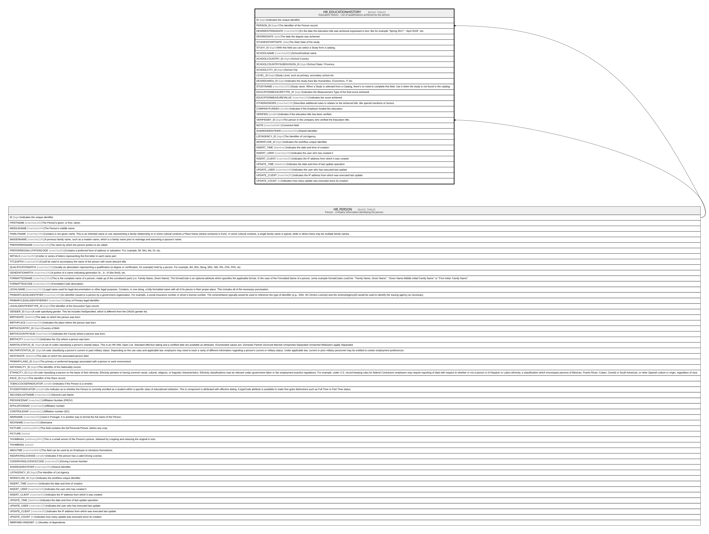

# HR_EDUCATIONHISTORY

## Description

Education History - List of qualifications achieved by the person.  

## Columns

| Name | Type | Default | Nullable | Parents | Comment |
| ---- | ---- | ------- | -------- | ------- | ------- |
| ID | bigint |  | false |  | Indicates the unique identifier |
| PERSON_ID | bigint |  | false | [HR_PERSON](HR_PERSON.md) | The Identifier of the Person record. |
| DEGREESTRINGDATE | nvarchar(50) |  | true |  | It’s the date the education title was achieved expressed in text, like for example “Spring 2017”, “April 2018”, etc. |
| DEGREEDATE | date |  | true |  | The date the degree was achieved. |
| STUDIESSTARTDATE | date |  | true |  | The Start Date of the study. |
| STUDY_ID | bigint |  | true |  | With this field you can select a Study from a catalog. |
| SCHOOLNAME | nvarchar(500) |  | true |  | School/Institute name |
| SCHOOLCOUNTRY_ID | bigint |  | true |  | School Country |
| SCHOOLCOUNTRYSUBDIVISION_ID | bigint |  | true |  | School State / Province. |
| SCHOOLCITY_ID | bigint |  | true |  | School City |
| LEVEL_ID | bigint |  | true |  | Study Level, such as primary, secondary school etc. |
| DEGREEAREA_ID | bigint |  | true |  | Indicates the study Area like Humanities, Economics, IT etc. |
| STUDYNAME | nvarchar(1000) |  | false |  | Study name. When a Study is selected from a Catalog, there’s no need to complete this field. Use it when the study is not found in the catalog. |
| EDUCATIONMEASURETYPE_ID | bigint |  | true |  | Indicates the Measurement Type of the final score achieved. |
| EDUCATIONMEASUREVALUE | nvarchar(100) |  | true |  | Indicates the score achieved. |
| OTHERHONORS | nvarchar(100) |  | true |  | Describes additional notes in relation to the achieved title, like special mentions or honors. |
| COMPANYFUNDED | smallint |  | true |  | Indicates if the Employer funded the education. |
| VERIFIED | smallint |  | true |  | Indicates if the education title has been verified. |
| VERIFIEDBY_ID | bigint |  | true | [HR_PERSON](HR_PERSON.md) | The person in the company who verified the Education title. |
| NOTE | nvarchar(MAX) |  | true |  | Comment field. |
| SHAREDIDENTIFIER | nvarchar(255) |  | true |  | Shared Identifier |
| LISTAGENCY_ID | bigint |  | true |  | The Identifier of List Agency. |
| WORKFLOW_ID | bigint |  | true |  | Indicates the workflow unique identifier |
| INSERT_TIME | datetime2 | (sysutcdatetime()) | false |  | Indicates the date and time of creation |
| INSERT_USER | nvarchar(100) | (N'MAIN') | false |  | Indicates the user who has created it |
| INSERT_CLIENT | nvarchar(50) | (N'localhost') | false |  | Indicates the IP address from which it was created |
| UPDATE_TIME | datetime2 | (sysutcdatetime()) | false |  | Indicates the date and time of last update operation |
| UPDATE_USER | nvarchar(100) | (N'MAIN') | false |  | Indicates the user who has executed last update |
| UPDATE_CLIENT | nvarchar(50) | (N'localhost') | false |  | Indicates the IP address from which was executed last update |
| UPDATE_COUNT | int | ((0)) | false |  | Indicates how many update was executed since its creation |

## Constraints

| Name | Type | Definition |
| ---- | ---- | ---------- |
| PK_HR_EDUCATIONHISTORY | PRIMARY KEY | CLUSTERED, unique, part of a PRIMARY KEY constraint, [ ID ] |
| FK_EDUCATIONHISTORY_PERSON | FOREIGN KEY | FOREIGN KEY(VERIFIEDBY_ID) REFERENCES HR_PERSON(ID) ON UPDATE NO_ACTION ON DELETE NO_ACTION |
| FK_PERSON_EDUCATIONHISTORY | FOREIGN KEY | FOREIGN KEY(PERSON_ID) REFERENCES HR_PERSON(ID) ON UPDATE NO_ACTION ON DELETE CASCADE |

## Indexes

| Name | Definition |
| ---- | ---------- |
| PK_HR_EDUCATIONHISTORY | CLUSTERED, unique, part of a PRIMARY KEY constraint, [ ID ] |
| IDX_EDUCATIONHISTORY_TYPE | NONCLUSTERED, [ STUDY_ID ] |
| IDX_EDUCATIONHISTORY_COUNTRY | NONCLUSTERED, [ SCHOOLCOUNTRY_ID ] |
| IDX_EDUCATIONHISTORY_CSUB | NONCLUSTERED, [ SCHOOLCOUNTRYSUBDIVISION_ID ] |
| IDX_EDUCATIONHISTORY_CITY | NONCLUSTERED, [ SCHOOLCITY_ID ] |
| IDX_EDUCATIONHISTORY_DEGREE | NONCLUSTERED, [ LEVEL_ID ] |
| IDX_EDUCATIONHISTORY_ED | NONCLUSTERED, [ EDUCATIONMEASURETYPE_ID ] |
| IDX_EDUCATIONHISTORY_AREA | NONCLUSTERED, [ DEGREEAREA_ID ] |

## Relations

---

> Generated by [tbls](https://github.com/k1LoW/tbls)
