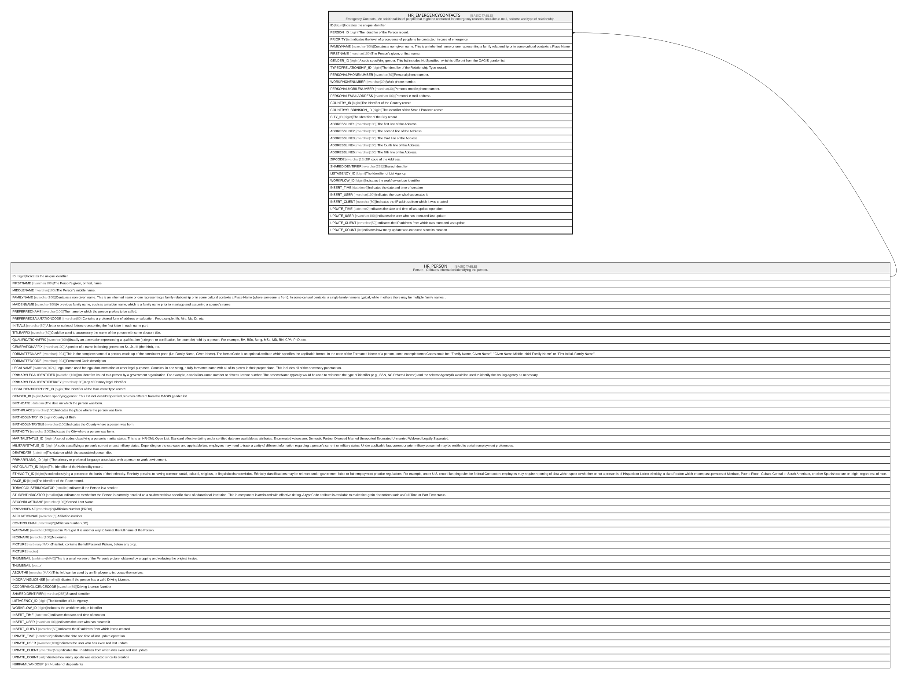

# HR_EMERGENCYCONTACTS

## Description

Emergency Contacts - An additional list of people that might be contacted for emergency reasons. Includes e-mail, address and type of relationship.  

## Columns

| Name | Type | Default | Nullable | Parents | Comment |
| ---- | ---- | ------- | -------- | ------- | ------- |
| ID | bigint |  | false |  | Indicates the unique identifier |
| PERSON_ID | bigint |  | false | [HR_PERSON](HR_PERSON.md) | The Identifier of the Person record. |
| PRIORITY | int |  | false |  | Indicates the level of precedence of people to be contacted, in case of emergency. |
| FAMILYNAME | nvarchar(100) |  | false |  | Contains a non-given name. This is an inherited name or one representing a family relationship or in some cultural contexts a Place Name |
| FIRSTNAME | nvarchar(100) |  | false |  | The Person's given, or first, name. |
| GENDER_ID | bigint |  | false |  | A code specifying gender. This list includes NotSpecified, which is different from the OAGIS gender list. |
| TYPEOFRELATIONSHIP_ID | bigint |  | false |  | The Identifier of the Relationship Type record. |
| PERSONALPHONENUMBER | nvarchar(30) |  | true |  | Personal phone number. |
| WORKPHONENUMBER | nvarchar(30) |  | true |  | Work phone number. |
| PERSONALMOBILENUMBER | nvarchar(30) |  | true |  | Personal mobile phone number. |
| PERSONALEMAILADDRESS | nvarchar(100) |  | true |  | Personal e-mail address. |
| COUNTRY_ID | bigint |  | true |  | The Identifier of the Country record. |
| COUNTRYSUBDIVISION_ID | bigint |  | true |  | The Identifier of the State / Province record. |
| CITY_ID | bigint |  | true |  | The Identifier of the City record. |
| ADDRESSLINE1 | nvarchar(100) |  | true |  | The first line of the Address.  |
| ADDRESSLINE2 | nvarchar(100) |  | true |  | The second line of the Address.  |
| ADDRESSLINE3 | nvarchar(100) |  | true |  | The third line of the Address.  |
| ADDRESSLINE4 | nvarchar(100) |  | true |  | The fourth line of the Address.  |
| ADDRESSLINE5 | nvarchar(100) |  | true |  | The fifth line of the Address.  |
| ZIPCODE | nvarchar(16) |  | true |  | ZIP code of the Address. |
| SHAREDIDENTIFIER | nvarchar(255) |  | true |  | Shared Identifier |
| LISTAGENCY_ID | bigint |  | true |  | The Identifier of List Agency. |
| WORKFLOW_ID | bigint |  | true |  | Indicates the workflow unique identifier |
| INSERT_TIME | datetime2 | (sysutcdatetime()) | false |  | Indicates the date and time of creation |
| INSERT_USER | nvarchar(100) | (N'MAIN') | false |  | Indicates the user who has created it |
| INSERT_CLIENT | nvarchar(50) | (N'localhost') | false |  | Indicates the IP address from which it was created |
| UPDATE_TIME | datetime2 | (sysutcdatetime()) | false |  | Indicates the date and time of last update operation |
| UPDATE_USER | nvarchar(100) | (N'MAIN') | false |  | Indicates the user who has executed last update |
| UPDATE_CLIENT | nvarchar(50) | (N'localhost') | false |  | Indicates the IP address from which was executed last update |
| UPDATE_COUNT | int | ((0)) | false |  | Indicates how many update was executed since its creation |

## Constraints

| Name | Type | Definition |
| ---- | ---- | ---------- |
| PK_HR_EMERGENCYCONTACTS | PRIMARY KEY | CLUSTERED, unique, part of a PRIMARY KEY constraint, [ ID ] |
| FK_PERSON_EMERGENCYCONTACTS | FOREIGN KEY | FOREIGN KEY(PERSON_ID) REFERENCES HR_PERSON(ID) ON UPDATE NO_ACTION ON DELETE CASCADE |

## Indexes

| Name | Definition |
| ---- | ---------- |
| PK_HR_EMERGENCYCONTACTS | CLUSTERED, unique, part of a PRIMARY KEY constraint, [ ID ] |
| IDX_EMERGENCYCONTACT_REL | NONCLUSTERED, [ TYPEOFRELATIONSHIP_ID ] |
| IDX_EMERGENCYCONTACT_GENDER | NONCLUSTERED, [ GENDER_ID ] |
| IDX_EMERGENCYCONTACT_COUSUB | NONCLUSTERED, [ COUNTRYSUBDIVISION_ID ] |
| IDX_EMERGENCYCONTACT_COU | NONCLUSTERED, [ COUNTRY_ID ] |
| IDX_EMERGENCYCONTACT_CITY | NONCLUSTERED, [ CITY_ID ] |

## Relations

---

> Generated by [tbls](https://github.com/k1LoW/tbls)
