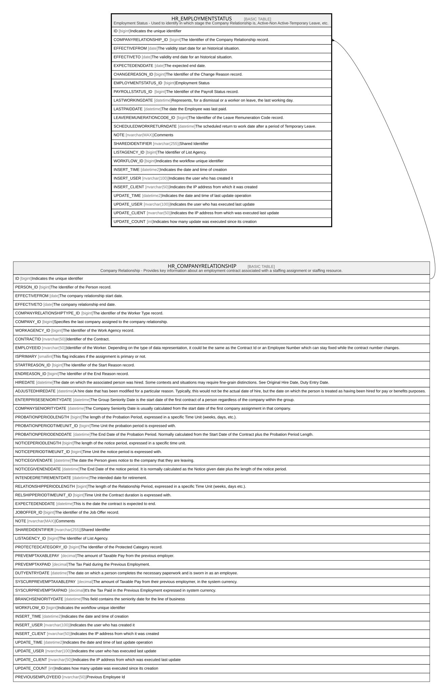

# HR_EMPLOYMENTSTATUS

## Description

Employment Status - Used to identify in which stage the Company Relationship is, Active-Non Active-Temporary Leave, etc.  

## Columns

| Name | Type | Default | Nullable | Parents | Comment |
| ---- | ---- | ------- | -------- | ------- | ------- |
| ID | bigint |  | false |  | Indicates the unique identifier |
| COMPANYRELATIONSHIP_ID | bigint |  | false | [HR_COMPANYRELATIONSHIP](HR_COMPANYRELATIONSHIP.md) | The Identifier of the Company Relationship record. |
| EFFECTIVEFROM | date |  | false |  | The validity start date for an historical situation. |
| EFFECTIVETO | date |  | true |  | The validity end date for an historical situation. |
| EXPECTEDENDDATE | date |  | true |  | The expected end date. |
| CHANGEREASON_ID | bigint |  | true |  | The Identifier of the Change Reason record. |
| EMPLOYMENTSTATUS_ID | bigint |  | true |  | Employment Status |
| PAYROLLSTATUS_ID | bigint |  | true |  | The Identifier of the Payroll Status record. |
| LASTWORKINGDATE | datetime |  | true |  | Represents, for a dismissal or a worker on leave, the last working day. |
| LASTPAIDDATE | datetime |  | true |  | The date the Employee was last paid. |
| LEAVEREMUNERATIONCODE_ID | bigint |  | true |  | The Identifier of the Leave Remuneration Code record. |
| SCHEDULEDWORKRETURNDATE | datetime |  | true |  | The scheduled return to work date after a period of Temporary Leave. |
| NOTE | nvarchar(MAX) |  | true |  | Comments |
| SHAREDIDENTIFIER | nvarchar(255) |  | true |  | Shared Identifier |
| LISTAGENCY_ID | bigint |  | true |  | The Identifier of List Agency. |
| WORKFLOW_ID | bigint |  | true |  | Indicates the workflow unique identifier |
| INSERT_TIME | datetime2 | (sysutcdatetime()) | false |  | Indicates the date and time of creation |
| INSERT_USER | nvarchar(100) | (N'MAIN') | false |  | Indicates the user who has created it |
| INSERT_CLIENT | nvarchar(50) | (N'localhost') | false |  | Indicates the IP address from which it was created |
| UPDATE_TIME | datetime2 | (sysutcdatetime()) | false |  | Indicates the date and time of last update operation |
| UPDATE_USER | nvarchar(100) | (N'MAIN') | false |  | Indicates the user who has executed last update |
| UPDATE_CLIENT | nvarchar(50) | (N'localhost') | false |  | Indicates the IP address from which was executed last update |
| UPDATE_COUNT | int | ((0)) | false |  | Indicates how many update was executed since its creation |

## Constraints

| Name | Type | Definition |
| ---- | ---- | ---------- |
| PK_EMPLOYMENTSTATUS | PRIMARY KEY | CLUSTERED, unique, part of a PRIMARY KEY constraint, [ ID ] |
| FK_EMPLOY_COMPREL | FOREIGN KEY | FOREIGN KEY(COMPANYRELATIONSHIP_ID) REFERENCES HR_COMPANYRELATIONSHIP(ID) ON UPDATE NO_ACTION ON DELETE CASCADE |

## Indexes

| Name | Definition |
| ---- | ---------- |
| PK_EMPLOYMENTSTATUS | CLUSTERED, unique, part of a PRIMARY KEY constraint, [ ID ] |
| IDX_EMPLOYMENTSTATUS_REAS | NONCLUSTERED, [ CHANGEREASON_ID ] |
| IDX_EMPLOYMENTSTATUS_STATUS | NONCLUSTERED, [ EMPLOYMENTSTATUS_ID ] |
| IDX_EMPLOYMENTSTATUS_PAYROLL | NONCLUSTERED, [ PAYROLLSTATUS_ID ] |
| IDX_EMPLOYMENTSTATUS_REM | NONCLUSTERED, [ LEAVEREMUNERATIONCODE_ID ] |
| IDX_EMPLOYMENTSTATUS | NONCLUSTERED, unique, [ COMPANYRELATIONSHIP_ID, EFFECTIVEFROM, EMPLOYMENTSTATUS_ID, PAYROLLSTATUS_ID ] |
| IDX_EMPLOYMENTSTATUS_P | NONCLUSTERED, [ COMPANYRELATIONSHIP_ID, EFFECTIVEFROM, EFFECTIVETO, EMPLOYMENTSTATUS_ID ] |

## Relations

---

> Generated by [tbls](https://github.com/k1LoW/tbls)
