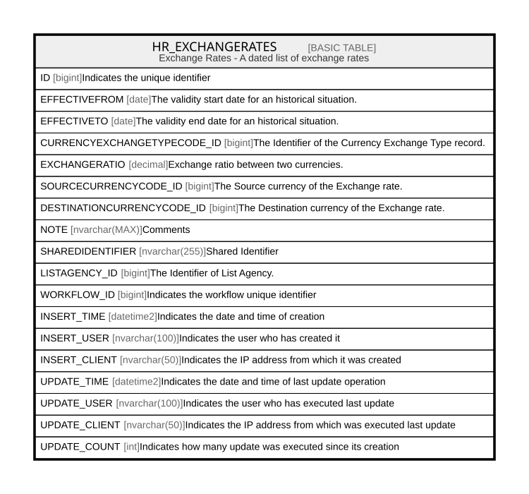

# HR_EXCHANGERATES

## Description

Exchange Rates - A dated list of exchange rates  

## Columns

| Name | Type | Default | Nullable | Comment |
| ---- | ---- | ------- | -------- | ------- |
| ID | bigint |  | false | Indicates the unique identifier |
| EFFECTIVEFROM | date |  | false | The validity start date for an historical situation. |
| EFFECTIVETO | date |  | true | The validity end date for an historical situation. |
| CURRENCYEXCHANGETYPECODE_ID | bigint |  | true | The Identifier of the Currency Exchange Type record. |
| EXCHANGERATIO | decimal |  | true | Exchange ratio between two currencies. |
| SOURCECURRENCYCODE_ID | bigint |  | true | The Source currency of the Exchange rate. |
| DESTINATIONCURRENCYCODE_ID | bigint |  | true | The Destination currency of the Exchange rate. |
| NOTE | nvarchar(MAX) |  | true | Comments |
| SHAREDIDENTIFIER | nvarchar(255) |  | true | Shared Identifier |
| LISTAGENCY_ID | bigint |  | true | The Identifier of List Agency. |
| WORKFLOW_ID | bigint |  | true | Indicates the workflow unique identifier |
| INSERT_TIME | datetime2 | (sysutcdatetime()) | false | Indicates the date and time of creation |
| INSERT_USER | nvarchar(100) | (N'MAIN') | false | Indicates the user who has created it |
| INSERT_CLIENT | nvarchar(50) | (N'localhost') | false | Indicates the IP address from which it was created |
| UPDATE_TIME | datetime2 | (sysutcdatetime()) | false | Indicates the date and time of last update operation |
| UPDATE_USER | nvarchar(100) | (N'MAIN') | false | Indicates the user who has executed last update |
| UPDATE_CLIENT | nvarchar(50) | (N'localhost') | false | Indicates the IP address from which was executed last update |
| UPDATE_COUNT | int | ((0)) | false | Indicates how many update was executed since its creation |

## Constraints

| Name | Type | Definition |
| ---- | ---- | ---------- |
| PK_EXCHANGERATES | PRIMARY KEY | CLUSTERED, unique, part of a PRIMARY KEY constraint, [ ID ] |

## Indexes

| Name | Definition |
| ---- | ---------- |
| PK_EXCHANGERATES | CLUSTERED, unique, part of a PRIMARY KEY constraint, [ ID ] |
| IDX_EXCHANGERATES_DESTCUR | NONCLUSTERED, [ DESTINATIONCURRENCYCODE_ID ] |
| IDX_EXCHANGERATES_SOURCECUR | NONCLUSTERED, [ SOURCECURRENCYCODE_ID ] |

## Relations

---

> Generated by [tbls](https://github.com/k1LoW/tbls)
