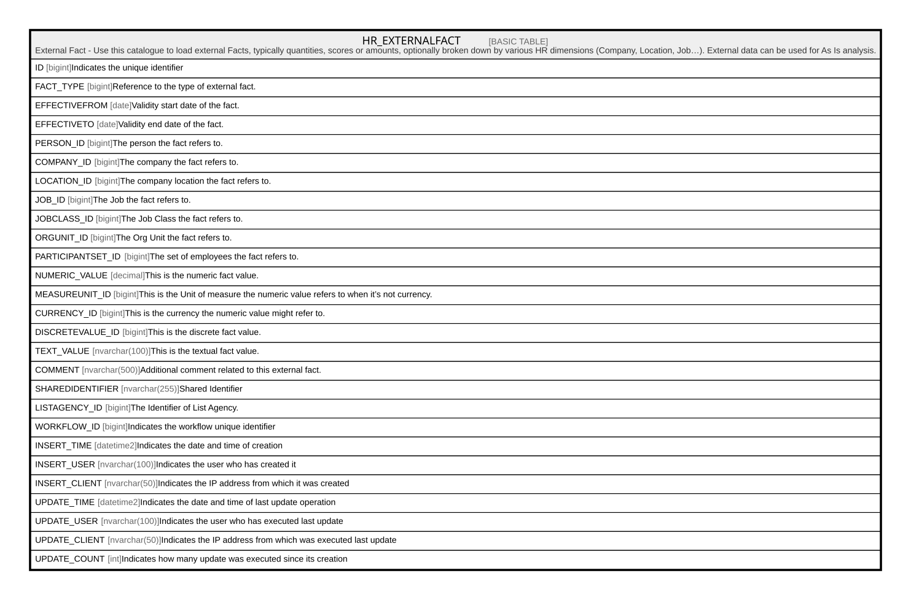

# HR_EXTERNALFACT

## Description

External Fact - Use this catalogue to load external Facts, typically quantities, scores or amounts, optionally broken down by various HR dimensions (Company, Location, Job…). External data can be used for As Is analysis.  

## Columns

| Name | Type | Default | Nullable | Comment |
| ---- | ---- | ------- | -------- | ------- |
| ID | bigint |  | false | Indicates the unique identifier |
| FACT_TYPE | bigint |  | false | Reference to the type of external fact. |
| EFFECTIVEFROM | date |  | true | Validity start date of the fact. |
| EFFECTIVETO | date |  | true | Validity end date of the fact. |
| PERSON_ID | bigint |  | true | The person the fact refers to. |
| COMPANY_ID | bigint |  | true | The company the fact refers to. |
| LOCATION_ID | bigint |  | true | The company location the fact refers to. |
| JOB_ID | bigint |  | true | The Job the fact refers to. |
| JOBCLASS_ID | bigint |  | true | The Job Class the fact refers to. |
| ORGUNIT_ID | bigint |  | true | The Org Unit the fact refers to. |
| PARTICIPANTSET_ID | bigint |  | true | The set of employees the fact refers to. |
| NUMERIC_VALUE | decimal |  | true | This is the numeric fact value. |
| MEASUREUNIT_ID | bigint |  | true | This is the Unit of measure the numeric value refers to when it’s not currency. |
| CURRENCY_ID | bigint |  | true | This is the currency the numeric value might refer to. |
| DISCRETEVALUE_ID | bigint |  | true | This is the discrete fact value. |
| TEXT_VALUE | nvarchar(100) |  | true | This is the textual fact value. |
| COMMENT | nvarchar(500) |  | true | Additional comment related to this external fact. |
| SHAREDIDENTIFIER | nvarchar(255) |  | true | Shared Identifier |
| LISTAGENCY_ID | bigint |  | true | The Identifier of List Agency. |
| WORKFLOW_ID | bigint |  | true | Indicates the workflow unique identifier |
| INSERT_TIME | datetime2 |  | false | Indicates the date and time of creation |
| INSERT_USER | nvarchar(100) |  | false | Indicates the user who has created it |
| INSERT_CLIENT | nvarchar(50) |  | false | Indicates the IP address from which it was created |
| UPDATE_TIME | datetime2 |  | false | Indicates the date and time of last update operation |
| UPDATE_USER | nvarchar(100) |  | false | Indicates the user who has executed last update |
| UPDATE_CLIENT | nvarchar(50) |  | false | Indicates the IP address from which was executed last update |
| UPDATE_COUNT | int |  | false | Indicates how many update was executed since its creation |

## Constraints

| Name | Type | Definition |
| ---- | ---- | ---------- |
| PK__HR_EXTER__3214EC278BAA453C | PRIMARY KEY | CLUSTERED, unique, part of a PRIMARY KEY constraint, [ ID ] |
| UQ__HR_EXTER__F2DDA661A8FBF646 | UNIQUE | NONCLUSTERED, unique, part of a UNIQUE constraint, [ FACT_TYPE, EFFECTIVEFROM, PERSON_ID, COMPANY_ID, LOCATION_ID, JOB_ID, JOBCLASS_ID, ORGUNIT_ID, PARTICIPANTSET_ID ] |

## Indexes

| Name | Definition |
| ---- | ---------- |
| PK__HR_EXTER__3214EC278BAA453C | CLUSTERED, unique, part of a PRIMARY KEY constraint, [ ID ] |
| UQ__HR_EXTER__F2DDA661A8FBF646 | NONCLUSTERED, unique, part of a UNIQUE constraint, [ FACT_TYPE, EFFECTIVEFROM, PERSON_ID, COMPANY_ID, LOCATION_ID, JOB_ID, JOBCLASS_ID, ORGUNIT_ID, PARTICIPANTSET_ID ] |

## Relations

---

> Generated by [tbls](https://github.com/k1LoW/tbls)
