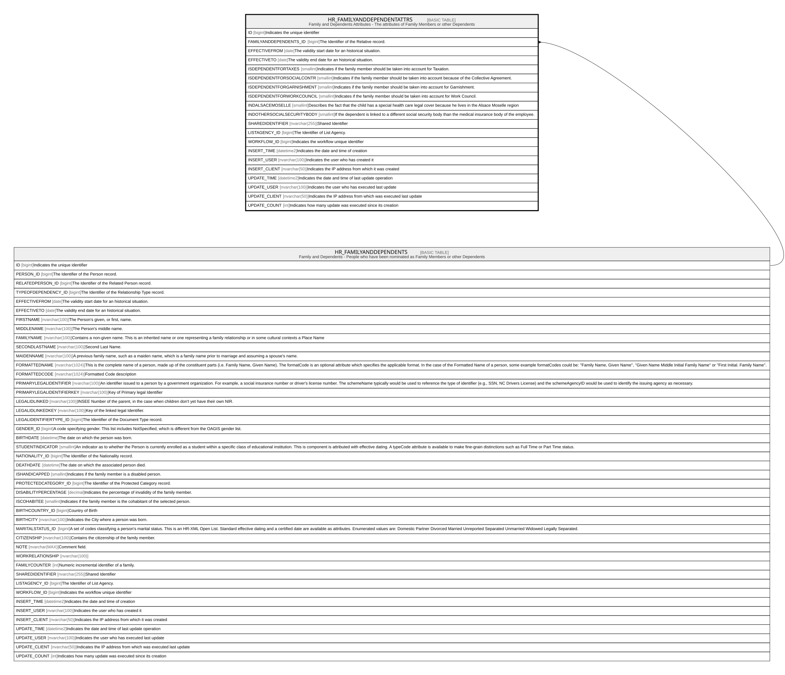

# HR_FAMILYANDDEPENDENTATTRS

## Description

Family and Dependents Attributes - The attributes of Family Members or other Dependents  

## Columns

| Name | Type | Default | Nullable | Parents | Comment |
| ---- | ---- | ------- | -------- | ------- | ------- |
| ID | bigint |  | false |  | Indicates the unique identifier |
| FAMILYANDDEPENDENTS_ID | bigint |  | false | [HR_FAMILYANDDEPENDENTS](HR_FAMILYANDDEPENDENTS.md) | The Identifier of the Relative record. |
| EFFECTIVEFROM | date |  | false |  | The validity start date for an historical situation. |
| EFFECTIVETO | date |  | true |  | The validity end date for an historical situation. |
| ISDEPENDENTFORTAXES | smallint |  | true |  | Indicates if the family member should be taken into account for Taxation. |
| ISDEPENDENTFORSOCIALCONTR | smallint |  | true |  | Indicates if the family member should be taken into account because of the Collective Agreement. |
| ISDEPENDENTFORGARNISHMENT | smallint |  | true |  | Indicates if the family member should be taken into account for Garnishment. |
| ISDEPENDENTFORWORKCOUNCIL | smallint |  | true |  | Indicates if the family member should be taken into account for Work Council. |
| INDALSACEMOSELLE | smallint |  | true |  | Describes the fact that the child has a special health care legal cover because he lives in the Alsace Moselle region |
| INDOTHERSOCIALSECURITYBODY | smallint |  | true |  | If the dependent is linked to a different social security body than the medical insurance body of the employee. |
| SHAREDIDENTIFIER | nvarchar(255) |  | true |  | Shared Identifier |
| LISTAGENCY_ID | bigint |  | true |  | The Identifier of List Agency. |
| WORKFLOW_ID | bigint |  | true |  | Indicates the workflow unique identifier |
| INSERT_TIME | datetime2 | (sysutcdatetime()) | false |  | Indicates the date and time of creation |
| INSERT_USER | nvarchar(100) | (N'MAIN') | false |  | Indicates the user who has created it |
| INSERT_CLIENT | nvarchar(50) | (N'localhost') | false |  | Indicates the IP address from which it was created |
| UPDATE_TIME | datetime2 | (sysutcdatetime()) | false |  | Indicates the date and time of last update operation |
| UPDATE_USER | nvarchar(100) | (N'MAIN') | false |  | Indicates the user who has executed last update |
| UPDATE_CLIENT | nvarchar(50) | (N'localhost') | false |  | Indicates the IP address from which was executed last update |
| UPDATE_COUNT | int | ((0)) | false |  | Indicates how many update was executed since its creation |

## Constraints

| Name | Type | Definition |
| ---- | ---- | ---------- |
| PK_FAMILYANDDEPENDENTATTRS | PRIMARY KEY | CLUSTERED, unique, part of a PRIMARY KEY constraint, [ ID ] |
| FK_ATTRS_FAMILYANDDEPENDENTS | FOREIGN KEY | FOREIGN KEY(FAMILYANDDEPENDENTS_ID) REFERENCES HR_FAMILYANDDEPENDENTS(ID) ON UPDATE NO_ACTION ON DELETE CASCADE |

## Indexes

| Name | Definition |
| ---- | ---------- |
| PK_FAMILYANDDEPENDENTATTRS | CLUSTERED, unique, part of a PRIMARY KEY constraint, [ ID ] |

## Relations

---

> Generated by [tbls](https://github.com/k1LoW/tbls)
