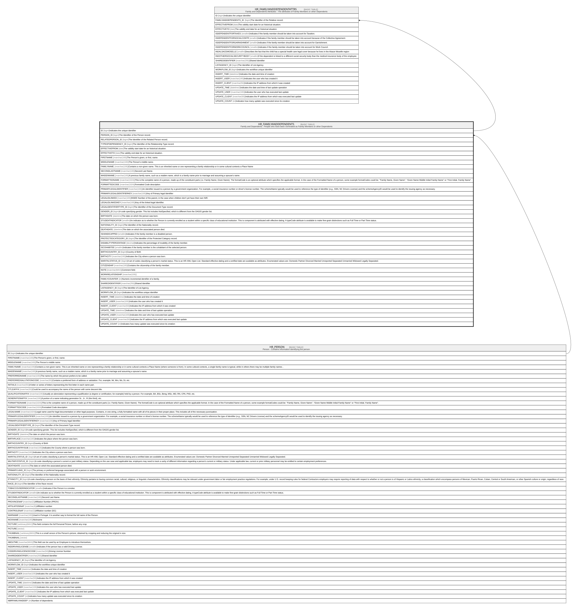

# HR_FAMILYANDDEPENDENTS

## Description

Family and Dependents - People who have been nominated as Family Members or other Dependents  

## Columns

| Name | Type | Default | Nullable | Children | Parents | Comment |
| ---- | ---- | ------- | -------- | -------- | ------- | ------- |
| ID | bigint |  | false | [HR_FAMILYANDDEPENDENTATTRS](HR_FAMILYANDDEPENDENTATTRS.md) |  | Indicates the unique identifier |
| PERSON_ID | bigint |  | false |  | [HR_PERSON](HR_PERSON.md) | The Identifier of the Person record. |
| RELATEDPERSON_ID | bigint |  | true |  |  | The Identifier of the Related Person record. |
| TYPEOFDEPENDENCY_ID | bigint |  | false |  |  | The Identifier of the Relationship Type record. |
| EFFECTIVEFROM | date |  | false |  |  | The validity start date for an historical situation. |
| EFFECTIVETO | date |  | true |  |  | The validity end date for an historical situation. |
| FIRSTNAME | nvarchar(100) |  | false |  |  | The Person's given, or first, name. |
| MIDDLENAME | nvarchar(100) |  | true |  |  | The Person's middle name. |
| FAMILYNAME | nvarchar(100) |  | false |  |  | Contains a non-given name. This is an inherited name or one representing a family relationship or in some cultural contexts a Place Name |
| SECONDLASTNAME | nvarchar(100) |  | true |  |  | Second Last Name. |
| MAIDENNAME | nvarchar(100) |  | true |  |  | A previous family name, such as a maiden name, which is a family name prior to marriage and assuming a spouse's name. |
| FORMATTEDNAME | nvarchar(1024) |  | true |  |  | This is the complete name of a person, made up of the constituent parts (i.e. Family Name, Given Name). The formatCode is an optional attribute which specifies the applicable format. In the case of the Formatted Name of a person, some example formatCodes could be: ''Family Name, Given Name'', ''Given Name Middle Initial Family Name'' or ''First Initial. Family Name''. |
| FORMATTEDCODE | nvarchar(1024) |  | true |  |  | Formatted Code description |
| PRIMARYLEGALIDENTIFIER | nvarchar(100) |  | true |  |  | An identifier issued to a person by a government organization. For example, a social insurance number or driver's license number. The schemeName typically would be used to reference the type of identifier (e.g., SSN, NC Drivers License) and the schemeAgencyID would be used to identify the issuing agency as necessary. |
| PRIMARYLEGALIDENTIFIERKEY | nvarchar(100) |  | true |  |  | Key of Primary legal Identifier |
| LEGALIDLINKED | nvarchar(100) |  | true |  |  | INSEE Number of the parent, in the case when children don't yet have their own NIR. |
| LEGALIDLINKEDKEY | nvarchar(100) |  | true |  |  | Key of the linked legal Identifier. |
| LEGALIDENTIFIERTYPE_ID | bigint |  | false |  |  | The Identifier of the Document Type record. |
| GENDER_ID | bigint |  | true |  |  | A code specifying gender. This list includes NotSpecified, which is different from the OAGIS gender list. |
| BIRTHDATE | datetime |  | true |  |  | The date on which the person was born. |
| STUDENTINDICATOR | smallint |  | true |  |  | An indicator as to whether the Person is currently enrolled as a student within a specific class of educational institution. This is component is attributed with effective dating. A typeCode attribute is available to make fine-grain distinctions such as Full Time or Part Time status. |
| NATIONALITY_ID | bigint |  | true |  |  | The Identifier of the Nationality record. |
| DEATHDATE | datetime |  | true |  |  | The date on which the associated person died. |
| ISHANDICAPPED | smallint |  | true |  |  | Indicates if the family member is a disabled person. |
| PROTECTEDCATEGORY_ID | bigint |  | true |  |  | The Identifier of the Protected Category record. |
| DISABILITYPERCENTAGE | decimal |  | true |  |  | Indicates the percentage of invalidity of the family member. |
| ISCOHABITEE | smallint |  | true |  |  | Indicates if the family member is the cohabitant of the selected person. |
| BIRTHCOUNTRY_ID | bigint |  | true |  |  | Country of Birth |
| BIRTHCITY | nvarchar(100) |  | true |  |  | Indicates the City where a person was born. |
| MARITALSTATUS_ID | bigint |  | true |  |  | A set of codes classifying a person's marital status. This is an HR-XML Open List. Standard effective dating and a certified date are available as attributes. Enumerated values are: Domestic Partner Divorced Married Unreported Separated Unmarried Widowed Legally Separated. |
| CITIZENSHIP | nvarchar(100) |  | true |  |  | Contains the citizenship of the family member. |
| NOTE | nvarchar(MAX) |  | true |  |  | Comment field. |
| WORKRELATIONSHIP | nvarchar(100) |  | true |  |  |  |
| FAMILYCOUNTER | int |  | true |  |  | Numeric incremental identifier of a family. |
| SHAREDIDENTIFIER | nvarchar(255) |  | true |  |  | Shared Identifier |
| LISTAGENCY_ID | bigint |  | true |  |  | The Identifier of List Agency. |
| WORKFLOW_ID | bigint |  | true |  |  | Indicates the workflow unique identifier |
| INSERT_TIME | datetime2 | (sysutcdatetime()) | false |  |  | Indicates the date and time of creation |
| INSERT_USER | nvarchar(100) | (N'MAIN') | false |  |  | Indicates the user who has created it |
| INSERT_CLIENT | nvarchar(50) | (N'localhost') | false |  |  | Indicates the IP address from which it was created |
| UPDATE_TIME | datetime2 | (sysutcdatetime()) | false |  |  | Indicates the date and time of last update operation |
| UPDATE_USER | nvarchar(100) | (N'MAIN') | false |  |  | Indicates the user who has executed last update |
| UPDATE_CLIENT | nvarchar(50) | (N'localhost') | false |  |  | Indicates the IP address from which was executed last update |
| UPDATE_COUNT | int | ((0)) | false |  |  | Indicates how many update was executed since its creation |

## Constraints

| Name | Type | Definition |
| ---- | ---- | ---------- |
| PK_FAMILYANDDEPENDENTS | PRIMARY KEY | CLUSTERED, unique, part of a PRIMARY KEY constraint, [ ID ] |
| FK_FAMILYANDDEPENDENTS_RPERSON | FOREIGN KEY | FOREIGN KEY(PERSON_ID) REFERENCES HR_PERSON(ID) ON UPDATE NO_ACTION ON DELETE CASCADE |

## Indexes

| Name | Definition |
| ---- | ---------- |
| PK_FAMILYANDDEPENDENTS | CLUSTERED, unique, part of a PRIMARY KEY constraint, [ ID ] |
| IDX_FAMILYANDDEP_STANDARD | NONCLUSTERED, unique, [ PERSON_ID, TYPEOFDEPENDENCY_ID, FIRSTNAME, FAMILYNAME, GENDER_ID, BIRTHDATE, SECONDLASTNAME ] |
| IDX_FAMILYANDDEP_GEN | NONCLUSTERED, [ GENDER_ID ] |
| IDX_FAMILYANDDEP_LEG | NONCLUSTERED, [ LEGALIDENTIFIERTYPE_ID ] |
| IDX_FAMILYANDDEP_NAT | NONCLUSTERED, [ NATIONALITY_ID ] |
| IDX_FAMILYANDDEP_TYPE | NONCLUSTERED, [ TYPEOFDEPENDENCY_ID ] |
| IDX_FAMILYANDDEP_PROTCATEG | NONCLUSTERED, [ PROTECTEDCATEGORY_ID ] |
| IDX_FAMILYANDDEP_MARITSTATUS | NONCLUSTERED, [ MARITALSTATUS_ID ] |
| IDX_FAMILYANDDEP_BIRTHCOUNTRY | NONCLUSTERED, [ BIRTHCOUNTRY_ID ] |

## Relations

---

> Generated by [tbls](https://github.com/k1LoW/tbls)
