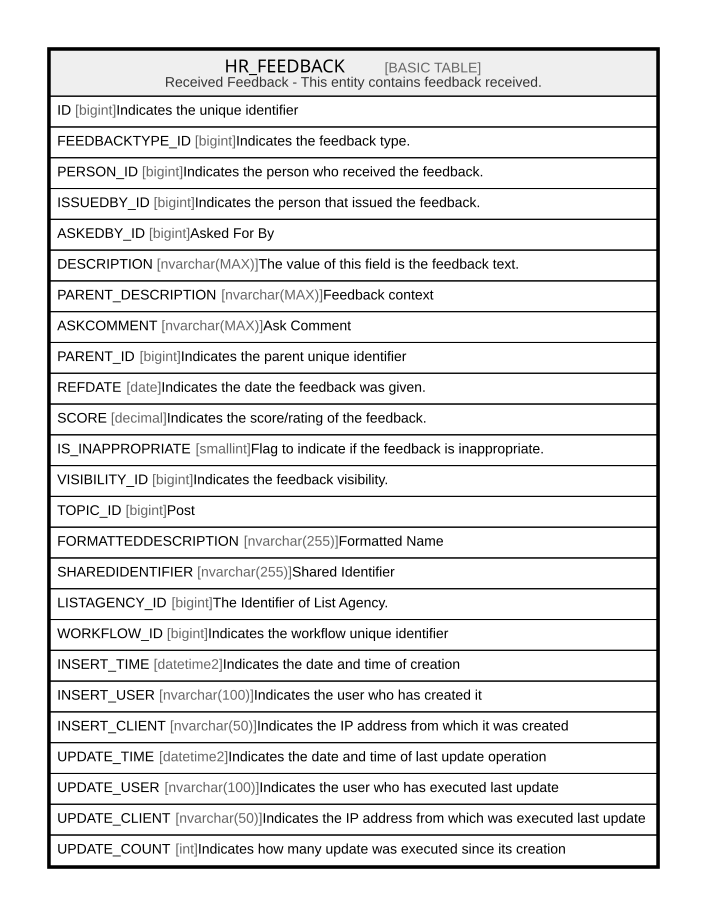

# HR_FEEDBACK

## Description

Received Feedback - This entity contains feedback received.  

## Columns

| Name | Type | Default | Nullable | Comment |
| ---- | ---- | ------- | -------- | ------- |
| ID | bigint |  | false | Indicates the unique identifier |
| FEEDBACKTYPE_ID | bigint |  | true | Indicates the feedback type. |
| PERSON_ID | bigint |  | true | Indicates the person who received the feedback. |
| ISSUEDBY_ID | bigint |  | true | Indicates the person that issued the feedback. |
| ASKEDBY_ID | bigint |  | true | Asked For By |
| DESCRIPTION | nvarchar(MAX) |  | true | The value of this field is the feedback text. |
| PARENT_DESCRIPTION | nvarchar(MAX) |  | true | Feedback context |
| ASKCOMMENT | nvarchar(MAX) |  | true | Ask Comment |
| PARENT_ID | bigint |  | true | Indicates the parent unique identifier |
| REFDATE | date |  | true | Indicates the date the feedback was given. |
| SCORE | decimal |  | true | Indicates the score/rating of the feedback. |
| IS_INAPPROPRIATE | smallint |  | true | Flag to indicate if the feedback is inappropriate. |
| VISIBILITY_ID | bigint |  | true | Indicates the feedback visibility. |
| TOPIC_ID | bigint |  | true | Post |
| FORMATTEDDESCRIPTION | nvarchar(255) |  | true | Formatted Name |
| SHAREDIDENTIFIER | nvarchar(255) |  | true | Shared Identifier |
| LISTAGENCY_ID | bigint |  | true | The Identifier of List Agency. |
| WORKFLOW_ID | bigint |  | true | Indicates the workflow unique identifier |
| INSERT_TIME | datetime2 | (sysutcdatetime()) | false | Indicates the date and time of creation |
| INSERT_USER | nvarchar(100) | (N'MAIN') | false | Indicates the user who has created it |
| INSERT_CLIENT | nvarchar(50) | (N'localhost') | false | Indicates the IP address from which it was created |
| UPDATE_TIME | datetime2 | (sysutcdatetime()) | false | Indicates the date and time of last update operation |
| UPDATE_USER | nvarchar(100) | (N'MAIN') | false | Indicates the user who has executed last update |
| UPDATE_CLIENT | nvarchar(50) | (N'localhost') | false | Indicates the IP address from which was executed last update |
| UPDATE_COUNT | int | ((0)) | false | Indicates how many update was executed since its creation |

## Constraints

| Name | Type | Definition |
| ---- | ---- | ---------- |
| PK_HR_FEEDBACK | PRIMARY KEY | CLUSTERED, unique, part of a PRIMARY KEY constraint, [ ID ] |

## Indexes

| Name | Definition |
| ---- | ---------- |
| PK_HR_FEEDBACK | CLUSTERED, unique, part of a PRIMARY KEY constraint, [ ID ] |

## Relations

---

> Generated by [tbls](https://github.com/k1LoW/tbls)
