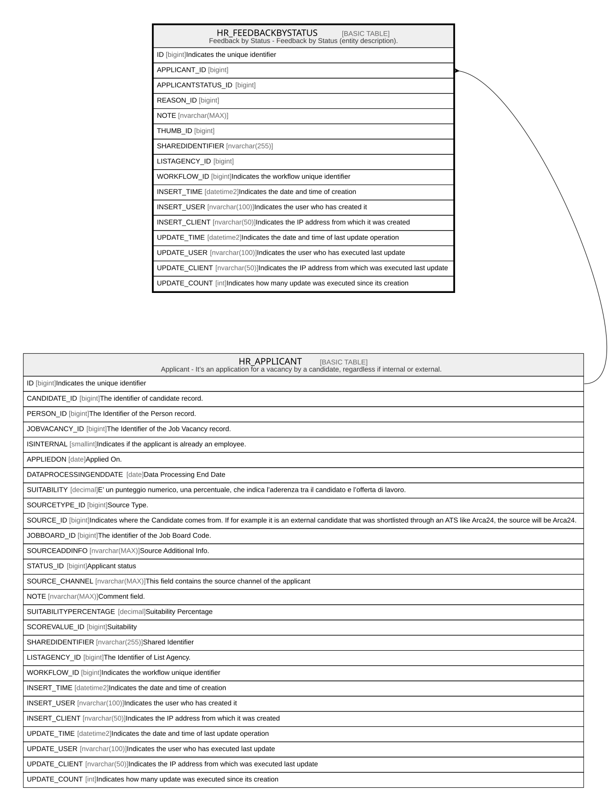

# HR_FEEDBACKBYSTATUS

## Description

Feedback by Status - Feedback by Status (entity description).  

## Columns

| Name | Type | Default | Nullable | Parents | Comment |
| ---- | ---- | ------- | -------- | ------- | ------- |
| ID | bigint |  | false |  | Indicates the unique identifier |
| APPLICANT_ID | bigint |  | true | [HR_APPLICANT](HR_APPLICANT.md) |  |
| APPLICANTSTATUS_ID | bigint |  | true |  |  |
| REASON_ID | bigint |  | true |  |  |
| NOTE | nvarchar(MAX) |  | true |  |  |
| THUMB_ID | bigint |  | true |  |  |
| SHAREDIDENTIFIER | nvarchar(255) |  | true |  |  |
| LISTAGENCY_ID | bigint |  | true |  |  |
| WORKFLOW_ID | bigint |  | true |  | Indicates the workflow unique identifier |
| INSERT_TIME | datetime2 |  | false |  | Indicates the date and time of creation |
| INSERT_USER | nvarchar(100) |  | false |  | Indicates the user who has created it |
| INSERT_CLIENT | nvarchar(50) |  | false |  | Indicates the IP address from which it was created |
| UPDATE_TIME | datetime2 |  | false |  | Indicates the date and time of last update operation |
| UPDATE_USER | nvarchar(100) |  | false |  | Indicates the user who has executed last update |
| UPDATE_CLIENT | nvarchar(50) |  | false |  | Indicates the IP address from which was executed last update |
| UPDATE_COUNT | int |  | false |  | Indicates how many update was executed since its creation |

## Constraints

| Name | Type | Definition |
| ---- | ---- | ---------- |
| PK_FEEDBACKBYSTATUS | PRIMARY KEY | CLUSTERED, unique, part of a PRIMARY KEY constraint, [ ID ] |
| FK_FEEDBACKSTATUS_APPLICANT | FOREIGN KEY | FOREIGN KEY(APPLICANT_ID) REFERENCES HR_APPLICANT(ID) ON UPDATE NO_ACTION ON DELETE NO_ACTION |

## Indexes

| Name | Definition |
| ---- | ---------- |
| PK_FEEDBACKBYSTATUS | CLUSTERED, unique, part of a PRIMARY KEY constraint, [ ID ] |

## Relations

---

> Generated by [tbls](https://github.com/k1LoW/tbls)
