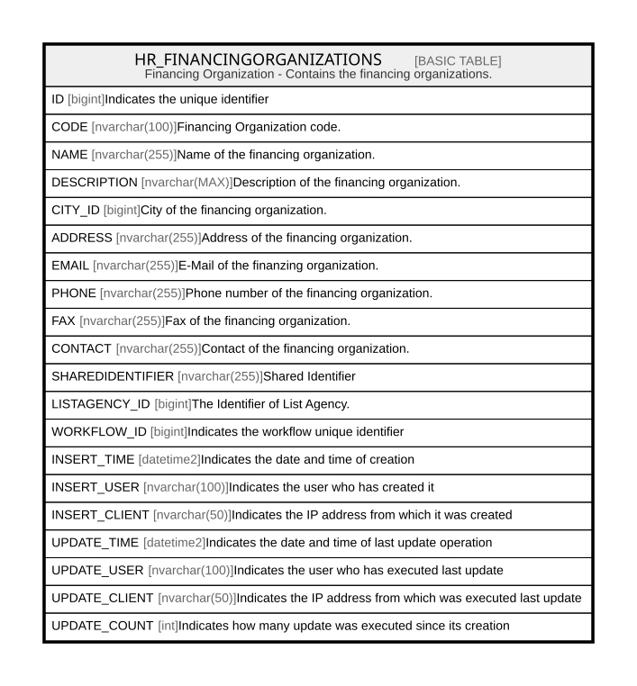

# HR_FINANCINGORGANIZATIONS

## Description

Financing Organization - Contains the financing organizations.  

## Columns

| Name | Type | Default | Nullable | Comment |
| ---- | ---- | ------- | -------- | ------- |
| ID | bigint |  | false | Indicates the unique identifier |
| CODE | nvarchar(100) |  | false | Financing Organization code. |
| NAME | nvarchar(255) |  | true | Name of the financing organization. |
| DESCRIPTION | nvarchar(MAX) |  | true | Description of the financing organization. |
| CITY_ID | bigint |  | true | City of the financing organization. |
| ADDRESS | nvarchar(255) |  | true | Address of the financing organization. |
| EMAIL | nvarchar(255) |  | true | E-Mail of the finanzing organization. |
| PHONE | nvarchar(255) |  | true | Phone number of the financing organization. |
| FAX | nvarchar(255) |  | true | Fax of the financing organization. |
| CONTACT | nvarchar(255) |  | true | Contact of the financing organization. |
| SHAREDIDENTIFIER | nvarchar(255) |  | true | Shared Identifier |
| LISTAGENCY_ID | bigint |  | true | The Identifier of List Agency. |
| WORKFLOW_ID | bigint |  | true | Indicates the workflow unique identifier |
| INSERT_TIME | datetime2 | (sysutcdatetime()) | false | Indicates the date and time of creation |
| INSERT_USER | nvarchar(100) | (N'MAIN') | false | Indicates the user who has created it |
| INSERT_CLIENT | nvarchar(50) | (N'localhost') | false | Indicates the IP address from which it was created |
| UPDATE_TIME | datetime2 | (sysutcdatetime()) | false | Indicates the date and time of last update operation |
| UPDATE_USER | nvarchar(100) | (N'MAIN') | false | Indicates the user who has executed last update |
| UPDATE_CLIENT | nvarchar(50) | (N'localhost') | false | Indicates the IP address from which was executed last update |
| UPDATE_COUNT | int | ((0)) | false | Indicates how many update was executed since its creation |

## Constraints

| Name | Type | Definition |
| ---- | ---- | ---------- |
| PK_HR_FINANCINGORGANIZATIONS | PRIMARY KEY | CLUSTERED, unique, part of a PRIMARY KEY constraint, [ ID ] |
| UQ_FINANCINGORGANIZATIONS | UNIQUE | NONCLUSTERED, unique, part of a UNIQUE constraint, [ CODE ] |

## Indexes

| Name | Definition |
| ---- | ---------- |
| PK_HR_FINANCINGORGANIZATIONS | CLUSTERED, unique, part of a PRIMARY KEY constraint, [ ID ] |
| UQ_FINANCINGORGANIZATIONS | NONCLUSTERED, unique, part of a UNIQUE constraint, [ CODE ] |

## Relations

---

> Generated by [tbls](https://github.com/k1LoW/tbls)
