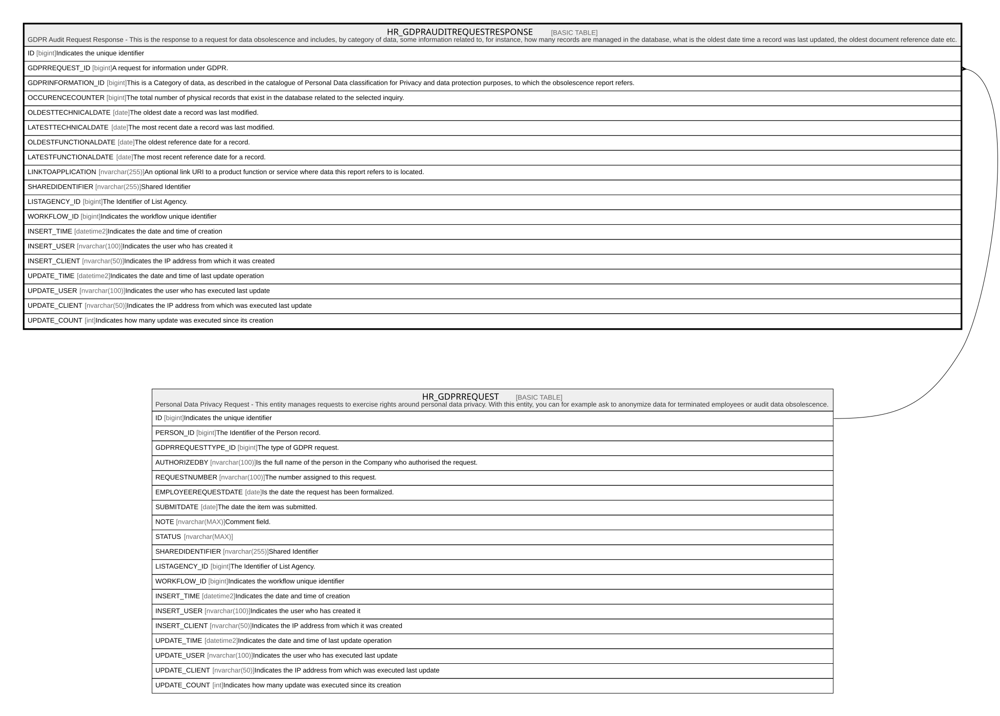

# HR_GDPRAUDITREQUESTRESPONSE

## Description

GDPR Audit Request Response - This is the response to a request for data obsolescence and includes, by category of data, some information related to, for instance, how many records are managed in the database, what is the oldest date time a record was last updated, the oldest document reference date etc.  

## Columns

| Name | Type | Default | Nullable | Parents | Comment |
| ---- | ---- | ------- | -------- | ------- | ------- |
| ID | bigint |  | false |  | Indicates the unique identifier |
| GDPRREQUEST_ID | bigint |  | false | [HR_GDPRREQUEST](HR_GDPRREQUEST.md) | A request for information under GDPR. |
| GDPRINFORMATION_ID | bigint |  | true |  | This is a Category of data, as described in the catalogue of Personal Data classification for Privacy and data protection purposes, to which the obsolescence report refers. |
| OCCURENCECOUNTER | bigint |  | true |  | The total number of physical records that exist in the database related to the selected inquiry. |
| OLDESTTECHNICALDATE | date |  | true |  | The oldest date a record was last modified. |
| LATESTTECHNICALDATE | date |  | true |  | The most recent date a record was last modified. |
| OLDESTFUNCTIONALDATE | date |  | true |  | The oldest reference date for a record. |
| LATESTFUNCTIONALDATE | date |  | true |  | The most recent reference date for a record. |
| LINKTOAPPLICATION | nvarchar(255) |  | true |  | An optional link URI to a product function or service where data this report refers to is located. |
| SHAREDIDENTIFIER | nvarchar(255) |  | true |  | Shared Identifier |
| LISTAGENCY_ID | bigint |  | true |  | The Identifier of List Agency. |
| WORKFLOW_ID | bigint |  | true |  | Indicates the workflow unique identifier |
| INSERT_TIME | datetime2 | (sysutcdatetime()) | false |  | Indicates the date and time of creation |
| INSERT_USER | nvarchar(100) | (N'MAIN') | false |  | Indicates the user who has created it |
| INSERT_CLIENT | nvarchar(50) | (N'localhost') | false |  | Indicates the IP address from which it was created |
| UPDATE_TIME | datetime2 | (sysutcdatetime()) | false |  | Indicates the date and time of last update operation |
| UPDATE_USER | nvarchar(100) | (N'MAIN') | false |  | Indicates the user who has executed last update |
| UPDATE_CLIENT | nvarchar(50) | (N'localhost') | false |  | Indicates the IP address from which was executed last update |
| UPDATE_COUNT | int | ((0)) | false |  | Indicates how many update was executed since its creation |

## Constraints

| Name | Type | Definition |
| ---- | ---- | ---------- |
| PK_GDPRAUDITREQUESTRESPONSE | PRIMARY KEY | CLUSTERED, unique, part of a PRIMARY KEY constraint, [ ID ] |
| FK_GDPRREQUEST_AUDITRESPONSE | FOREIGN KEY | FOREIGN KEY(GDPRREQUEST_ID) REFERENCES HR_GDPRREQUEST(ID) ON UPDATE NO_ACTION ON DELETE NO_ACTION |

## Indexes

| Name | Definition |
| ---- | ---------- |
| PK_GDPRAUDITREQUESTRESPONSE | CLUSTERED, unique, part of a PRIMARY KEY constraint, [ ID ] |

## Relations

---

> Generated by [tbls](https://github.com/k1LoW/tbls)
