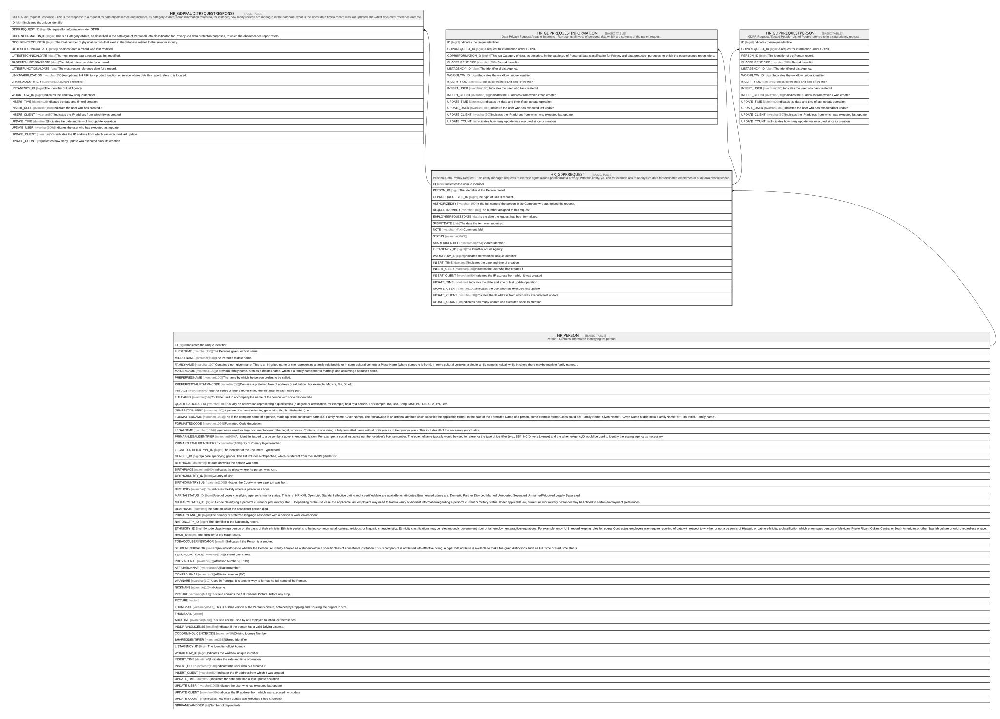

# HR_GDPRREQUEST

## Description

Personal Data Privacy Request - This entity manages requests to exercise rights around personal data privacy. With this entity, you can for example ask to anonymize data for terminated employees or audit data obsolescence.  

## Columns

| Name | Type | Default | Nullable | Children | Parents | Comment |
| ---- | ---- | ------- | -------- | -------- | ------- | ------- |
| ID | bigint |  | false | [HR_GDPRAUDITREQUESTRESPONSE](HR_GDPRAUDITREQUESTRESPONSE.md) [HR_GDPRREQUESTINFORMATION](HR_GDPRREQUESTINFORMATION.md) [HR_GDPRREQUESTPERSON](HR_GDPRREQUESTPERSON.md) |  | Indicates the unique identifier |
| PERSON_ID | bigint |  | true |  | [HR_PERSON](HR_PERSON.md) | The Identifier of the Person record. |
| GDPRREQUESTTYPE_ID | bigint |  | true |  |  | The type of GDPR request. |
| AUTHORIZEDBY | nvarchar(100) |  | false |  |  | Is the full name of the person in the Company who authorised the request. |
| REQUESTNUMBER | nvarchar(100) |  | false |  |  | The number assigned to this request. |
| EMPLOYEEREQUESTDATE | date |  | false |  |  | Is the date the request has been formalized. |
| SUBMITDATE | date | (sysutcdatetime()) | true |  |  | The date the item was submitted. |
| NOTE | nvarchar(MAX) |  | true |  |  | Comment field. |
| STATUS | nvarchar(MAX) |  | true |  |  |  |
| SHAREDIDENTIFIER | nvarchar(255) |  | true |  |  | Shared Identifier |
| LISTAGENCY_ID | bigint |  | true |  |  | The Identifier of List Agency. |
| WORKFLOW_ID | bigint |  | true |  |  | Indicates the workflow unique identifier |
| INSERT_TIME | datetime2 | (sysutcdatetime()) | false |  |  | Indicates the date and time of creation |
| INSERT_USER | nvarchar(100) | (N'MAIN') | false |  |  | Indicates the user who has created it |
| INSERT_CLIENT | nvarchar(50) | (N'localhost') | false |  |  | Indicates the IP address from which it was created |
| UPDATE_TIME | datetime2 | (sysutcdatetime()) | false |  |  | Indicates the date and time of last update operation |
| UPDATE_USER | nvarchar(100) | (N'MAIN') | false |  |  | Indicates the user who has executed last update |
| UPDATE_CLIENT | nvarchar(50) | (N'localhost') | false |  |  | Indicates the IP address from which was executed last update |
| UPDATE_COUNT | int | ((0)) | false |  |  | Indicates how many update was executed since its creation |

## Constraints

| Name | Type | Definition |
| ---- | ---- | ---------- |
| PK_GDPRREQUEST | PRIMARY KEY | CLUSTERED, unique, part of a PRIMARY KEY constraint, [ ID ] |
| FK_GDPRREQUEST_PERSON | FOREIGN KEY | FOREIGN KEY(PERSON_ID) REFERENCES HR_PERSON(ID) ON UPDATE NO_ACTION ON DELETE NO_ACTION |

## Indexes

| Name | Definition |
| ---- | ---------- |
| PK_GDPRREQUEST | CLUSTERED, unique, part of a PRIMARY KEY constraint, [ ID ] |

## Relations

---

> Generated by [tbls](https://github.com/k1LoW/tbls)
