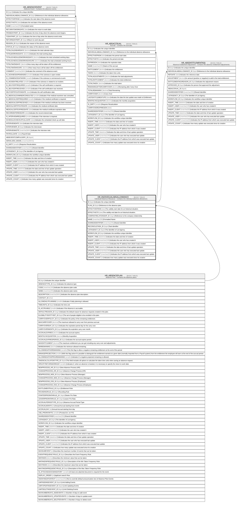

# HR_INDIVIDUALABSALLOWANCE

## Description

Individual Absence Allowance - Contains the individual absence allowances.  

## Columns

| Name | Type | Default | Nullable | Children | Parents | Comment |
| ---- | ---- | ------- | -------- | -------- | ------- | ------- |
| ID | bigint |  | false | [HR_ABSENCEEVENT](HR_ABSENCEEVENT.md) [HR_ABSACCRUAL](HR_ABSACCRUAL.md) [HR_ABSENTITLEMENTADJ](HR_ABSENTITLEMENTADJ.md) |  | Indicates the unique identifier |
| PLAN_ID | bigint |  | true |  | [HR_ABSENCEPLAN](HR_ABSENCEPLAN.md) | Reference to the absence plan. |
| EFFECTIVEFROM | date |  | true |  |  | The validity start date for an historical situation. |
| EFFECTIVETO | date |  | true |  |  | The validity end date for an historical situation. |
| COMPANYRELATIONSHIP_ID | bigint |  | true |  |  | Reference to the company relationship. |
| NAME | nvarchar(255) |  | true |  |  | Formatted Name |
| SHAREDIDENTIFIER | nvarchar(255) |  | true |  |  | Shared Identifier |
| RECONCILETASK_ID | bigint |  | true |  |  | Task identifier |
| LISTAGENCY_ID | bigint |  | true |  |  | The Identifier of List Agency. |
| WORKFLOW_ID | bigint |  | true |  |  | Indicates the workflow unique identifier |
| INSERT_TIME | datetime2 | (sysutcdatetime()) | false |  |  | Indicates the date and time of creation |
| INSERT_USER | nvarchar(100) | (N'MAIN') | false |  |  | Indicates the user who has created it |
| INSERT_CLIENT | nvarchar(50) | (N'localhost') | false |  |  | Indicates the IP address from which it was created |
| UPDATE_TIME | datetime2 | (sysutcdatetime()) | false |  |  | Indicates the date and time of last update operation |
| UPDATE_USER | nvarchar(100) | (N'MAIN') | false |  |  | Indicates the user who has executed last update |
| UPDATE_CLIENT | nvarchar(50) | (N'localhost') | false |  |  | Indicates the IP address from which was executed last update |
| UPDATE_COUNT | int | ((0)) | false |  |  | Indicates how many update was executed since its creation |

## Constraints

| Name | Type | Definition |
| ---- | ---- | ---------- |
| PK_HR_INDIVIDUALABSALLOWANCE | PRIMARY KEY | CLUSTERED, unique, part of a PRIMARY KEY constraint, [ ID ] |
| UQ_ABSPLANINDIVIDUALALLOWANCE | UNIQUE | NONCLUSTERED, unique, part of a UNIQUE constraint, [ PLAN_ID, EFFECTIVEFROM, COMPANYRELATIONSHIP_ID ] |
| FK_INDALLOWANCE_ABSPLAN | FOREIGN KEY | FOREIGN KEY(PLAN_ID) REFERENCES HR_ABSENCEPLAN(ID) ON UPDATE NO_ACTION ON DELETE NO_ACTION |

## Indexes

| Name | Definition |
| ---- | ---------- |
| PK_HR_INDIVIDUALABSALLOWANCE | CLUSTERED, unique, part of a PRIMARY KEY constraint, [ ID ] |
| UQ_ABSPLANINDIVIDUALALLOWANCE | NONCLUSTERED, unique, part of a UNIQUE constraint, [ PLAN_ID, EFFECTIVEFROM, COMPANYRELATIONSHIP_ID ] |
| IDX_INDIVIDUALABSALLOWANCE_S | NONCLUSTERED, [ COMPANYRELATIONSHIP_ID, EFFECTIVEFROM, EFFECTIVETO ] |

## Relations

---

> Generated by [tbls](https://github.com/k1LoW/tbls)
