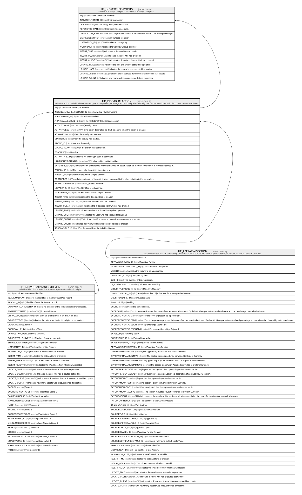

# HR_INDIVIDUALACTION

## Description

Individual Action - Individual action with a type, a completion percentage and optionally a linked Entity that can be a workflow task of a course session enrolment.  

## Columns

| Name | Type | Default | Nullable | Children | Parents | Comment |
| ---- | ---- | ------- | -------- | -------- | ------- | ------- |
| ID | bigint |  | false | [HR_INDACTCHECKPOINTS](HR_INDACTCHECKPOINTS.md) |  | Indicates the unique identifier |
| INDIVIDUALPLANENROLMENT_ID | bigint |  | true |  | [HR_INDIVIDUALPLANENROLMENT](HR_INDIVIDUALPLANENROLMENT.md) | Individual Plan Enrolment |
| PLANOUTLINE_ID | bigint |  | true |  |  | Individual Plan Outline |
| APPRAISALSECTION_ID | bigint |  | true |  | [HR_APPRAISALSECTION](HR_APPRAISALSECTION.md) | This field identify the Appraisal section. |
| ACTIVITYNAME | nvarchar(2000) |  | true |  |  | Activity name. |
| ACTIVITYDESC | nvarchar(MAX) |  | true |  |  | The action description as it will be shown when the action is created. |
| ASSIGNEDON | date |  | true |  |  | When the activity was assigned. |
| STARTEDON | date |  | true |  |  | When the activity was started. |
| STATUS_ID | bigint |  | true |  |  | Status of the activity. |
| COMPLETEDON | date |  | true |  |  | When the activity was completed. |
| DEADLINE | date |  | true |  |  | Deadline |
| ACTIONTYPE_ID | bigint |  | true |  |  | Refers an action type code in catalogue. |
| LINKEDSUBJECTENTITY | nvarchar(50) |  | true |  |  | Linked subject entity identifier. |
| EXTERNAL_ID | bigint |  | true |  |  | Identifier of the entity record which is linked to the action. It can be  Learner record Id or a Process Instance Id. |
| PERSON_ID | bigint |  | true |  |  | The person who the activity is assigned to. |
| PARENT_ID | bigint |  | true |  |  | Indicates the parent unique identifier |
| SORTORDER | int |  | true |  |  | The relative sort order of the activity when compared to the other activities in the same plan. |
| SHAREDIDENTIFIER | nvarchar(255) |  | true |  |  | Shared Identifier |
| LISTAGENCY_ID | bigint |  | true |  |  | The Identifier of List Agency. |
| WORKFLOW_ID | bigint |  | true |  |  | Indicates the workflow unique identifier |
| INSERT_TIME | datetime2 | (sysutcdatetime()) | false |  |  | Indicates the date and time of creation |
| INSERT_USER | nvarchar(100) | (N'MAIN') | false |  |  | Indicates the user who has created it |
| INSERT_CLIENT | nvarchar(50) | (N'localhost') | false |  |  | Indicates the IP address from which it was created |
| UPDATE_TIME | datetime2 | (sysutcdatetime()) | false |  |  | Indicates the date and time of last update operation |
| UPDATE_USER | nvarchar(100) | (N'MAIN') | false |  |  | Indicates the user who has executed last update |
| UPDATE_CLIENT | nvarchar(50) | (N'localhost') | false |  |  | Indicates the IP address from which was executed last update |
| UPDATE_COUNT | int | ((0)) | false |  |  | Indicates how many update was executed since its creation |
| RESPONSIBLE_ID | bigint |  | true |  |  | The Responsible of the Individual Action |

## Constraints

| Name | Type | Definition |
| ---- | ---- | ---------- |
| PK_HR_INDIVIDUALACTION | PRIMARY KEY | CLUSTERED, unique, part of a PRIMARY KEY constraint, [ ID ] |
| FK_INDACTION_APPRAISALSECTION | FOREIGN KEY | FOREIGN KEY(APPRAISALSECTION_ID) REFERENCES HR_APPRAISALSECTION(ID) ON UPDATE NO_ACTION ON DELETE CASCADE |
| FK_INDACTION_INDPLANENROL | FOREIGN KEY | FOREIGN KEY(INDIVIDUALPLANENROLMENT_ID) REFERENCES HR_INDIVIDUALPLANENROLMENT(ID) ON UPDATE NO_ACTION ON DELETE NO_ACTION |

## Indexes

| Name | Definition |
| ---- | ---------- |
| PK_HR_INDIVIDUALACTION | CLUSTERED, unique, part of a PRIMARY KEY constraint, [ ID ] |
| IDX_INDIVIDUALACTION | NONCLUSTERED, [ LINKEDSUBJECTENTITY, EXTERNAL_ID ] |

## Relations

---

> Generated by [tbls](https://github.com/k1LoW/tbls)
