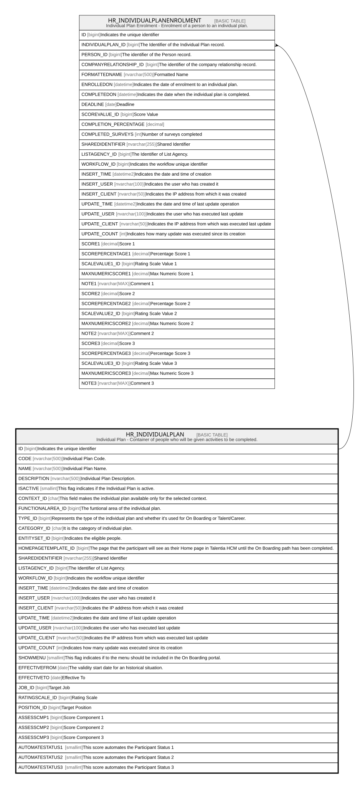

# HR_INDIVIDUALPLAN

## Description

Individual Plan - Container of people who will be given activities to be completed.  

## Columns

| Name | Type | Default | Nullable | Children | Comment |
| ---- | ---- | ------- | -------- | -------- | ------- |
| ID | bigint |  | false | [HR_INDIVIDUALPLANENROLMENT](HR_INDIVIDUALPLANENROLMENT.md) | Indicates the unique identifier |
| CODE | nvarchar(500) |  | true |  | Individual Plan Code. |
| NAME | nvarchar(500) |  | true |  | Individual Plan Name. |
| DESCRIPTION | nvarchar(500) |  | true |  | Individual Plan Description. |
| ISACTIVE | smallint |  | true |  | This flag indicates if the Individual Plan is active. |
| CONTEXT_ID | char |  | true |  | This field makes the individual plan available only for the selected context. |
| FUNCTIONALAREA_ID | bigint |  | true |  | The funtional area of the individual plan. |
| TYPE_ID | bigint |  | true |  | Represents the type of the individual plan and whether it's used for On Boarding or Talent/Career. |
| CATEGORY_ID | char |  | true |  | It is the category of individual plan. |
| ENTITYSET_ID | bigint |  | true |  | Indicates the eligible people. |
| HOMEPAGETEMPLATE_ID | bigint |  | true |  | The page that the participant will see as their Home page in Talentia HCM until the On Boarding path has been completed. |
| SHAREDIDENTIFIER | nvarchar(255) |  | true |  | Shared Identifier |
| LISTAGENCY_ID | bigint |  | true |  | The Identifier of List Agency. |
| WORKFLOW_ID | bigint |  | true |  | Indicates the workflow unique identifier |
| INSERT_TIME | datetime2 | (sysutcdatetime()) | false |  | Indicates the date and time of creation |
| INSERT_USER | nvarchar(100) | (N'MAIN') | false |  | Indicates the user who has created it |
| INSERT_CLIENT | nvarchar(50) | (N'localhost') | false |  | Indicates the IP address from which it was created |
| UPDATE_TIME | datetime2 | (sysutcdatetime()) | false |  | Indicates the date and time of last update operation |
| UPDATE_USER | nvarchar(100) | (N'MAIN') | false |  | Indicates the user who has executed last update |
| UPDATE_CLIENT | nvarchar(50) | (N'localhost') | false |  | Indicates the IP address from which was executed last update |
| UPDATE_COUNT | int | ((0)) | false |  | Indicates how many update was executed since its creation |
| SHOWMENU | smallint |  | true |  | This flag indicates if to the menu should be included in the On Boarding portal. |
| EFFECTIVEFROM | date |  | true |  | The validity start date for an historical situation. |
| EFFECTIVETO | date |  | true |  | Effective To |
| JOB_ID | bigint |  | true |  | Target Job |
| RATINGSCALE_ID | bigint |  | true |  | Rating Scale |
| POSITION_ID | bigint |  | true |  | Target Position |
| ASSESSCMP1 | bigint |  | true |  | Score Component 1 |
| ASSESSCMP2 | bigint |  | true |  | Score Component 2 |
| ASSESSCMP3 | bigint |  | true |  | Score Component 3 |
| AUTOMATESTATUS1 | smallint |  | true |  | This score automates the Participant Status 1 |
| AUTOMATESTATUS2 | smallint |  | true |  | This score automates the Participant Status 2 |
| AUTOMATESTATUS3 | smallint |  | true |  | This score automates the Participant Status 3 |

## Constraints

| Name | Type | Definition |
| ---- | ---- | ---------- |
| PK_HR_INDIVIDUALPLAN | PRIMARY KEY | CLUSTERED, unique, part of a PRIMARY KEY constraint, [ ID ] |
| UQ_INDIVIDUALPLAN | UNIQUE | NONCLUSTERED, unique, part of a UNIQUE constraint, [ CODE, TYPE_ID ] |

## Indexes

| Name | Definition |
| ---- | ---------- |
| PK_HR_INDIVIDUALPLAN | CLUSTERED, unique, part of a PRIMARY KEY constraint, [ ID ] |
| UQ_INDIVIDUALPLAN | NONCLUSTERED, unique, part of a UNIQUE constraint, [ CODE, TYPE_ID ] |

## Relations

---

> Generated by [tbls](https://github.com/k1LoW/tbls)
