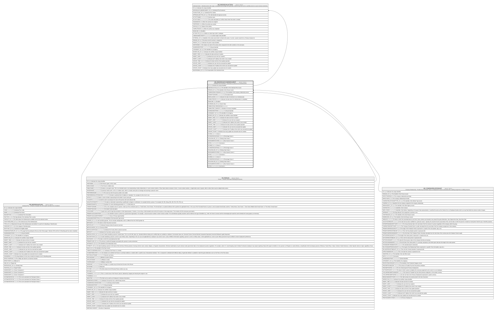

# HR_INDIVIDUALPLANENROLMENT

## Description

Individual Plan Enrolment - Enrolment of a person to an individual plan.  

## Columns

| Name | Type | Default | Nullable | Children | Parents | Comment |
| ---- | ---- | ------- | -------- | -------- | ------- | ------- |
| ID | bigint |  | false | [HR_INDIVIDUALACTION](HR_INDIVIDUALACTION.md) |  | Indicates the unique identifier |
| INDIVIDUALPLAN_ID | bigint |  | false |  | [HR_INDIVIDUALPLAN](HR_INDIVIDUALPLAN.md) | The Identifier of the Individual Plan record. |
| PERSON_ID | bigint |  | false |  | [HR_PERSON](HR_PERSON.md) | The identifier of the Person record. |
| COMPANYRELATIONSHIP_ID | bigint |  | true |  | [HR_COMPANYRELATIONSHIP](HR_COMPANYRELATIONSHIP.md) | The identifier of the company relationship record. |
| FORMATTEDNAME | nvarchar(500) |  | true |  |  | Formatted Name |
| ENROLLEDON | datetime |  | true |  |  | Indicates the date of enrolment to an individual plan. |
| COMPLETEDON | datetime |  | true |  |  | Indicates the date when the individual plan is completed. |
| DEADLINE | date |  | true |  |  | Deadline |
| SCOREVALUE_ID | bigint |  | true |  |  | Score Value |
| COMPLETION_PERCENTAGE | decimal |  | true |  |  |  |
| COMPLETED_SURVEYS | int |  | true |  |  | Number of surveys completed |
| SHAREDIDENTIFIER | nvarchar(255) |  | true |  |  | Shared Identifier |
| LISTAGENCY_ID | bigint |  | true |  |  | The Identifier of List Agency. |
| WORKFLOW_ID | bigint |  | true |  |  | Indicates the workflow unique identifier |
| INSERT_TIME | datetime2 | (sysutcdatetime()) | false |  |  | Indicates the date and time of creation |
| INSERT_USER | nvarchar(100) | (N'MAIN') | false |  |  | Indicates the user who has created it |
| INSERT_CLIENT | nvarchar(50) | (N'localhost') | false |  |  | Indicates the IP address from which it was created |
| UPDATE_TIME | datetime2 | (sysutcdatetime()) | false |  |  | Indicates the date and time of last update operation |
| UPDATE_USER | nvarchar(100) | (N'MAIN') | false |  |  | Indicates the user who has executed last update |
| UPDATE_CLIENT | nvarchar(50) | (N'localhost') | false |  |  | Indicates the IP address from which was executed last update |
| UPDATE_COUNT | int | ((0)) | false |  |  | Indicates how many update was executed since its creation |
| SCORE1 | decimal |  | true |  |  | Score 1 |
| SCOREPERCENTAGE1 | decimal |  | true |  |  | Percentage Score 1 |
| SCALEVALUE1_ID | bigint |  | true |  |  | Rating Scale Value 1 |
| MAXNUMERICSCORE1 | decimal |  | true |  |  | Max Numeric Score 1 |
| NOTE1 | nvarchar(MAX) |  | true |  |  | Comment 1 |
| SCORE2 | decimal |  | true |  |  | Score 2 |
| SCOREPERCENTAGE2 | decimal |  | true |  |  | Percentage Score 2 |
| SCALEVALUE2_ID | bigint |  | true |  |  | Rating Scale Value 2 |
| MAXNUMERICSCORE2 | decimal |  | true |  |  | Max Numeric Score 2 |
| NOTE2 | nvarchar(MAX) |  | true |  |  | Comment 2 |
| SCORE3 | decimal |  | true |  |  | Score 3 |
| SCOREPERCENTAGE3 | decimal |  | true |  |  | Percentage Score 3 |
| SCALEVALUE3_ID | bigint |  | true |  |  | Rating Scale Value 3 |
| MAXNUMERICSCORE3 | decimal |  | true |  |  | Max Numeric Score 3 |
| NOTE3 | nvarchar(MAX) |  | true |  |  | Comment 3 |

## Constraints

| Name | Type | Definition |
| ---- | ---- | ---------- |
| PK_HR_INDIVIDUALPLANENROLMENT | PRIMARY KEY | CLUSTERED, unique, part of a PRIMARY KEY constraint, [ ID ] |
| FK_INDPLANENROL_COMPREL | FOREIGN KEY | FOREIGN KEY(COMPANYRELATIONSHIP_ID) REFERENCES HR_COMPANYRELATIONSHIP(ID) ON UPDATE NO_ACTION ON DELETE NO_ACTION |
| FK_INDPLANENROL_INDPLAN | FOREIGN KEY | FOREIGN KEY(INDIVIDUALPLAN_ID) REFERENCES HR_INDIVIDUALPLAN(ID) ON UPDATE NO_ACTION ON DELETE NO_ACTION |
| FK_INDPLANENROL_PERSON | FOREIGN KEY | FOREIGN KEY(PERSON_ID) REFERENCES HR_PERSON(ID) ON UPDATE NO_ACTION ON DELETE NO_ACTION |

## Indexes

| Name | Definition |
| ---- | ---------- |
| PK_HR_INDIVIDUALPLANENROLMENT | CLUSTERED, unique, part of a PRIMARY KEY constraint, [ ID ] |

## Relations

---

> Generated by [tbls](https://github.com/k1LoW/tbls)
