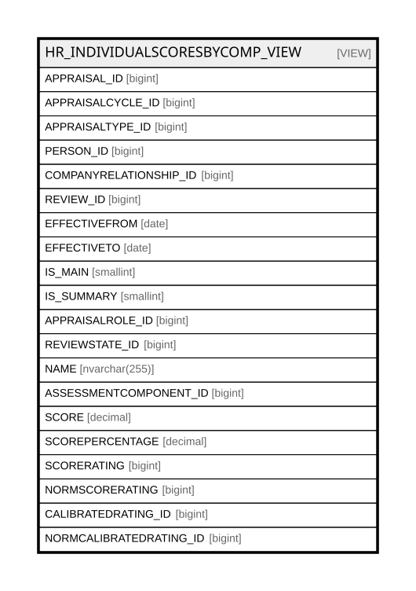

# HR_INDIVIDUALSCORESBYCOMP_VIEW

## Description

<details>
<summary><strong>Table Definition</strong></summary>

```sql
-- Talentia Software - All right reserved
-- Type: VIEW                     Name: HR_INDIVIDUALSCORESBYCOMP_VIEW
-- Date: 09-04-2026 07:27:59 (UTC)
-- 
-- ChangeLogId: 00000000-0000-0000-0000-000000000000
-- ChangeSetId: dad355b7-3027-45a5-8d17-01c3d91d9164
-- Original file name: C:\repos\Talentia-Software\hcm-core/DB/ProductDB/EDM\Schema\Views\HR_INDIVIDUALSCORESBYCOMP_VIEW.xml


CREATE VIEW [HR_INDIVIDUALSCORESBYCOMP_VIEW]
 ( APPRAISAL_ID, APPRAISALCYCLE_ID, APPRAISALTYPE_ID, PERSON_ID, COMPANYRELATIONSHIP_ID, REVIEW_ID, EFFECTIVEFROM, EFFECTIVETO, IS_MAIN, IS_SUMMARY, APPRAISALROLE_ID, REVIEWSTATE_ID, NAME, ASSESSMENTCOMPONENT_ID, SCORE, SCOREPERCENTAGE, SCORERATING, NORMSCORERATING, CALIBRATEDRATING_ID, NORMCALIBRATEDRATING_ID ) 
 AS 
( 
					SELECT AX.ID as APPRAISAL_ID,
					AX.APPRAISALCYCLE_ID,
					AX.APPRAISALTYPE_ID,
					HR_SCORECOMPONENTPROFILE.PERSON_ID,
					AX.COMPANYRELATIONSHIP_ID,
					RX.ID As REVIEW_ID,
					HR_SCORECOMPONENTPROFILE.EFFECTIVEFROM,
					HR_SCORECOMPONENTPROFILE.EFFECTIVETO,
					RX.IS_MAIN,
					RX.IS_SUMMARY,
					RX.APPRAISALROLE_ID,
					RX.REVIEWSTATE_ID,
					CX.NAME,
					HR_SCORECOMPONENTPROFILE.ASSESSMENTCOMPONENT_ID as ASSESSMENTCOMPONENT_ID,
					(Case when HR_SCORECOMPONENTPROFILE.SCORE_FIXED is null then X.SCOREADJ else HR_SCORECOMPONENTPROFILE.SCORE_FIXED end) as SCORE,
					(Case when HR_SCORECOMPONENTPROFILE.SCOREPERCENTAGE_FIXED is null then X.SCOREPERCENTAGEADJ else HR_SCORECOMPONENTPROFILE.SCOREPERCENTAGE_FIXED end) as SCOREPERCENTAGE,
					(case when HR_SCORECOMPONENTPROFILE.SCALEVALUE_ID_FIXED is null then X.SCALEVALUEADJ_ID else HR_SCORECOMPONENTPROFILE.SCALEVALUE_ID_FIXED end) as SCORERATING,
					PTFC.ID as NORMSCORERATING,
					CR.PARENT_ID as CALIBRATEDRATING_ID,
					NCR.PARENT_ID as NORMCALIBRATEDRATING_ID
					from HR_SCORECOMPONENTPROFILE
					Left outer join HR_APPRCOMPONENTSCORE X
					on (X.APPRAISALREVIEW_ID=HR_SCORECOMPONENTPROFILE.APPRAISALREVIEW_ID and HR_SCORECOMPONENTPROFILE.ASSESSMENTCOMPONENT_ID=X.ASSESMENTCOMPONENT_ID)
					inner join HR_ASSESMENTCOMPONENT CX on (CX.ID=HR_SCORECOMPONENTPROFILE.ASSESSMENTCOMPONENT_ID)
					Left outer join TF_CODES TFC on (TFC.ENTITY_ID='57b765ef-bf00-4521-9f37-2836c00bd1b9' and TFC.ID=case when HR_SCORECOMPONENTPROFILE.SCALEVALUE_ID_FIXED is null then X.SCALEVALUEADJ_ID else HR_SCORECOMPONENTPROFILE.SCALEVALUE_ID_FIXED end)
					Left outer join TF_CODES PTFC on (TFC.ENTITY_ID='57b765ef-bf00-4521-9f37-2836c00bd1b9' and PTFC.ID=TFC.PARENT_ID)
					Left outer join HR_APPRAISALREVIEW RX
					on (RX.ID=HR_SCORECOMPONENTPROFILE.APPRAISALREVIEW_ID)
					Left outer join HR_APPRAISAL AX
					on (RX.APPRAISAL_ID=AX.ID)
					LEFT OUTER JOIN HR_APPRSCORECALIBRATION SCX on (SCX.APPRCOMPONENTSCORE_ID=X.ID)
					LEFT OUTER JOIN HR_POOLAPPRAISAL ON SCX.APPRCOMPONENTSCORE_ID = HR_POOLAPPRAISAL.APPRCOMPONENTSCORE_ID
					LEFT OUTER JOIN HR_CALIBRATIONPOOL ON HR_POOLAPPRAISAL.CALIBRATIONPOOL_ID = HR_CALIBRATIONPOOL.ID
					LEFT JOIN HR_APPRAISALCYCLE ON HR_APPRAISALCYCLE.ID = RX.SOURCEAPPRAISALCYCLE_ID
					LEFT OUTER JOIN HR_CALIBRATIONMODEL CM ON COALESCE(HR_CALIBRATIONPOOL.CALIBRATIONMODEL_ID, HR_APPRAISALCYCLE.CALIBRATIONMODEL_ID) = CM.ID
					LEFT OUTER JOIN HR_CALIBRATIONMODELLEVEL CML ON COALESCE(HR_CALIBRATIONPOOL.CALIBRATIONMODEL_ID, HR_APPRAISALCYCLE.CALIBRATIONMODEL_ID) = CML.CALIBRATIONMODEL_ID AND
					(
					(CM.SCALESAMPLING_ID = 1210574 AND CML.PERFORMANCELEVEL_ID = SCX.SCALEVALUE_ID) OR
					(CM.SCALESAMPLING_ID = 1210573 AND SCX.NUMERICSCORE BETWEEN CML.FROMSCORE AND CML.TOSCORE) OR
					(CM.SCALESAMPLING_ID = 1210383 AND SCX.SCOREPERCENTAGE BETWEEN CML.FROMSCORE AND CML.TOSCORE)
					)
					LEFT OUTER JOIN TF_CODES CR ON CR.ID = SCX.SCALEVALUE_ID
					LEFT OUTER JOIN TF_CODES NCR ON NCR.ID = COALESCE(CML.PERFORMANCELEVEL_ID, SCX.SCALEVALUE_ID) )

```

</details>

## Columns

| Name | Type | Default | Nullable | Comment |
| ---- | ---- | ------- | -------- | ------- |
| APPRAISAL_ID | bigint |  | true |  |
| APPRAISALCYCLE_ID | bigint |  | true |  |
| APPRAISALTYPE_ID | bigint |  | true |  |
| PERSON_ID | bigint |  | false |  |
| COMPANYRELATIONSHIP_ID | bigint |  | true |  |
| REVIEW_ID | bigint |  | true |  |
| EFFECTIVEFROM | date |  | true |  |
| EFFECTIVETO | date |  | true |  |
| IS_MAIN | smallint |  | true |  |
| IS_SUMMARY | smallint |  | true |  |
| APPRAISALROLE_ID | bigint |  | true |  |
| REVIEWSTATE_ID | bigint |  | true |  |
| NAME | nvarchar(255) |  | false |  |
| ASSESSMENTCOMPONENT_ID | bigint |  | true |  |
| SCORE | decimal |  | true |  |
| SCOREPERCENTAGE | decimal |  | true |  |
| SCORERATING | bigint |  | true |  |
| NORMSCORERATING | bigint |  | true |  |
| CALIBRATEDRATING_ID | bigint |  | true |  |
| NORMCALIBRATEDRATING_ID | bigint |  | true |  |

## Referenced Tables

| Name | Columns | Comment | Type |
| ---- | ------- | ------- | ---- |
| [HR_SCORECOMPONENTPROFILE](HR_SCORECOMPONENTPROFILE.md) | 21 | Score Component Profile - This entity collects all individual scores for each component from submitted Summary Reviews.<br /> | BASIC TABLE |
| [HR_APPRCOMPONENTSCORE](HR_APPRCOMPONENTSCORE.md) | 25 | Appraisal Component Score - This entity stores the score for each component in an appraisal review. For example, an individual appraisal which will generate an overall performance assessment calculated as a weighted average of Objectives and Competencies will generate, for each review, at least three scores in this table: one for the overall performance and two partial scores for objectives and competencies respectively. | BASIC TABLE |
| [HR_ASSESMENTCOMPONENT](HR_ASSESMENTCOMPONENT.md) | 33 | Assessment Component - Assessment Component<br /> | BASIC TABLE |
| [TF_CODES](TF_CODES.md) | 87 |  | BASIC TABLE |
| [HR_APPRAISALREVIEW](HR_APPRAISALREVIEW.md) | 43 | Appraisal Review - This entity stores the history of all individual appraisals.<br /> | BASIC TABLE |
| [HR_APPRAISAL](HR_APPRAISAL.md) | 20 | Appraisal - Appraisal<br /> | BASIC TABLE |
| [HR_APPRSCORECALIBRATION](HR_APPRSCORECALIBRATION.md) | 21 | Appraisal Score Calibration - Appraisal score calibration<br /> | BASIC TABLE |
| [HR_POOLAPPRAISAL](HR_POOLAPPRAISAL.md) | 13 | Pool Appraisal - Pool Appraisal consists of the relationship between Calibration Pool and Appraisal entity.<br /> | BASIC TABLE |
| [HR_CALIBRATIONPOOL](HR_CALIBRATIONPOOL.md) | 18 | Calibration Pool - Calibration Pool consists of the list of managers that need to perform a calibration cycle.<br /> | BASIC TABLE |
| [HR_APPRAISALCYCLE](HR_APPRAISALCYCLE.md) | 36 | Appraisal Cycle - This Entity allows defining a container of Appraisals that make sense on a specific period for a given employee set.<br /> | BASIC TABLE |
| [HR_CALIBRATIONMODEL](HR_CALIBRATIONMODEL.md) | 16 | Calibration Model - Calibration models to calculate evaluation scores based on an expected distribution<br /> | BASIC TABLE |
| [HR_CALIBRATIONMODELLEVEL](HR_CALIBRATIONMODELLEVEL.md) | 16 | Calibration Model Level - Calibration Model's levels<br /> | BASIC TABLE |

## Relations



---

> Generated by [tbls](https://github.com/k1LoW/tbls)
