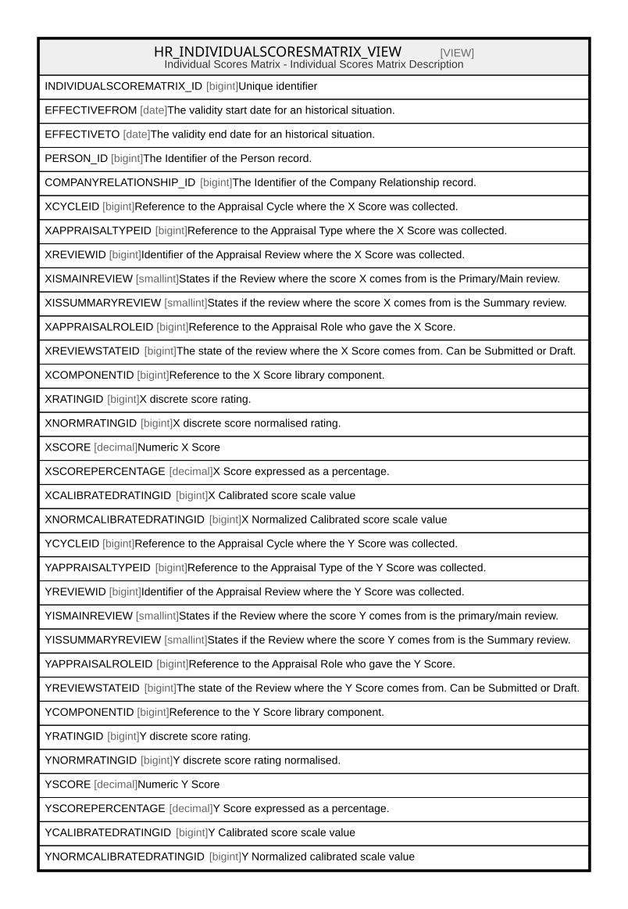

# HR_INDIVIDUALSCORESMATRIX_VIEW

## Description

Individual Scores Matrix - Individual Scores Matrix Description  


<details>
<summary><strong>Table Definition</strong></summary>

```sql
-- Talentia Software - All right reserved
-- Type: VIEW                     Name: HR_INDIVIDUALSCORESMATRIX_VIEW
-- Date: 09-04-2026 07:27:59 (UTC)
-- 
-- ChangeLogId: 00000000-0000-0000-0000-000000000000
-- ChangeSetId: acb75ebe-15ff-4669-9e44-d818a56505d2
-- Original file name: C:\repos\Talentia-Software\hcm-core/DB/ProductDB/EDM\Schema\Views\HR_INDIVIDUALSCORESMATRIX_VIEW.xml


CREATE VIEW [HR_INDIVIDUALSCORESMATRIX_VIEW]
 ( INDIVIDUALSCOREMATRIX_ID, EFFECTIVEFROM, EFFECTIVETO, PERSON_ID, COMPANYRELATIONSHIP_ID, XCYCLEID, XAPPRAISALTYPEID, XREVIEWID, XISMAINREVIEW, XISSUMMARYREVIEW, XAPPRAISALROLEID, XREVIEWSTATEID, XCOMPONENTID, XRATINGID, XNORMRATINGID, XSCORE, XSCOREPERCENTAGE, XCALIBRATEDRATINGID, XNORMCALIBRATEDRATINGID, YCYCLEID, YAPPRAISALTYPEID, YREVIEWID, YISMAINREVIEW, YISSUMMARYREVIEW, YAPPRAISALROLEID, YREVIEWSTATEID, YCOMPONENTID, YRATINGID, YNORMRATINGID, YSCORE, YSCOREPERCENTAGE, YCALIBRATEDRATINGID, YNORMCALIBRATEDRATINGID ) 
 AS 
( SELECT ROW_NUMBER() OVER(ORDER BY X.PERSON_ID, X.ASSESSMENTCOMPONENT_ID, Y.ASSESSMENTCOMPONENT_ID, X.EFFECTIVEFROM, Y.EFFECTIVEFROM) as INDIVIDUALSCOREMATRIX_ID,
(Case when X.EFFECTIVEFROM<Y.EFFECTIVEFROM THEN Y.EFFECTIVEFROM else X.EFFECTIVEFROM END) as EFFECTIVEFROM,
(Case when X.EFFECTIVETO<Y.EFFECTIVETO THEN X.EFFECTIVETO else Y.EFFECTIVETO END) as EFFECTIVETO,
X.PERSON_ID,
X.COMPANYRELATIONSHIP_ID,
X.APPRAISALCYCLE_ID as XCYCLEID,
X.APPRAISALTYPE_ID as XAPPRAISALTYPEID,
X.REVIEW_ID as XREVIEWID,
X.IS_MAIN as XISMAINREVIEW,
X.IS_SUMMARY as XISSUMMARYREVIEW,
X.APPRAISALROLE_ID as XAPPRAISALROLEID,
X.REVIEWSTATE_ID as XREVIEWSTATEID,
X.ASSESSMENTCOMPONENT_ID as XCOMPONENTID,
X.SCORERATING as XRATINGID,
X.NORMSCORERATING as XNORMRATINGID,
X.SCORE as XSCORE,
X.SCOREPERCENTAGE as XSCOREPERCENTAGE,
X.CALIBRATEDRATING_ID as XCALIBRATEDRATINGID,
X.NORMCALIBRATEDRATING_ID as XNORMCALIBRATEDRATINGID,
Y.APPRAISALCYCLE_ID as YCYCLEID,
Y.APPRAISALTYPE_ID as YAPPRAISALTYPEID,
Y.REVIEW_ID as YREVIEWID,
Y.IS_MAIN as YISMAINREVIEW,
Y.IS_SUMMARY as YISSUMMARYREVIEW,
Y.APPRAISALROLE_ID as YAPPRAISALROLEID ,
Y.REVIEWSTATE_ID as YREVIEWSTATEID,
Y.ASSESSMENTCOMPONENT_ID as YCOMPONENTID,
Y.SCORERATING as YRATINGID,
Y.NORMSCORERATING as YNORMRATINGID,
Y.SCORE as YSCORE,
Y.SCOREPERCENTAGE as YSCOREPERCENTAGE,
Y.CALIBRATEDRATING_ID as YCALIBRATEDRATINGID,
Y.NORMCALIBRATEDRATING_ID as YNORMCALIBRATEDRATINGID
FROM HR_INDIVIDUALSCORESBYCOMP_VIEW X
Inner join HR_INDIVIDUALSCORESBYCOMP_VIEW Y
on (X.PERSON_ID=Y.PERSON_ID) 
and (X.ASSESSMENTCOMPONENT_ID<>Y.ASSESSMENTCOMPONENT_ID) )

```

</details>

## Columns

| Name | Type | Default | Nullable | Comment |
| ---- | ---- | ------- | -------- | ------- |
| INDIVIDUALSCOREMATRIX_ID | bigint |  | true | Unique identifier |
| EFFECTIVEFROM | date |  | true | The validity start date for an historical situation. |
| EFFECTIVETO | date |  | true | The validity end date for an historical situation. |
| PERSON_ID | bigint |  | false | The Identifier of the Person record. |
| COMPANYRELATIONSHIP_ID | bigint |  | true | The Identifier of the Company Relationship record. |
| XCYCLEID | bigint |  | true | Reference to the Appraisal Cycle where the X Score was collected. |
| XAPPRAISALTYPEID | bigint |  | true | Reference to the Appraisal Type where the X Score was collected. |
| XREVIEWID | bigint |  | true | Identifier of the Appraisal Review where the X Score was collected. |
| XISMAINREVIEW | smallint |  | true | States if the Review where the score X comes from is the Primary/Main review. |
| XISSUMMARYREVIEW | smallint |  | true | States if the review where the score X comes from is the Summary review. |
| XAPPRAISALROLEID | bigint |  | true | Reference to the Appraisal Role who gave the X Score. |
| XREVIEWSTATEID | bigint |  | true | The state of the review where the X Score comes from. Can be Submitted or Draft. |
| XCOMPONENTID | bigint |  | true | Reference to the X Score library component. |
| XRATINGID | bigint |  | true | X discrete score rating. |
| XNORMRATINGID | bigint |  | true | X discrete score normalised rating. |
| XSCORE | decimal |  | true | Numeric X Score |
| XSCOREPERCENTAGE | decimal |  | true | X Score expressed as a percentage. |
| XCALIBRATEDRATINGID | bigint |  | true | X Calibrated score scale value |
| XNORMCALIBRATEDRATINGID | bigint |  | true | X Normalized Calibrated score scale value |
| YCYCLEID | bigint |  | true | Reference to the Appraisal Cycle where the Y Score was collected. |
| YAPPRAISALTYPEID | bigint |  | true | Reference to the Appraisal Type of the Y Score was collected. |
| YREVIEWID | bigint |  | true | Identifier of the Appraisal Review where the Y Score was collected. |
| YISMAINREVIEW | smallint |  | true | States if the Review where the score Y comes from is the primary/main review. |
| YISSUMMARYREVIEW | smallint |  | true | States if the Review where the score Y comes from is the Summary review. |
| YAPPRAISALROLEID | bigint |  | true | Reference to the Appraisal Role who gave the Y Score. |
| YREVIEWSTATEID | bigint |  | true | The state of the Review where the Y Score comes from. Can be Submitted or Draft. |
| YCOMPONENTID | bigint |  | true | Reference to the Y Score library component. |
| YRATINGID | bigint |  | true | Y discrete score rating. |
| YNORMRATINGID | bigint |  | true | Y discrete score rating normalised. |
| YSCORE | decimal |  | true | Numeric Y Score |
| YSCOREPERCENTAGE | decimal |  | true | Y Score expressed as a percentage. |
| YCALIBRATEDRATINGID | bigint |  | true | Y Calibrated score scale value |
| YNORMCALIBRATEDRATINGID | bigint |  | true | Y Normalized calibrated scale value |

## Referenced Tables

| Name | Columns | Comment | Type |
| ---- | ------- | ------- | ---- |
| [HR_INDIVIDUALSCORESBYCOMP_VIEW](HR_INDIVIDUALSCORESBYCOMP_VIEW.md) | 20 |  | VIEW |

## Relations



---

> Generated by [tbls](https://github.com/k1LoW/tbls)
